# //unminified-javascript/samples/pages

[→ Parent](../..)


## Raw


```yaml
p90min: 0
p90max: 150
p90range: 150
p90mean: 44.361702127659576
p90median: 0
p90stdev: 63.32218378108017
p90skewness: 0.8991236972263136
p90eccentricity: 1.0000000000000002
p90discretization: 8.545454545454545
outlandishness: 1.2958846735561187
confidence: 29.487526245246748
p90confidence: 25.60177307160091

```

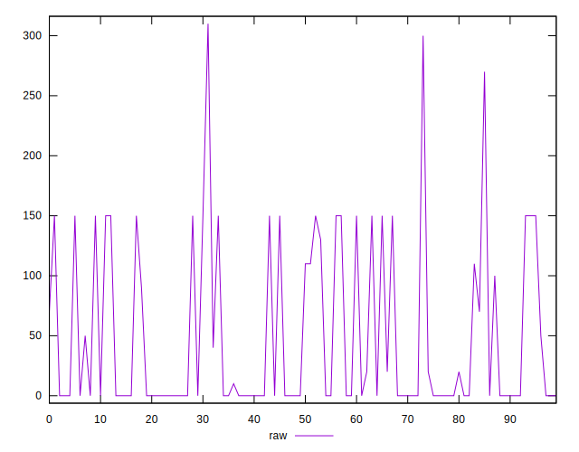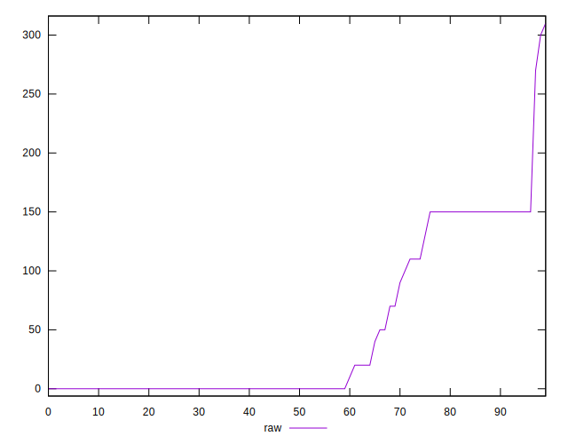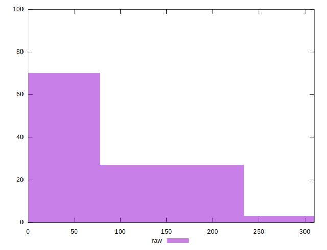
## Score


```yaml
p90min: 0.88
p90max: 1
p90range: 0.12
p90mean: 0.9641489361702127
p90median: 1
p90stdev: 0.050768761849382615
p90skewness: -0.8854502042219307
p90eccentricity: 1.0000000000000002
p90discretization: 8.545454545454545
outlandishness: 0.9893477297935137
confidence: 0.023956501159637305
p90confidence: 0.02052630282757869

```

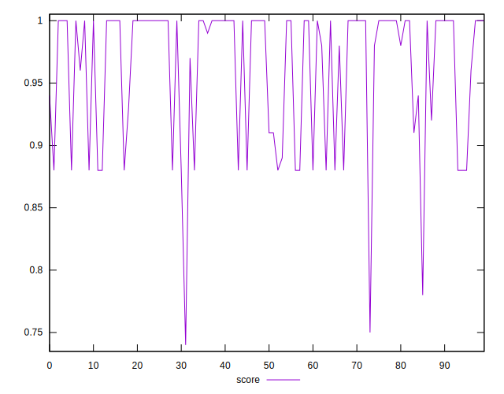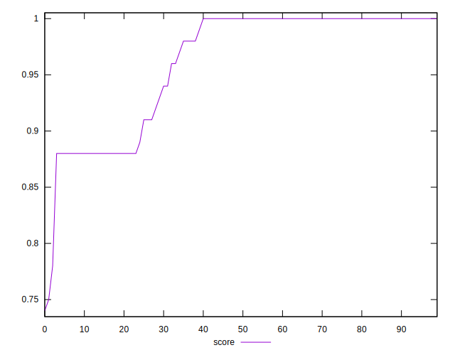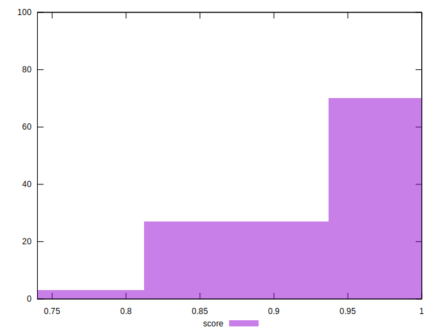
## Raw Estimate

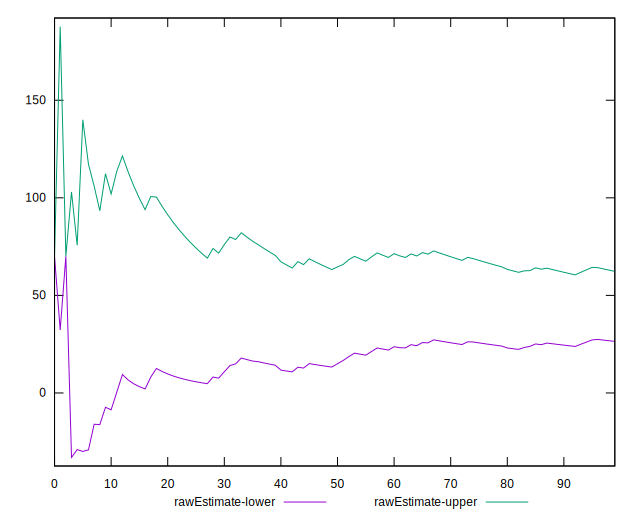
## Score Estimate

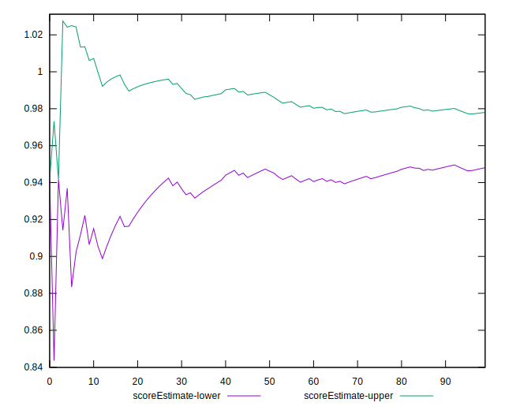
## P Score


```yaml
p90min: 0.875
p90max: 1
p90range: 0.125
p90mean: 0.963031914893617
p90median: 1
p90stdev: 0.05276848648423343
p90skewness: -0.8991236972263119
p90eccentricity: 1.000000000000002
p90discretization: 8.545454545454545
outlandishness: 0.9894623793510507
confidence: 0.024535586640448935
p90confidence: 0.02133481089300074

```

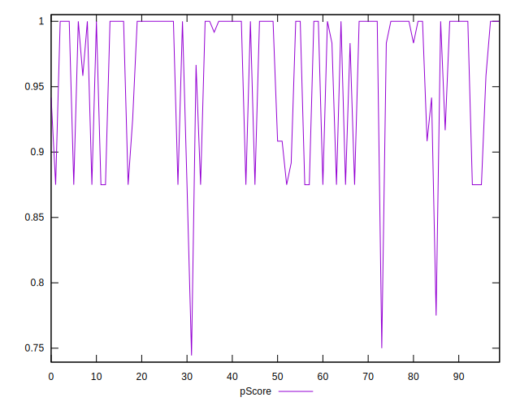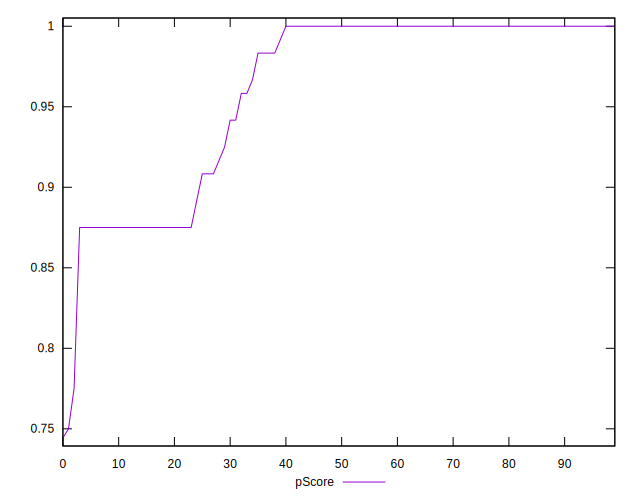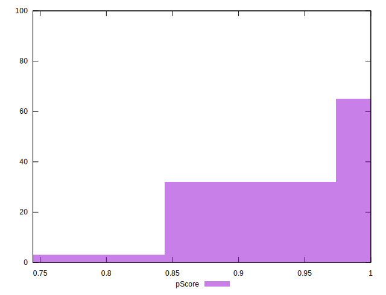
## Score Difference


```yaml
p90min: 0
p90max: 0
p90range: 0
p90mean: 0
p90median: 0
p90stdev: 0
p90skewness: .nan
p90eccentricity: .nan
p90discretization: 94
outlandishness: .inf
confidence: 6.092792000602807e-18
p90confidence: 0

```

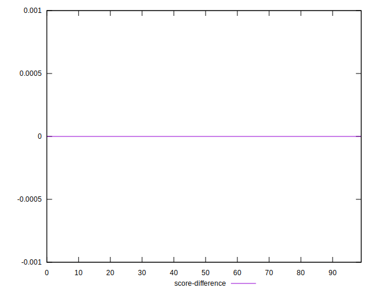
## P Score Difference


```yaml
p90min: -0.0050000000000000044
p90max: 0.0033333333333332993
p90range: 0.008333333333333304
p90mean: -0.0010815602836879445
p90median: 0
p90stdev: 0.002210915415500619
p90skewness: -0.8808266260797776
p90eccentricity: 0.9999999999999983
p90discretization: 10.444444444444445
outlandishness: 0.9524906685777431
confidence: 0.0009399657061614805
p90confidence: 0.000893894546401658

```

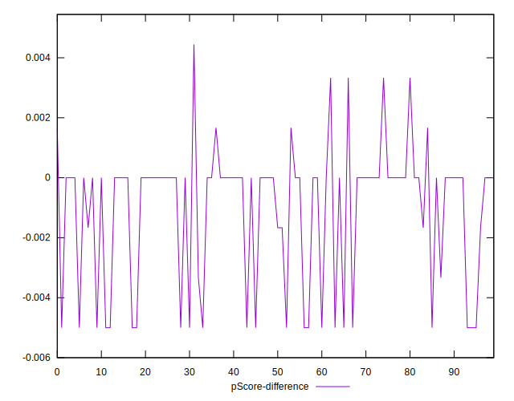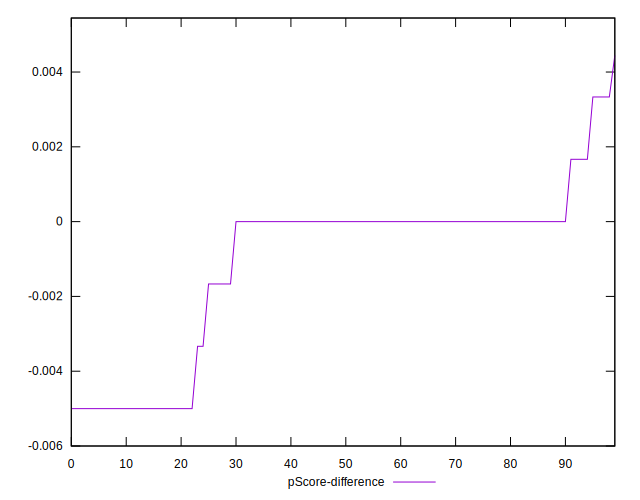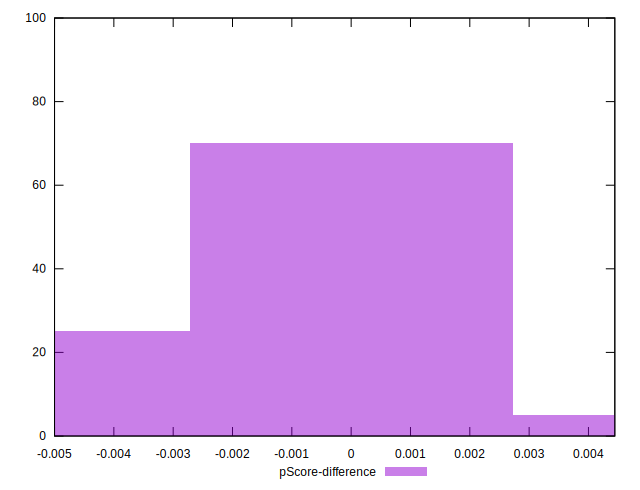