# //unused-css-rules/samples/pages+cached+noadtech

[→ Parent](../..)


## Raw


```yaml
p90min: 0
p90max: 330
p90range: 330
p90mean: 139.5744680851064
p90median: 150
p90stdev: 108.18536981375227
p90skewness: 0.20070368898973512
p90eccentricity: 0.9999999999999989
p90discretization: 5.529411764705882
outlandishness: 1.0688596912645005
confidence: 46.74834178531273
p90confidence: 43.74039431764622

```

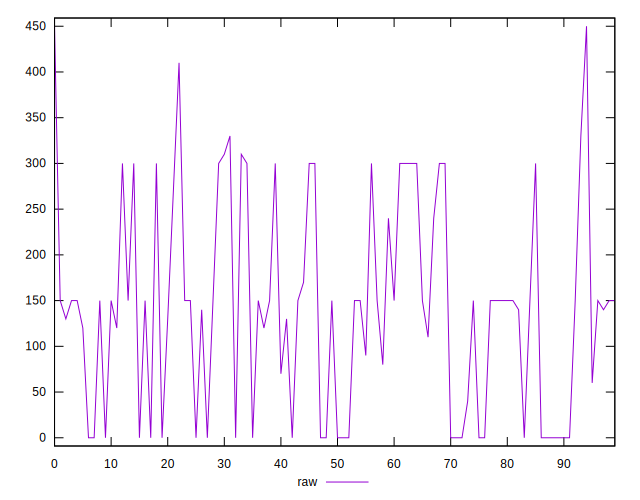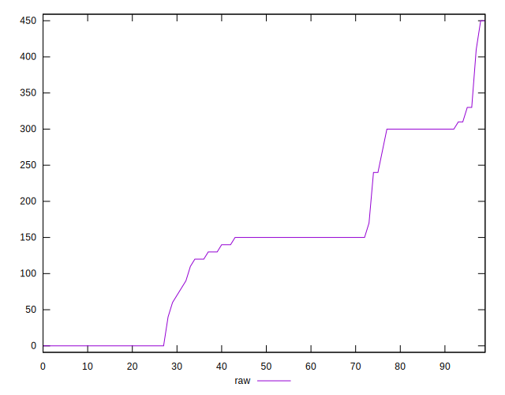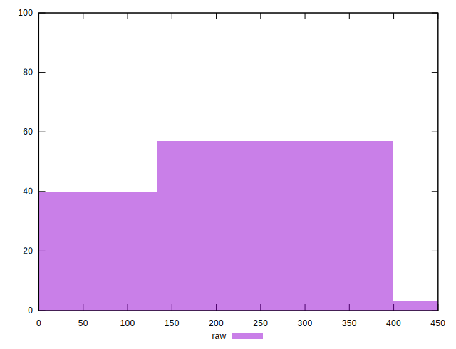
## Score


```yaml
p90min: 0.73
p90max: 1
p90range: 0.27
p90mean: 0.8853191489361697
p90median: 0.88
p90stdev: 0.08986635618374528
p90skewness: -0.24564348903982083
p90eccentricity: 0.9999999999999997
p90discretization: 6.266666666666667
outlandishness: 0.9936414785824659
confidence: 0.03777547760284767
p90confidence: 0.03633383942888173

```

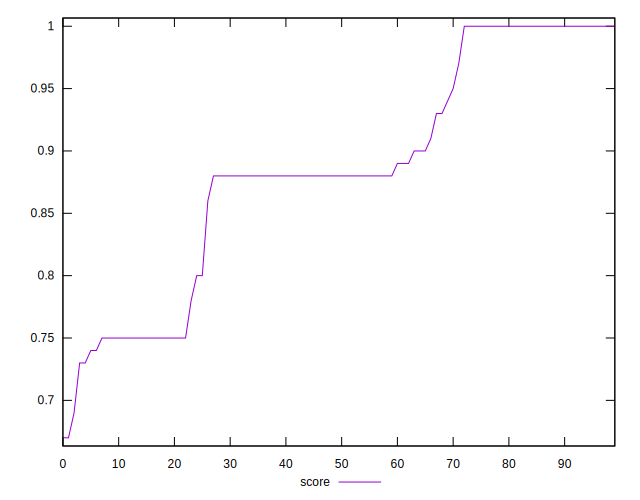
## Raw Estimate

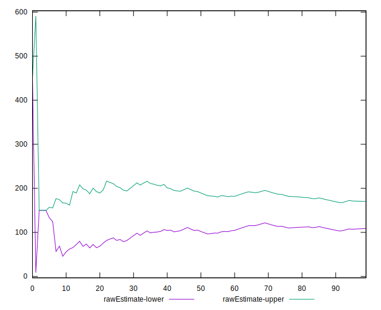
## Score Estimate

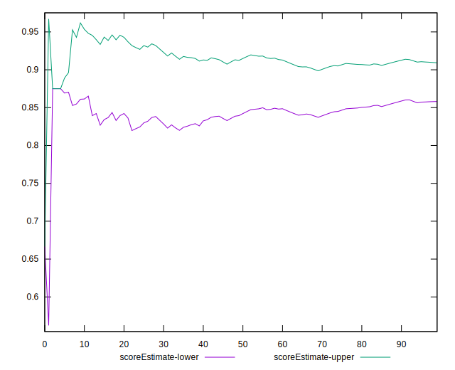
## P Score


```yaml
p90min: 0.7333333333333333
p90max: 1
p90range: 0.2666666666666667
p90mean: 0.8839243498817968
p90median: 0.875
p90stdev: 0.08975720279642874
p90skewness: -0.18886479020303235
p90eccentricity: 1.0000000000000004
p90discretization: 5.529411764705882
outlandishness: 0.9936447910572448
confidence: 0.03778955490924255
p90confidence: 0.0362897076556988

```

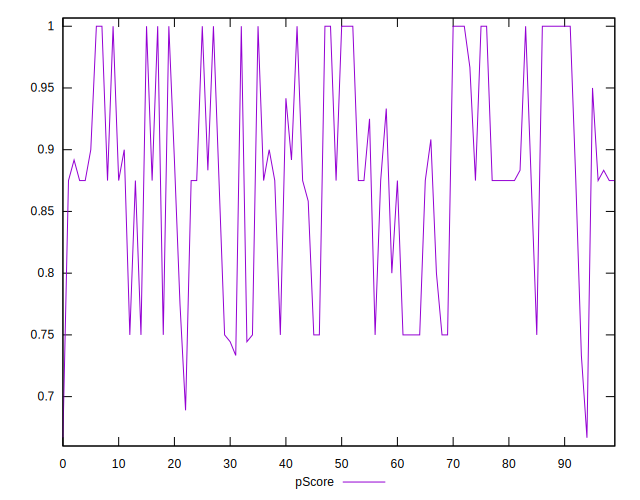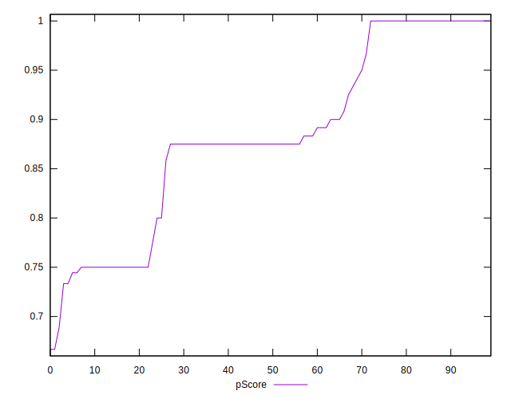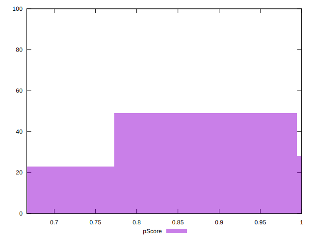
## Score Difference


```yaml
p90min: 0
p90max: 0
p90range: 0
p90mean: 0
p90median: 0
p90stdev: 0
p90skewness: .nan
p90eccentricity: .nan
p90discretization: 94
outlandishness: .inf
confidence: 7.423946114831071e-18
p90confidence: 0

```

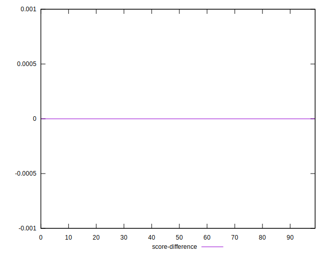
## P Score Difference


```yaml
p90min: -0.0050000000000000044
p90max: 0.0033333333333332993
p90range: 0.008333333333333304
p90mean: -0.0014479905437352301
p90median: 0
p90stdev: 0.002598490809269394
p90skewness: -0.3034846208301496
p90eccentricity: 0.9999999999999983
p90discretization: 9.4
outlandishness: 0.9200333194502288
confidence: 0.0010838485099181397
p90confidence: 0.0010505950372392669

```

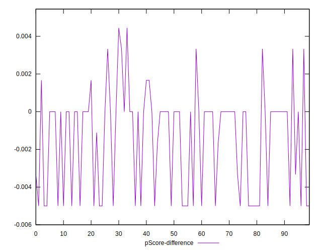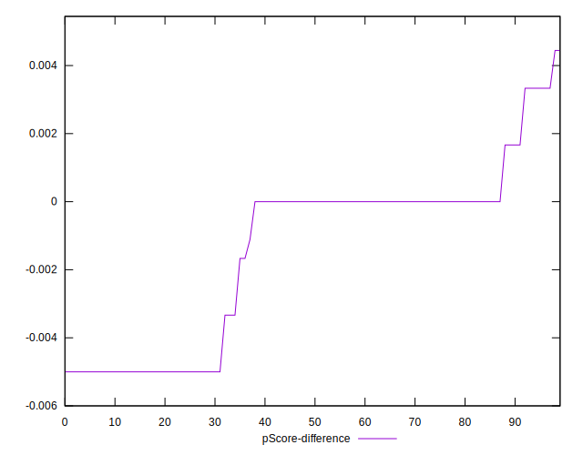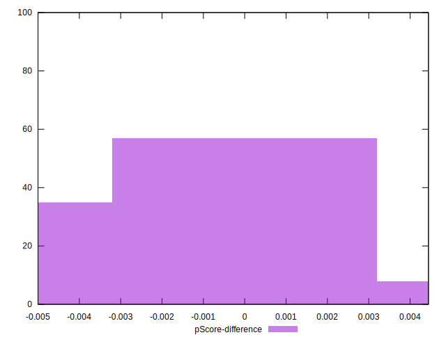