# //unused-css-rules/samples/pages+cached

[→ Parent](../..)


## Raw


```yaml
p90min: 0
p90max: 600
p90range: 600
p90mean: 98.40425531914893
p90median: 0
p90stdev: 137.7656288503434
p90skewness: 1.5376542435643272
p90eccentricity: 1
p90discretization: 3.357142857142857
outlandishness: 1.3000437135427318
confidence: 64.91140329885495
p90confidence: 55.6999799483656

```

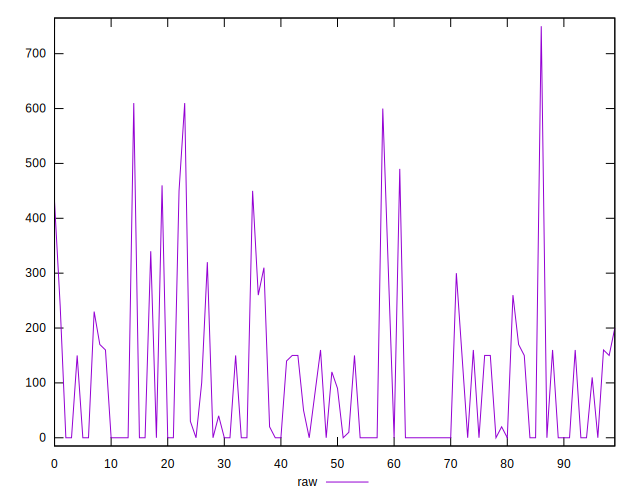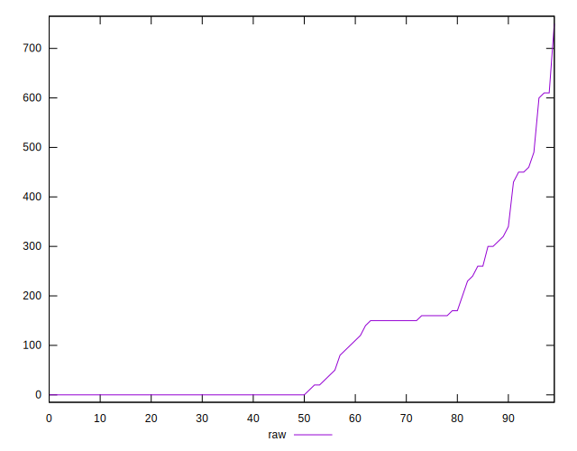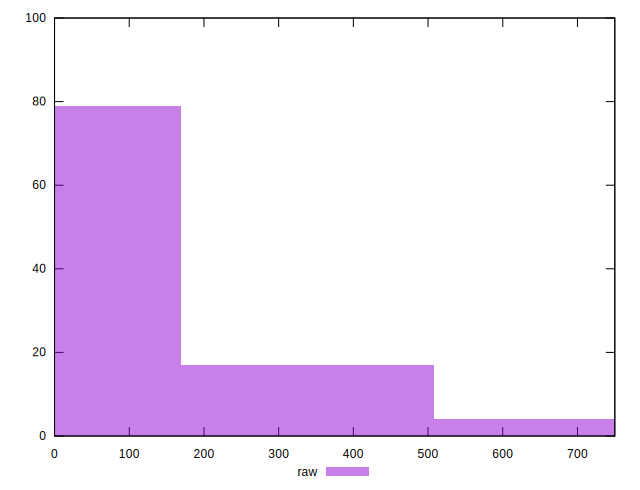
## Score


```yaml
p90min: 0.58
p90max: 1
p90range: 0.42000000000000004
p90mean: 0.9221276595744682
p90median: 1
p90stdev: 0.10537544165047681
p90skewness: -1.3122435082846358
p90eccentricity: 0.9999999999999983
p90discretization: 3.9166666666666665
outlandishness: 0.9811601850256677
confidence: 0.047472318378685166
p90confidence: 0.04260431310742786

```

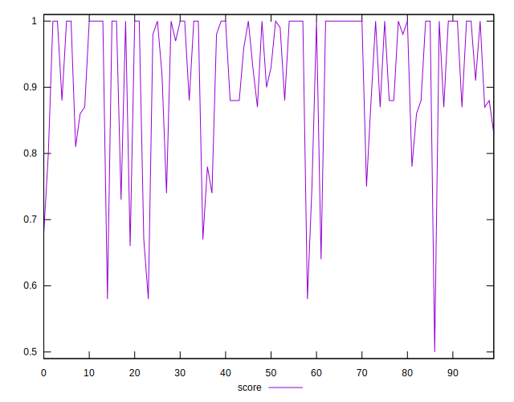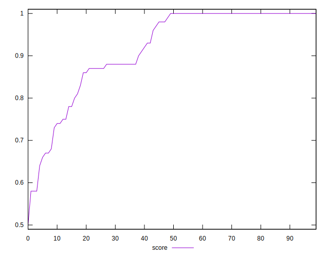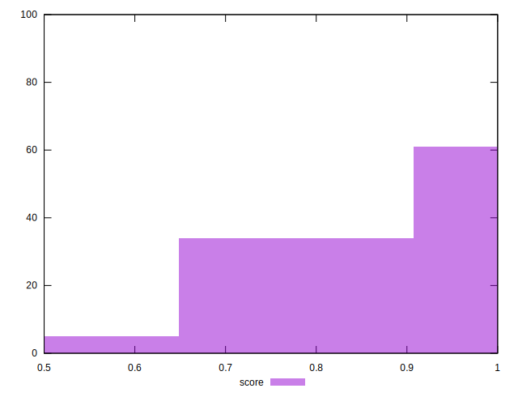
## Raw Estimate

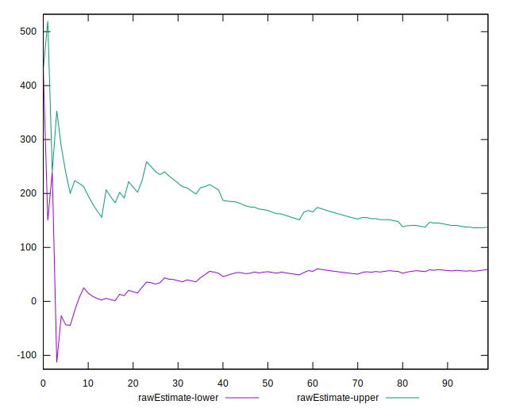
## Score Estimate

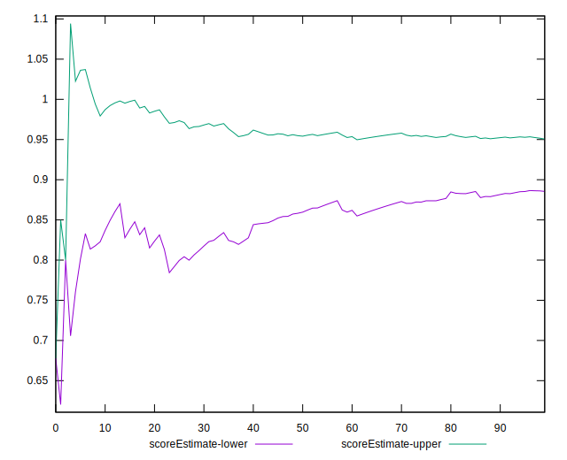
## P Score


```yaml
p90min: 0.5833333333333334
p90max: 1
p90range: 0.41666666666666663
p90mean: 0.9213947990543733
p90median: 1
p90stdev: 0.10555309020017717
p90skewness: -1.2779522931381904
p90eccentricity: 1.0000000000000004
p90discretization: 3.357142857142857
outlandishness: 0.9811442549125049
confidence: 0.047557853854344245
p90confidence: 0.04267613813910478

```

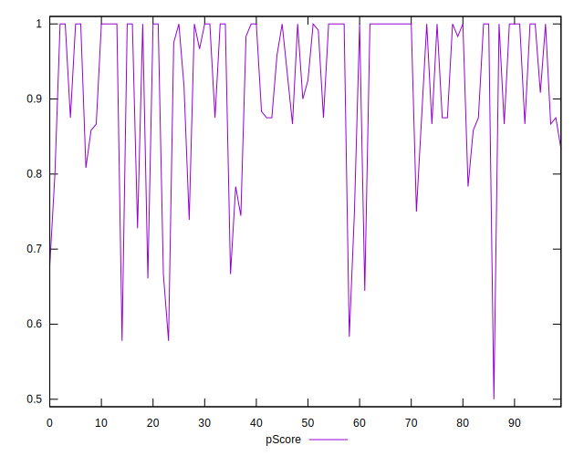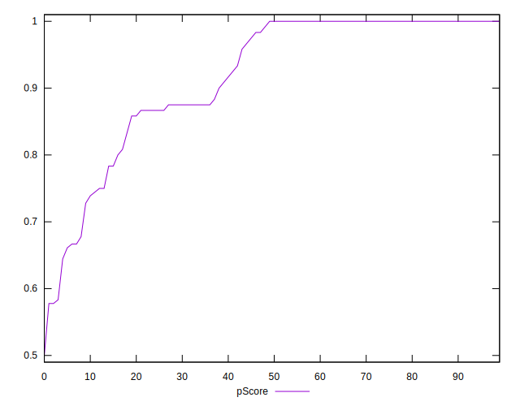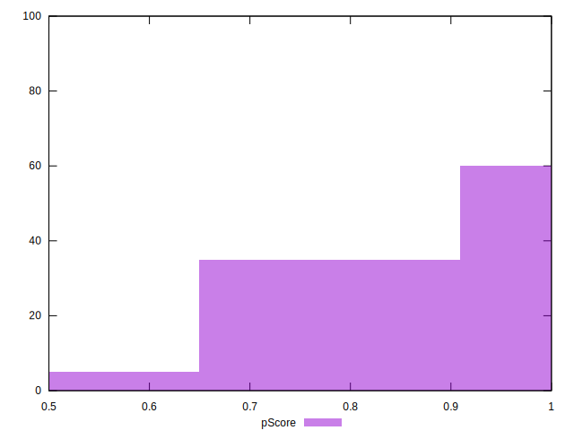
## Score Difference


```yaml
p90min: 0
p90max: 0
p90range: 0
p90mean: 0
p90median: 0
p90stdev: 0
p90skewness: .nan
p90eccentricity: .nan
p90discretization: 94
outlandishness: .inf
confidence: 4.330179641073931e-18
p90confidence: 0

```


## P Score Difference


```yaml
p90min: -0.0050000000000000044
p90max: 0.0033333333333332993
p90range: 0.008333333333333304
p90mean: -0.000750591016548465
p90median: 0
p90stdev: 0.0020623767831928976
p90skewness: -0.4347346270539497
p90eccentricity: 0.9999999999999984
p90discretization: 8.545454545454545
outlandishness: 0.9545443858887686
confidence: 0.0008978408974691878
p90confidence: 0.0008338389366669145

```

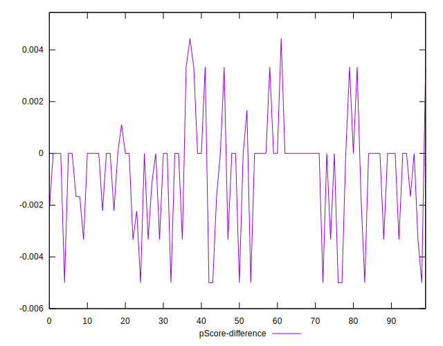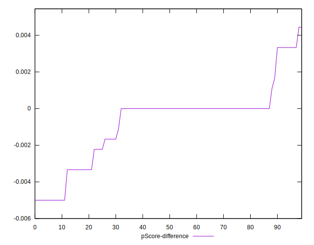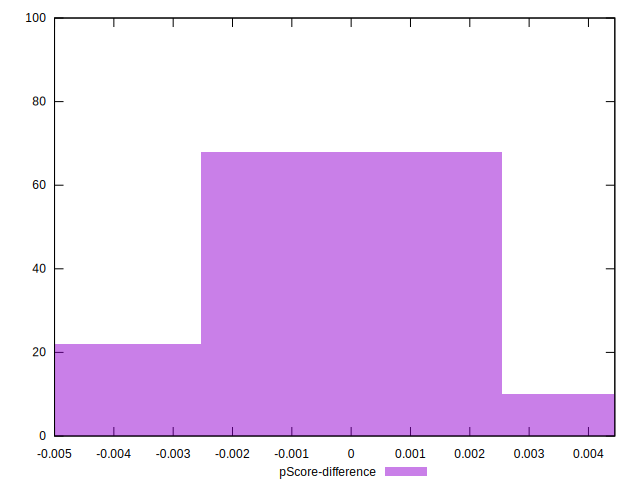