# //unused-javascript/samples/pages+cached+noadtech+nomedia+nocss

[→ Parent](../..)


## Raw


```yaml
p90min: 900
p90max: 1130
p90range: 230
p90mean: 1042.9787234042553
p90median: 1050
p90stdev: 42.89595991575088
p90skewness: -1.8424506352765515
p90eccentricity: 1.0000000000000022
p90discretization: 6.266666666666667
outlandishness: 0.9998490469048096
confidence: 21.33604226430029
p90confidence: 17.34325264662894

```

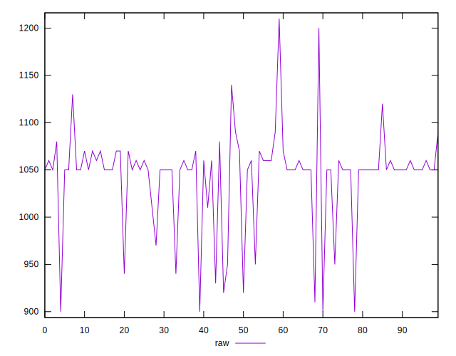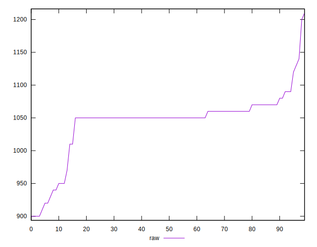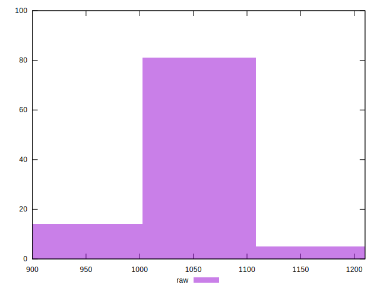
## Score


```yaml
p90min: 0.46
p90max: 0.48
p90range: 0.019999999999999962
p90mean: 0.4624468085106389
p90median: 0.46
p90stdev: 0.006305379367122296
p90skewness: 2.2996338125486058
p90eccentricity: 1.0000000000000044
p90discretization: 31.333333333333332
outlandishness: 1.000662635615052
confidence: 0.002805967569109569
p90confidence: 0.0025493260347040085

```

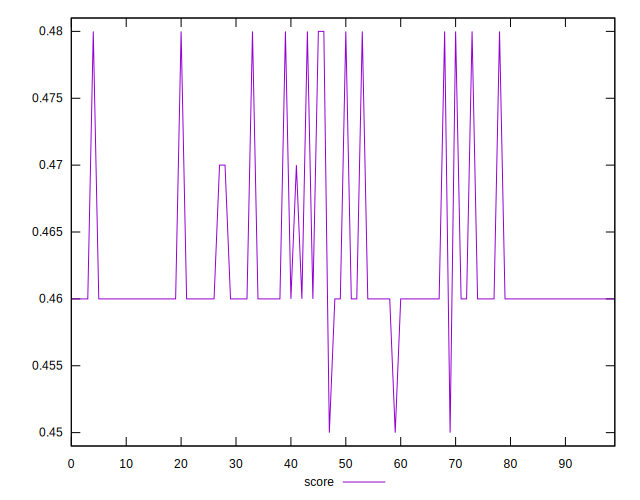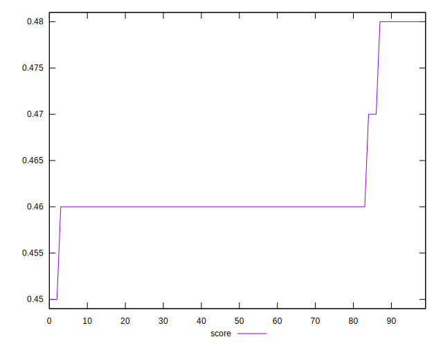
## Raw Estimate

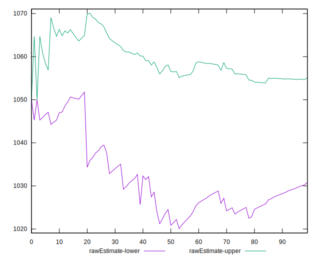
## Score Estimate

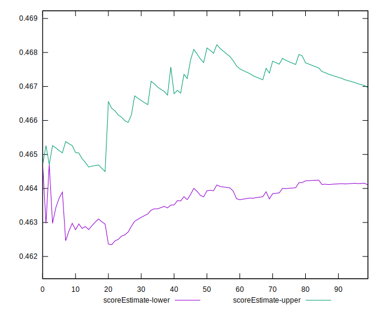
## P Score


```yaml
p90min: 0.45529411764705885
p90max: 0.4823529411764706
p90range: 0.027058823529411746
p90mean: 0.46553191489361634
p90median: 0.4647058823529412
p90stdev: 0.005046583519500102
p90skewness: 1.8424506352769212
p90eccentricity: 1.0000000000000018
p90discretization: 6.266666666666667
outlandishness: 1.0000397896204432
confidence: 0.0025101226193294467
p90confidence: 0.0020403826643092867

```

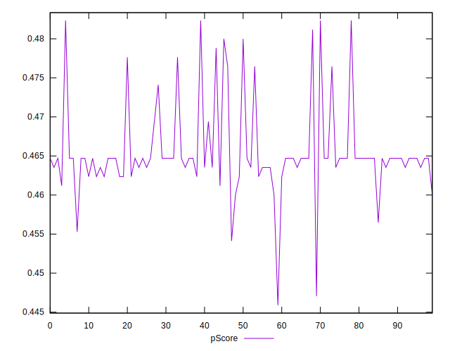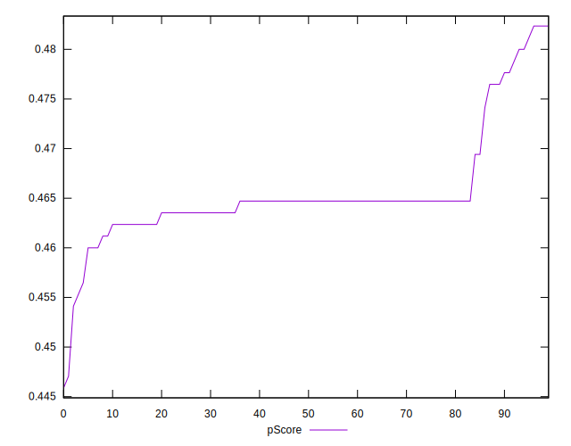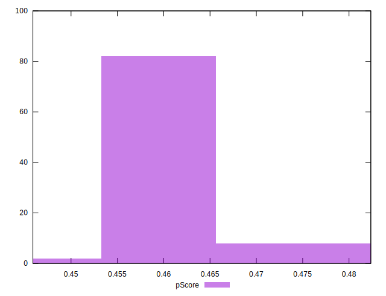
## Score Difference


```yaml
p90min: 0
p90max: 0
p90range: 0
p90mean: 0
p90median: 0
p90stdev: 0
p90skewness: .nan
p90eccentricity: .nan
p90discretization: 94
outlandishness: .inf
confidence: 3.711973057415536e-18
p90confidence: 0

```

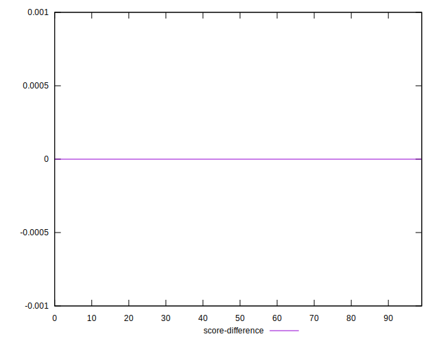
## P Score Difference


```yaml
p90min: -0.003529411764705892
p90max: 0.004705882352941171
p90range: 0.008235294117647063
p90mean: 0.0031101376720901017
p90median: 0.00382352941176467
p90stdev: 0.002215348633518006
p90skewness: -1.5634126716743626
p90eccentricity: 1.0000000000000016
p90discretization: 6.714285714285714
outlandishness: 0.8942993979976436
confidence: 0.0009788283932918457
p90confidence: 0.0008956869394443627

```

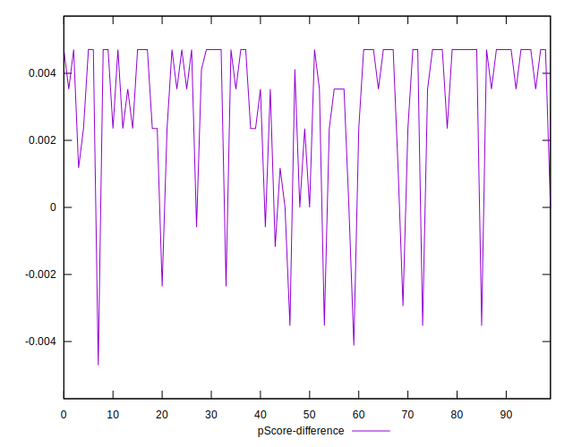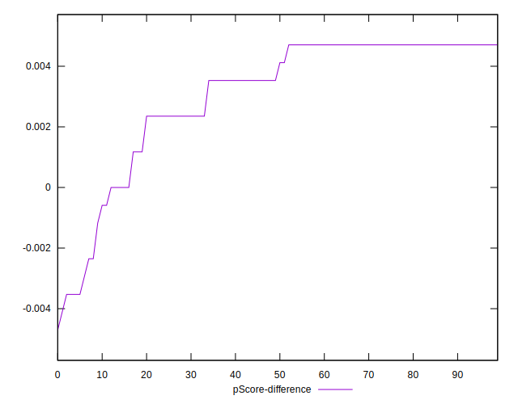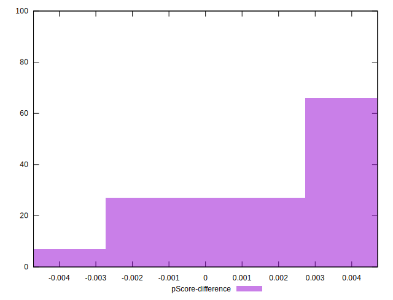