# //unused-javascript/samples/pages+cached

[→ Parent](../..)


## Raw


```yaml
p90min: 3050
p90max: 6060
p90range: 3010
p90mean: 5197.021276595745
p90median: 5555
p90stdev: 790.8678639764739
p90skewness: -1.2832242610288682
p90eccentricity: 1.0000000000000002
p90discretization: 1.3623188405797102
outlandishness: 0.9774915683374649
confidence: 364.64196501399806
p90confidence: 319.755548121149

```

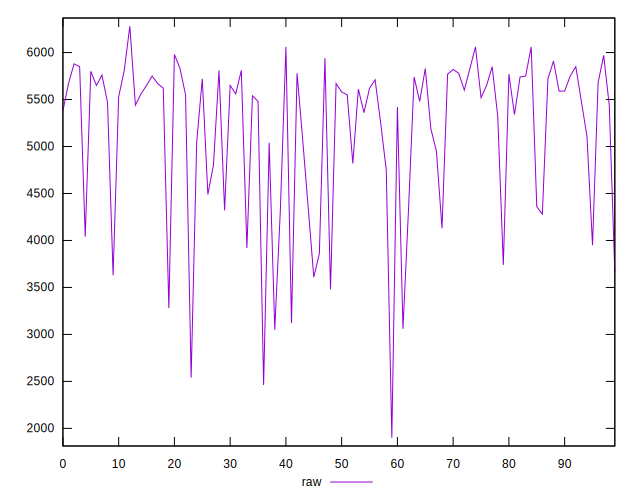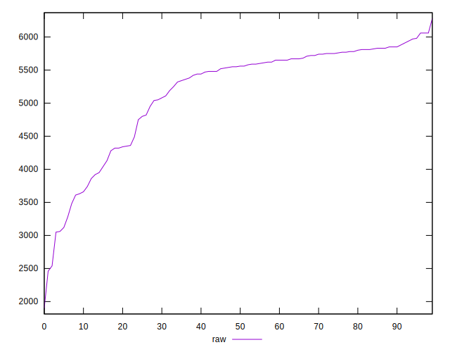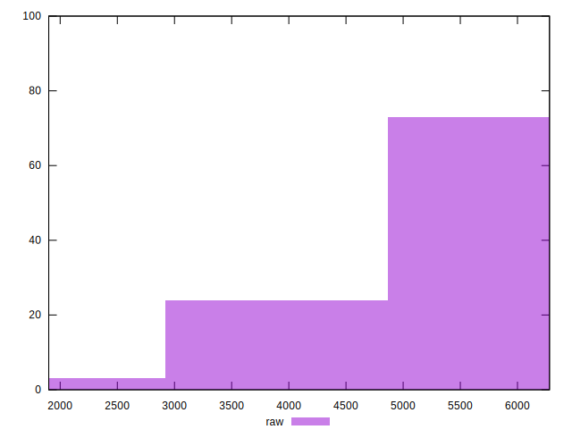
## Score


```yaml
p90min: 0
p90max: 0.23
p90range: 0.23
p90mean: 0.030851063829787237
p90median: 0
p90stdev: 0.06106605378113257
p90skewness: 1.9181413033204293
p90eccentricity: 0.9999999999999997
p90discretization: 5.875
outlandishness: 1.5573318668252079
confidence: 0.030248918600524137
p90confidence: 0.024689597830166048

```

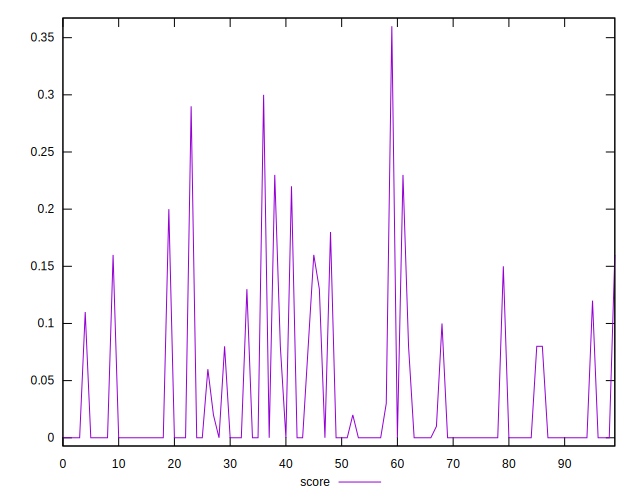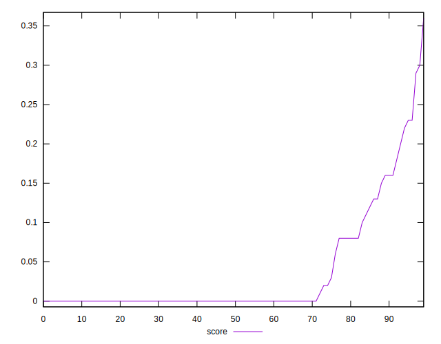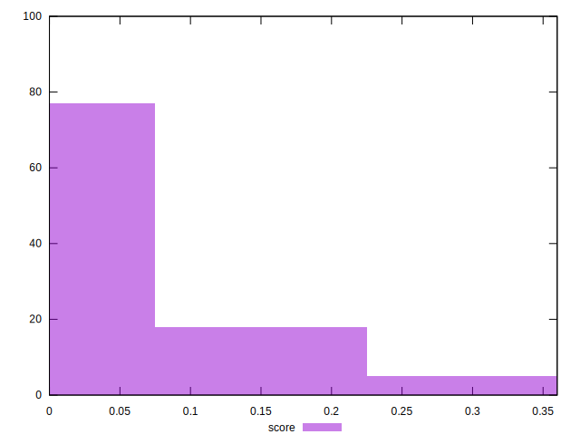
## Raw Estimate

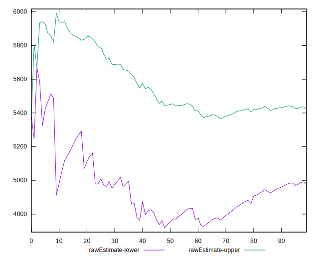
## Score Estimate

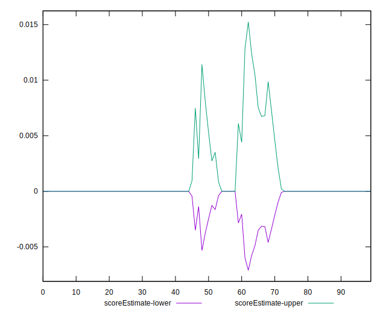
## P Score


```yaml
p90min: 0
p90max: 0.22941176470588237
p90range: 0.22941176470588237
p90mean: 0.03090112640801002
p90median: 0
p90stdev: 0.06119359910687755
p90skewness: 1.9134992443366174
p90eccentricity: 0.9999999999999976
p90discretization: 3.76
outlandishness: 1.5584625143763218
confidence: 0.03033849631479262
p90confidence: 0.02474116564244106

```

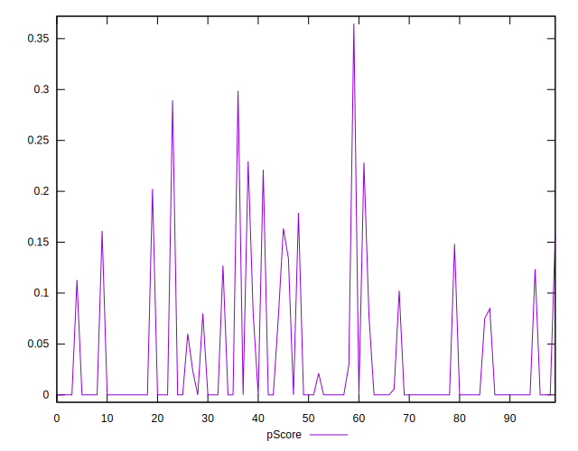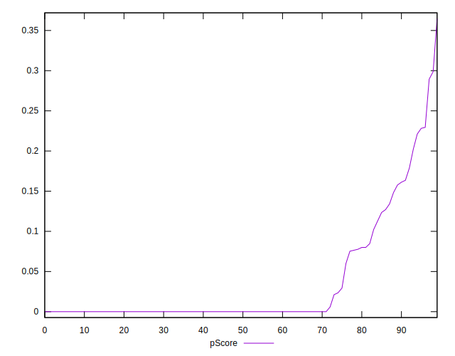
## Score Difference


```yaml
p90min: 0
p90max: 0
p90range: 0
p90mean: 0
p90median: 0
p90stdev: 0
p90skewness: .nan
p90eccentricity: .nan
p90discretization: 94
outlandishness: .nan
confidence: 0
p90confidence: 0

```


## P Score Difference


```yaml
p90min: -0.002941176470588225
p90max: 0.003529411764705892
p90range: 0.006470588235294117
p90mean: 0.00006883604505632077
p90median: 0
p90stdev: 0.0009815210216817863
p90skewness: 1.1609408540409294
p90eccentricity: 0.9999999999999983
p90discretization: 5.222222222222222
outlandishness: 1.2341190082644538
confidence: 0.0005588083192954039
p90confidence: 0.00039683846894760893

```

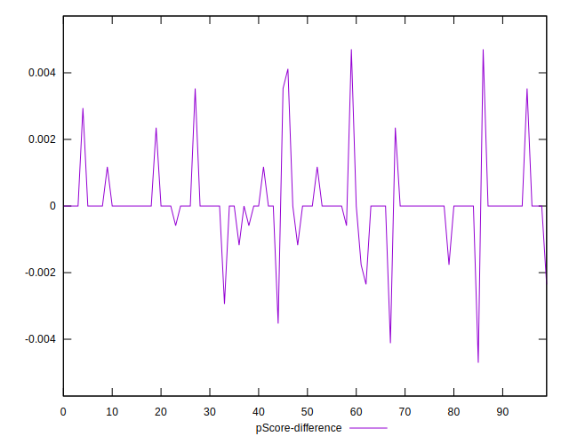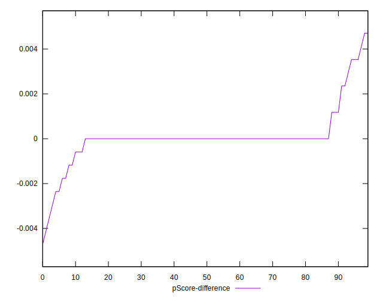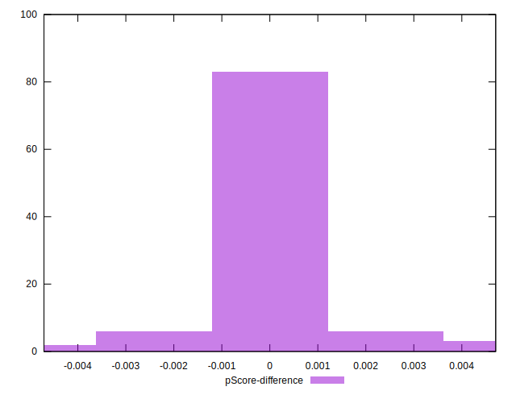