# //unused-javascript/samples/pages

[→ Parent](../..)


## Raw


```yaml
p90min: 2110
p90max: 6240
p90range: 4130
p90mean: 5049.04255319149
p90median: 5510
p90stdev: 1110.583581639062
p90skewness: -1.5656230561598332
p90eccentricity: 1
p90discretization: 1.4461538461538461
outlandishness: 0.979530625688507
confidence: 482.38605396883287
p90confidence: 449.01971373047314

```

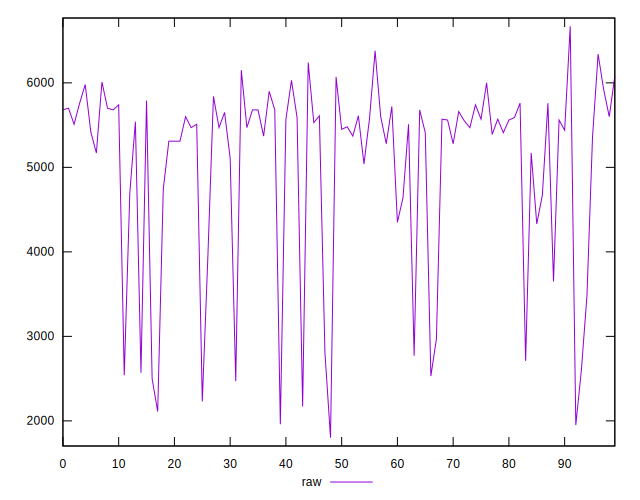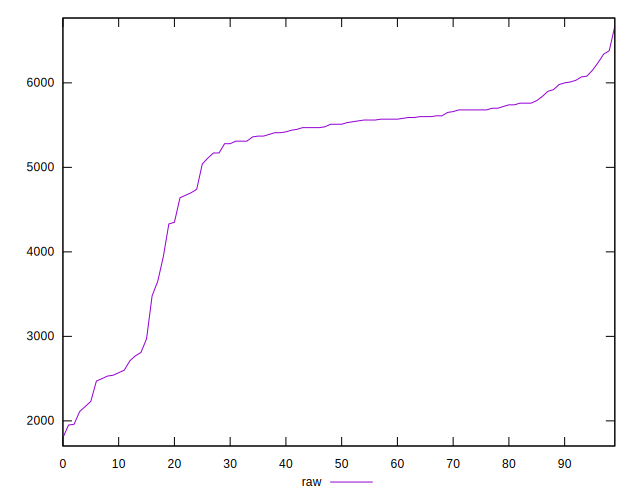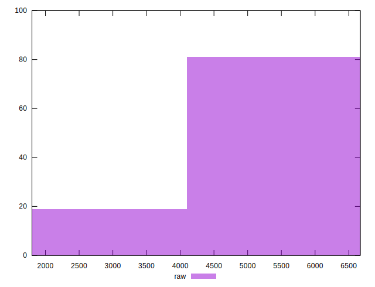
## Score


```yaml
p90min: 0
p90max: 0.34
p90range: 0.34
p90mean: 0.048297872340425534
p90median: 0
p90stdev: 0.10187224266334916
p90skewness: 1.884759581210726
p90eccentricity: 0.9999999999999999
p90discretization: 6.266666666666667
outlandishness: 1.3636477789206076
confidence: 0.04435418850106479
p90confidence: 0.04118793577901517

```

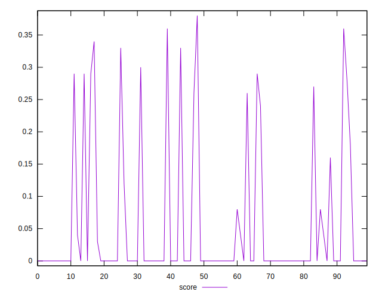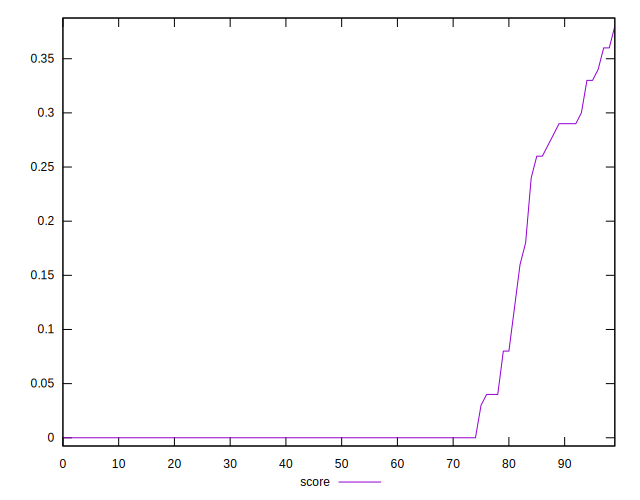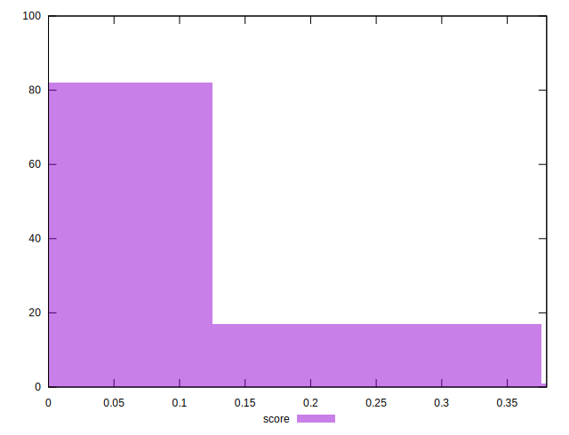
## Raw Estimate

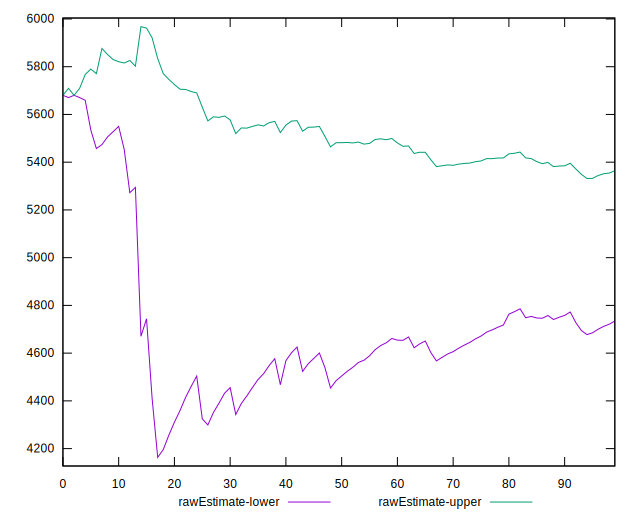
## Score Estimate

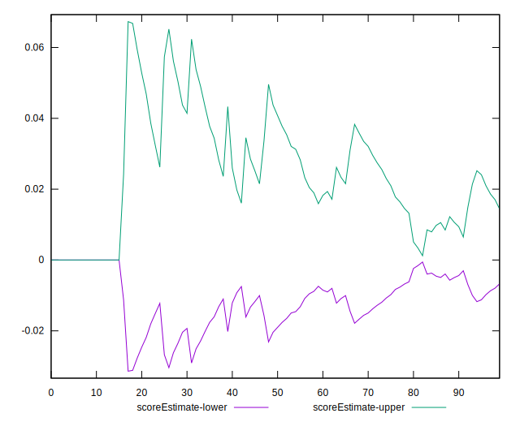
## P Score


```yaml
p90min: 0
p90max: 0.33999999999999997
p90range: 0.33999999999999997
p90mean: 0.048210262828535674
p90median: 0
p90stdev: 0.10179511923338719
p90skewness: 1.8861554187559642
p90eccentricity: 0.9999999999999976
p90discretization: 4.086956521739131
outlandishness: 1.3611959168626517
confidence: 0.04425443135581878
p90confidence: 0.041156754028252814

```

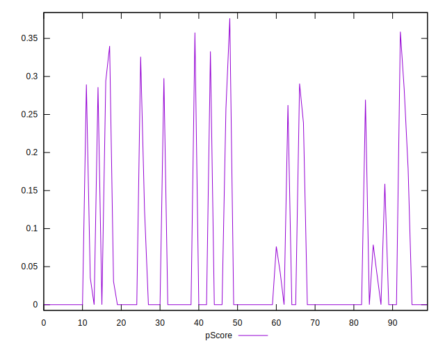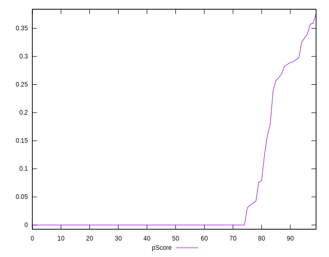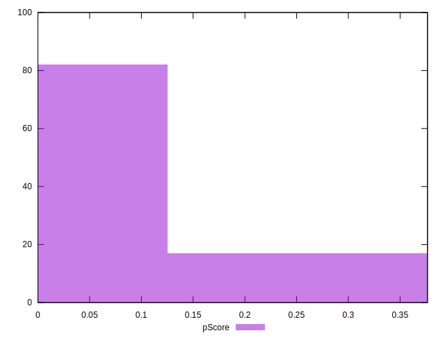
## Score Difference


```yaml
p90min: 0
p90max: 0
p90range: 0
p90mean: 0
p90median: 0
p90stdev: 0
p90skewness: .nan
p90eccentricity: .nan
p90discretization: 94
outlandishness: .nan
confidence: 0
p90confidence: 0

```


## P Score Difference


```yaml
p90min: -0.003529411764705892
p90max: 0.0023529411764705924
p90range: 0.005882352941176484
p90mean: -0.00015018773466833656
p90median: 0
p90stdev: 0.0008360225728242657
p90skewness: -1.2340062973407686
p90eccentricity: 0.9999999999999989
p90discretization: 5.875
outlandishness: 1.037002777777785
confidence: 0.0005100234492792711
p90confidence: 0.0003380120348688595

```

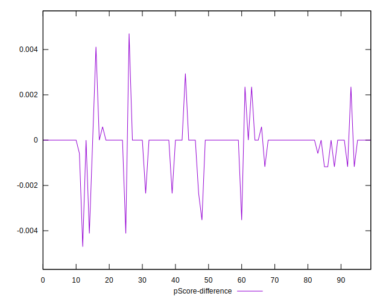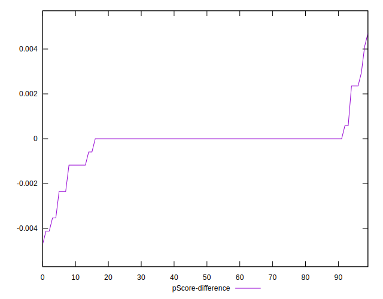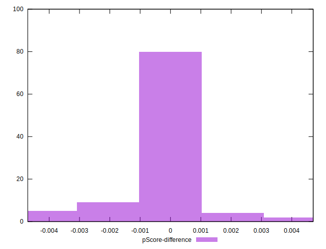