# //uses-http2/samples/pages+cached+noadtech+nomedia

[→ Parent](../..)


## Raw


```yaml
p90min: 250
p90max: 930
p90range: 680
p90mean: 529.7872340425532
p90median: 525
p90stdev: 163.6029100519177
p90skewness: 0.5645196303721965
p90eccentricity: 0.9999999999999999
p90discretization: 2.088888888888889
outlandishness: 1.0232094341865452
confidence: 75.56030011027937
p90confidence: 66.14624333682895

```

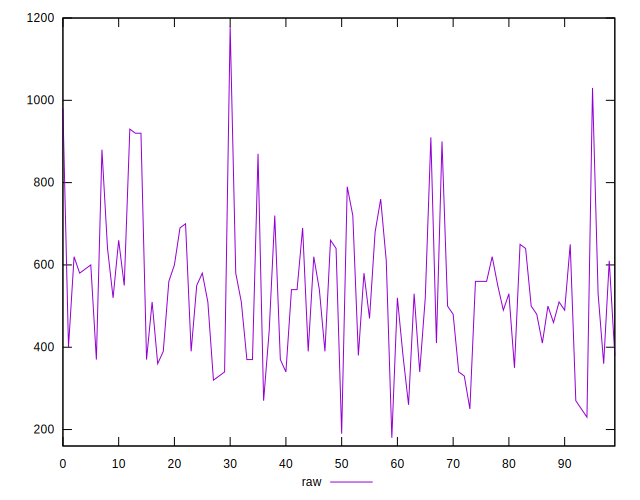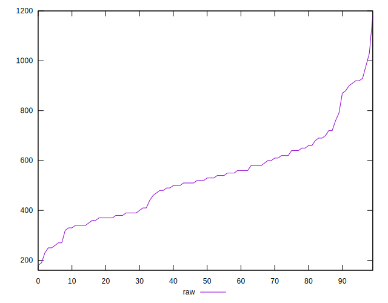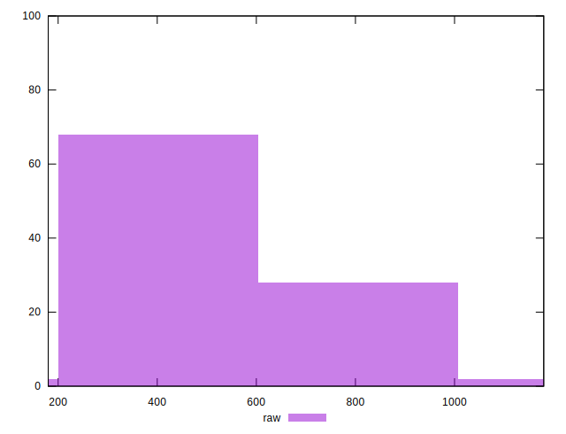
## Score


```yaml
p90min: 0.48
p90max: 0.79
p90range: 0.31000000000000005
p90mean: 0.6282978723404253
p90median: 0.625
p90stdev: 0.0813010991246571
p90skewness: -0.015536085024286906
p90eccentricity: 0.9999999999999997
p90discretization: 3.6153846153846154
outlandishness: 1.0038302777490773
confidence: 0.035713856865859095
p90confidence: 0.03287082292451059

```

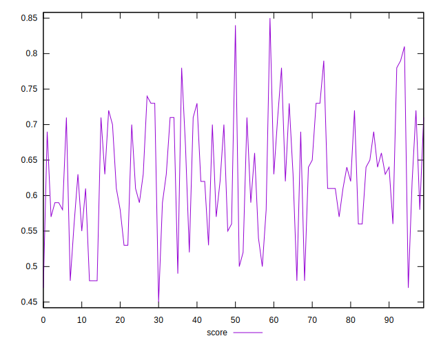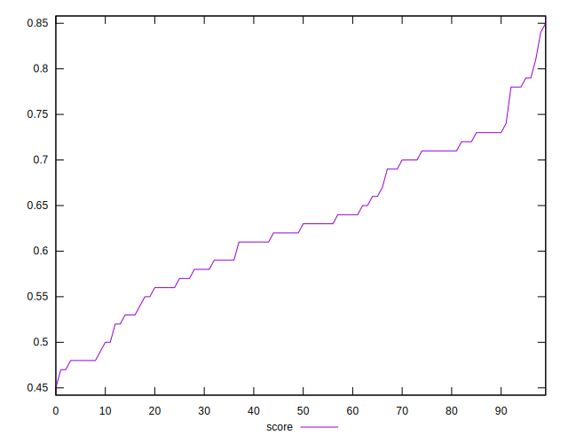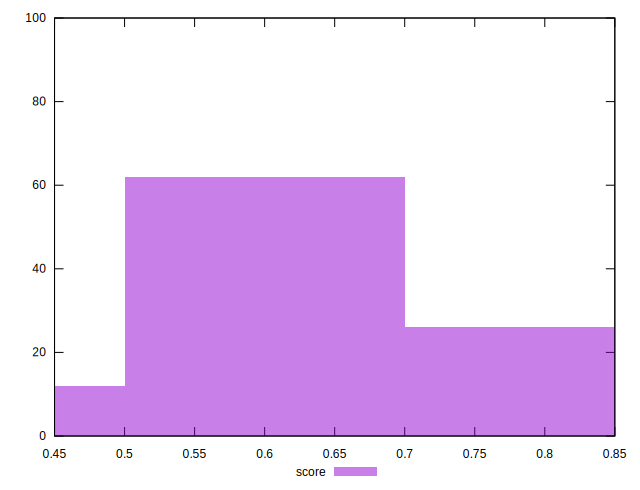
## Raw Estimate

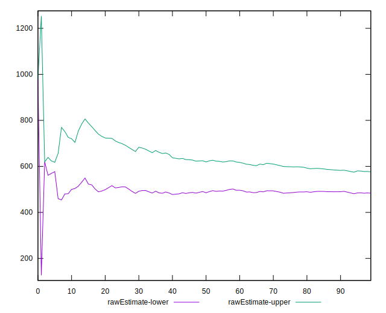
## Score Estimate

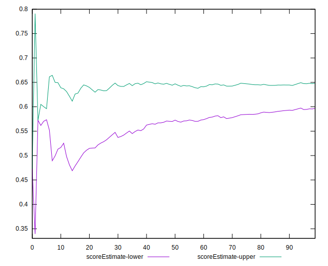
## P Score


```yaml
p90min: 0.4788235294117647
p90max: 0.7916666666666666
p90range: 0.3128431372549019
p90mean: 0.6281956612432205
p90median: 0.625
p90stdev: 0.08115967199860057
p90skewness: -0.02532505658570593
p90eccentricity: 0.9999999999999999
p90discretization: 2.088888888888889
outlandishness: 1.0038317000050176
confidence: 0.03567506272942508
p90confidence: 0.03281364256572848

```

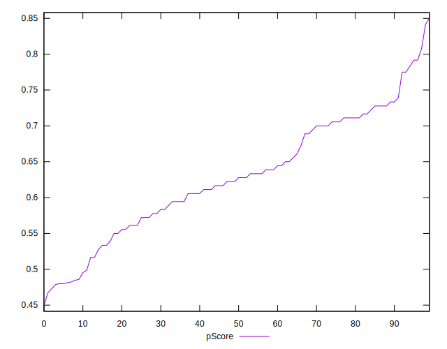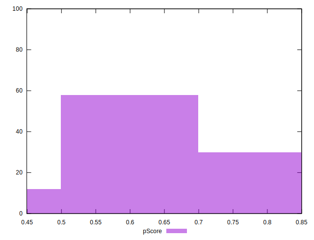
## Score Difference


```yaml
p90min: 0
p90max: 1.1102230246251565e-16
p90range: 1.1102230246251565e-16
p90mean: 9.448706592554524e-18
p90median: 0
p90stdev: 2.990276797139502e-17
p90skewness: 2.9678675841664903
p90eccentricity: 0.9999999999999974
p90discretization: 31.333333333333332
outlandishness: 1.67055625
confidence: 1.3264661553807667e-17
p90confidence: 1.2089979121110657e-17

```

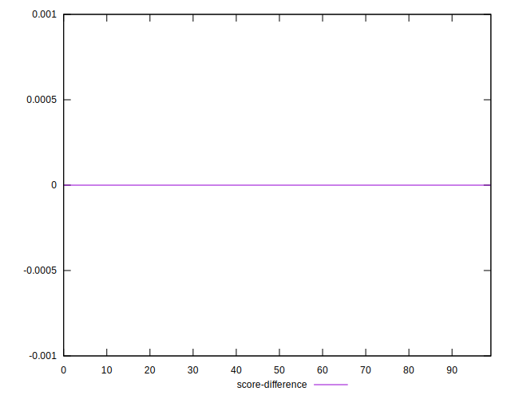
## P Score Difference


```yaml
p90min: -0.004444444444444473
p90max: 0.004444444444444473
p90range: 0.008888888888888946
p90mean: -0.00009664858851341176
p90median: 0
p90stdev: 0.002658587575923275
p90skewness: -0.09279279066746059
p90eccentricity: 1.0000000000000002
p90discretization: 3.9166666666666665
outlandishness: 1.1129491020133622
confidence: 0.001107360947767953
p90confidence: 0.0010748927428826612

```

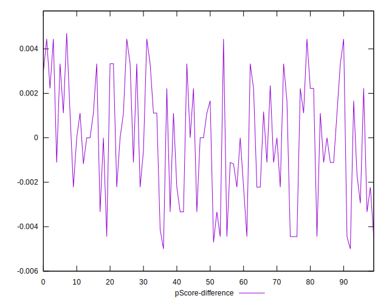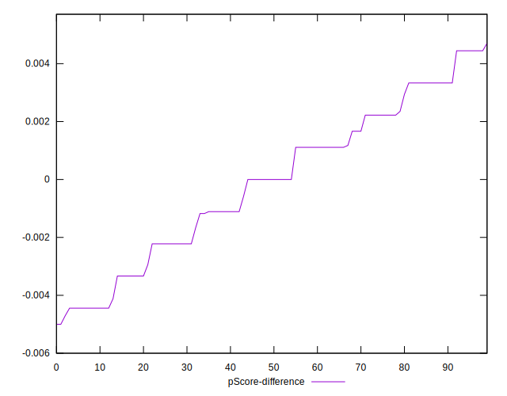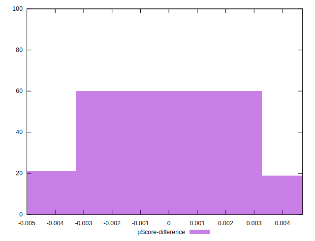