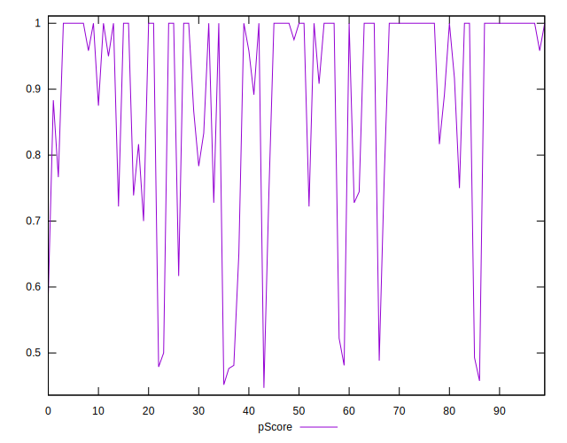

# //uses-http2/samples/pages+cached

[→ Parent](../..)


## Raw


```yaml
p90min: 0
p90max: 950
p90range: 950
p90mean: 149.5744680851064
p90median: 0
p90stdev: 255.69228053823753
p90skewness: 1.8752949284224791
p90eccentricity: 0.9999999999999991
p90discretization: 3.1333333333333333
outlandishness: 1.3735639943829434
confidence: 118.85394196770743
p90confidence: 103.37886900950477

```


## Score


```yaml
p90min: 0.48
p90max: 1
p90range: 0.52
p90mean: 0.8956382978723403
p90median: 1
p90stdev: 0.16279839059426074
p90skewness: -1.4379848937032507
p90eccentricity: 1.0000000000000016
p90discretization: 3.76
outlandishness: 0.9774888657958813
confidence: 0.06902496745049795
p90confidence: 0.06582096831697445

```


## Raw Estimate


## Score Estimate


## P Score


```yaml
p90min: 0.4764705882352941
p90max: 1
p90range: 0.5235294117647059
p90mean: 0.8954366569322766
p90median: 1
p90stdev: 0.16278437222460926
p90skewness: -1.43633864483255
p90eccentricity: 0.9999999999999979
p90discretization: 3.1333333333333333
outlandishness: 0.9774326040898884
confidence: 0.06904978174671858
p90confidence: 0.06581530055415863

```


## Score Difference


```yaml
p90min: 0
p90max: 1.1102230246251565e-16
p90range: 1.1102230246251565e-16
p90mean: 2.362176648138631e-18
p90median: 0
p90stdev: 1.6021061506108986e-17
p90skewness: 6.634888026970374
p90eccentricity: 0.9999999999999988
p90discretization: 47
outlandishness: 5.522500000000001
confidence: 9.484951648085953e-18
p90confidence: 6.477470556979047e-18

```


## P Score Difference


```yaml
p90min: -0.0033333333333334103
p90max: 0.0033333333333332993
p90range: 0.00666666666666671
p90mean: -0.00022528160200250256
p90median: 0
p90stdev: 0.001353775195653766
p90skewness: -0.34348017310264295
p90eccentricity: 0.9999999999999987
p90discretization: 5.529411764705882
outlandishness: 0.9960532845602805
confidence: 0.0006618343455827076
p90confidence: 0.0005473444420191569

```

