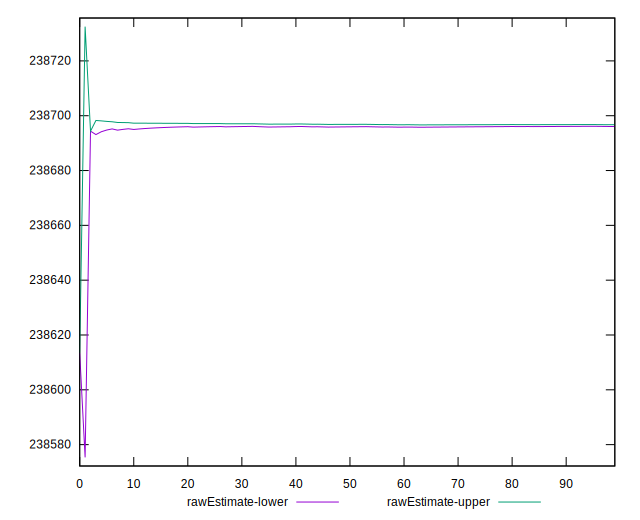

# //uses-long-cache-ttl/samples/pages+cached+noadtech+nomedia+nocss

[→ Parent](../..)


## Raw


```yaml
p90min: 238694.36666666667
p90max: 238697.01666666666
p90range: 2.6499999999941792
p90mean: 238696.3964539008
p90median: 238697.01666666666
p90stdev: 1.1220071099262767
p90skewness: -1.2562972692876004
p90eccentricity: 0.9999999999999997
p90discretization: 47
outlandishness: 0.9999927205800677
confidence: 3.264885890704738
p90confidence: 0.4536383570150667

```


## Score


```yaml
p90min: 0.31
p90max: 0.31
p90range: 0
p90mean: 0.3099999999999995
p90median: 0.31
p90stdev: 4.996003610813204e-16
p90skewness: 1
p90eccentricity: 1
p90discretization: 94
outlandishness: 0.9999999999999996
confidence: 2.175997143072433e-16
p90confidence: 2.0199327166470086e-16

```


## Raw Estimate


## Score Estimate


## P Score


```yaml
p90min: 0.3066149523844776
p90max: 0.3066182391944002
p90range: 0.000003286809922564693
p90mean: 0.3066157216378638
p90median: 0.3066149523844776
p90stdev: 0.000001391631736642234
p90skewness: 1.2562972687812144
p90eccentricity: 1.0000000000000022
p90discretization: 47
outlandishness: 1.000007030391583
confidence: 0.000004050423321145794
p90confidence: 5.626502087156003e-7

```


## Score Difference


```yaml
p90min: 0
p90max: 0
p90range: 0
p90mean: 0
p90median: 0
p90stdev: 0
p90skewness: .nan
p90eccentricity: .nan
p90discretization: 94
outlandishness: .nan
confidence: 0
p90confidence: 0

```


## P Score Difference


```yaml
p90min: -0.003385047615522385
p90max: -0.0033817608055998205
p90range: 0.000003286809922564693
p90mean: -0.003384278362136253
p90median: -0.003385047615522385
p90stdev: 0.0000013916317366422338
p90skewness: 1.2562972690738397
p90eccentricity: 1.0000000000000036
p90discretization: 47
outlandishness: 0.9993631488572752
confidence: 0.000004050423321145794
p90confidence: 5.626502087156002e-7

```

