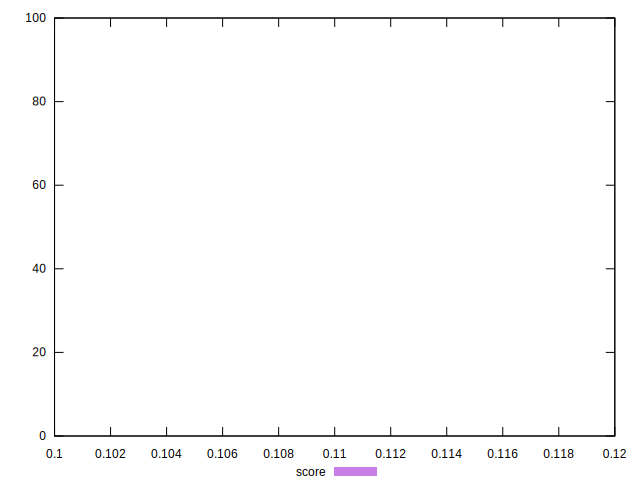

# //uses-long-cache-ttl/samples/pages+cached+noadtech+nomedia

[→ Parent](../..)


## Raw


```yaml
p90min: 571113.6166666667
p90max: 571116.2666666666
p90range: 2.6499999999068677
p90mean: 571115.7874113469
p90median: 571116.2666666666
p90stdev: 1.019971046029743
p90skewness: -1.658369976829158
p90eccentricity: 0.9999999999999988
p90discretization: 47
outlandishness: 0.9999902568342002
confidence: 10.676061923330257
p90confidence: 0.4123841867225547

```


## Score


```yaml
p90min: 0.11
p90max: 0.11
p90range: 0
p90mean: 0.10999999999999997
p90median: 0.11
p90stdev: 2.7755575615628914e-17
p90skewness: 1
p90eccentricity: 1
p90discretization: 94
outlandishness: 0.9999999999999996
confidence: 2.1759971430724333e-17
p90confidence: 1.1221848425816715e-17

```


## Raw Estimate


## Score Estimate


## P Score


```yaml
p90min: 0.10728558787046916
p90max: 0.10728631047497666
p90range: 7.226045075081622e-7
p90mean: 0.10728571855426311
p90median: 0.10728558787046916
p90stdev: 2.781266699678528e-7
p90skewness: 1.6583699780160859
p90eccentricity: 1.0000000000000002
p90discretization: 47
outlandishness: 1.0000141497178192
confidence: 0.0000029125752342747144
p90confidence: 1.1244931024953894e-7

```


## Score Difference


```yaml
p90min: 0
p90max: 0
p90range: 0
p90mean: 0
p90median: 0
p90stdev: 0
p90skewness: .nan
p90eccentricity: .nan
p90discretization: 94
outlandishness: .nan
confidence: 0
p90confidence: 0

```


## P Score Difference


```yaml
p90min: -0.0027144121295308438
p90max: -0.0027136895250233356
p90range: 7.226045075081622e-7
p90mean: -0.002714281445736926
p90median: -0.0027144121295308438
p90stdev: 2.781266699678527e-7
p90skewness: 1.6583699783949923
p90eccentricity: 1.000000000000002
p90discretization: 47
outlandishness: 0.9994407930617593
confidence: 0.0000029125752342747144
p90confidence: 1.1244931024953891e-7

```

