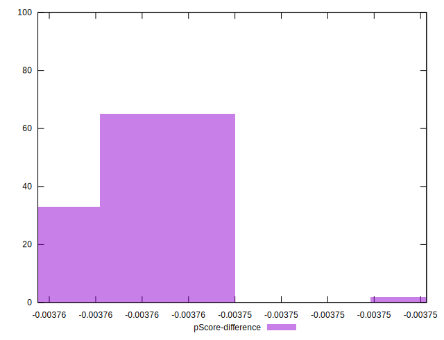

# //uses-long-cache-ttl/samples/pages+cached

[→ Parent](../..)


## Raw


```yaml
p90min: 1306818.7306164186
p90max: 1307023.0850593112
p90range: 204.35444289259613
p90mean: 1306921.9618960617
p90median: 1306922.3387171947
p90stdev: 60.37107415153239
p90skewness: -0.026429558118615647
p90eccentricity: 0.9999999999999992
p90discretization: 1
outlandishness: 0.999994333186816
confidence: 29.22106380831566
p90confidence: 24.408610825233893

```


## Score


```yaml
p90min: 0.03
p90max: 0.03
p90range: 0
p90mean: 0.02999999999999996
p90median: 0.03
p90stdev: 3.8163916471489756e-17
p90skewness: 1
p90eccentricity: 1
p90discretization: 94
outlandishness: 0.9999999999999993
confidence: 1.903997500188379e-17
p90confidence: 1.5430041585497983e-17

```


## Raw Estimate


## Score Estimate


## P Score


```yaml
p90min: 0.026237798667118728
p90max: 0.026245823810474966
p90range: 0.000008025143356238384
p90mean: 0.026241769576191194
p90median: 0.026241754634240777
p90stdev: 0.0000023708135061961456
p90skewness: 0.026566214845553642
p90eccentricity: 1
p90discretization: 1
outlandishness: 1.0000110890093905
confidence: 0.000001147625870916196
p90confidence: 9.585428953392427e-7

```


## Score Difference


```yaml
p90min: 0
p90max: 0
p90range: 0
p90mean: 0
p90median: 0
p90stdev: 0
p90skewness: .nan
p90eccentricity: .nan
p90discretization: 94
outlandishness: .nan
confidence: 0
p90confidence: 0

```


## P Score Difference


```yaml
p90min: -0.003762201332881271
p90max: -0.0037541761895250325
p90range: 0.000008025143356238384
p90mean: -0.003758230423808803
p90median: -0.003758245365759222
p90stdev: 0.0000023708135061961456
p90skewness: 0.026566214835675936
p90eccentricity: 1.0000000000000002
p90discretization: 1
outlandishness: 0.999922572924778
confidence: 0.0000011476258709161962
p90confidence: 9.585428953392427e-7

```

