# //uses-rel-preconnect/samples/pages+cached+noadtech+nomedia+nocss

[→ Parent](../..)


## Raw


```yaml
p90min: 70.6299999654293
p90max: 356.34999999999997
p90range: 285.72000003457066
p90mean: 227.01717021069118
p90median: 226.70299999415874
p90stdev: 80.96523483597932
p90skewness: -0.33050260773550877
p90eccentricity: 1.0000000000000002
p90discretization: 1.032967032967033
outlandishness: 0.9842913007049501
confidence: 35.23518341461339
p90confidence: 32.73502973501303

```

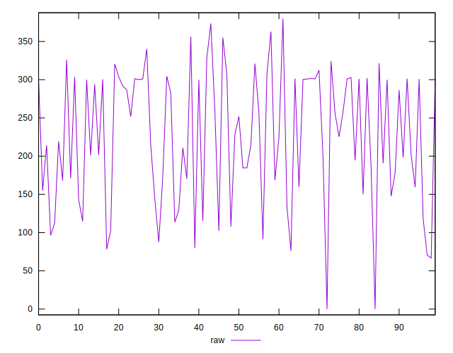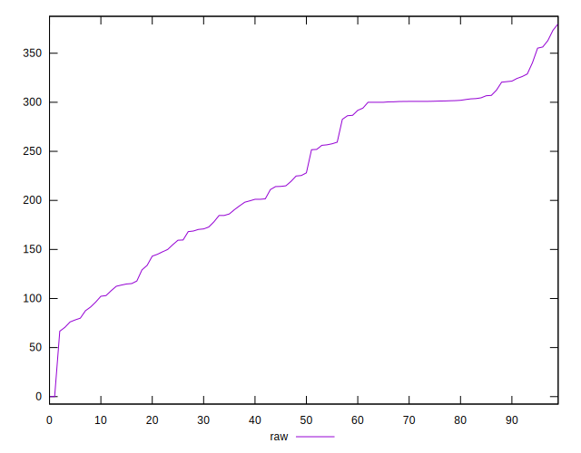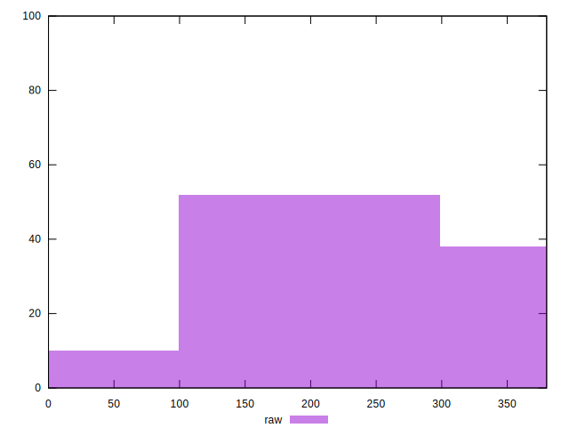
## Score


```yaml
p90min: 0.72
p90max: 0.94
p90range: 0.21999999999999997
p90mean: 0.8120212765957449
p90median: 0.81
p90stdev: 0.06569723895934244
p90skewness: 0.3838024584438528
p90eccentricity: 0.9999999999999996
p90discretization: 4.476190476190476
outlandishness: 1.005126427508349
confidence: 0.0283109724918919
p90confidence: 0.026562030916096935

```

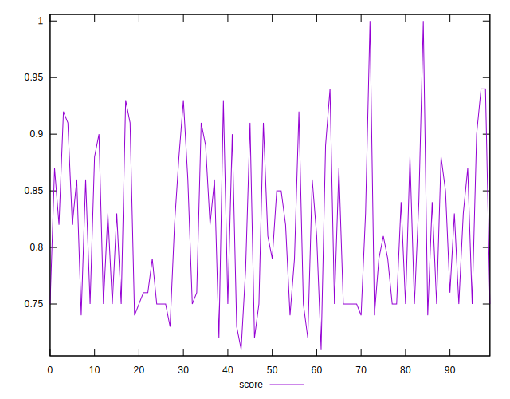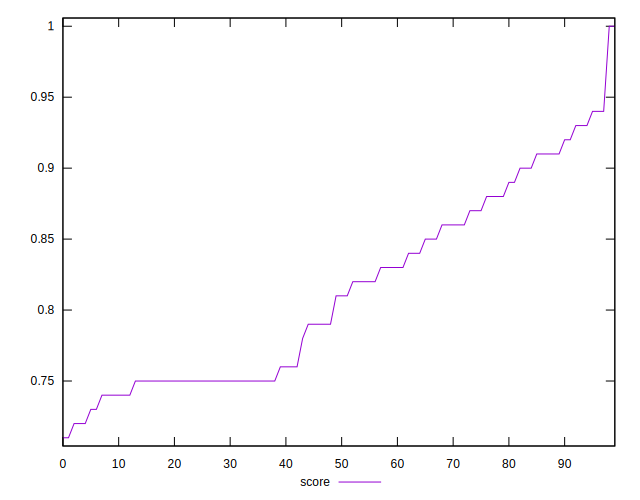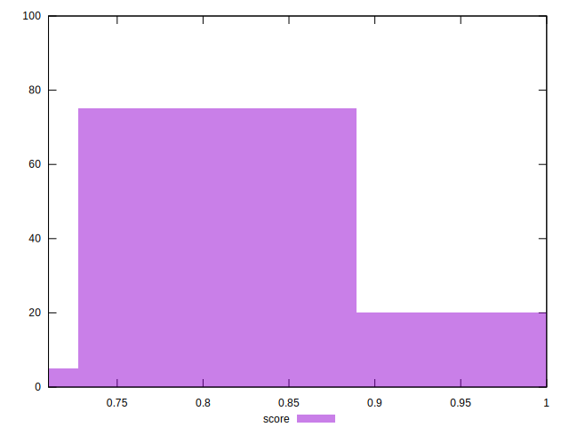
## Raw Estimate

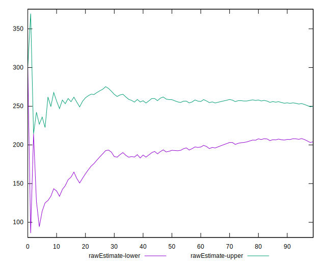
## Score Estimate

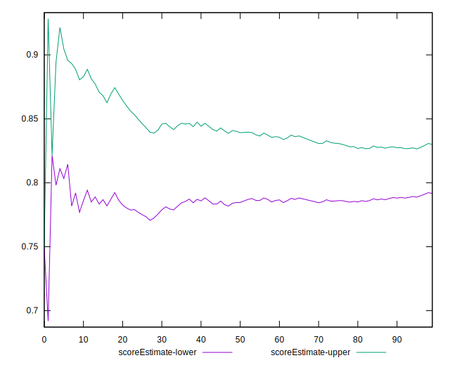
## P Score


```yaml
p90min: 0.7186944444444444
p90max: 0.9411416666954756
p90range: 0.2224472222510312
p90mean: 0.8118567582758457
p90median: 0.8110808333382011
p90stdev: 0.06616188632331393
p90skewness: 0.3807011366945033
p90eccentricity: 1
p90discretization: 1.032967032967033
outlandishness: 1.0050085065650511
confidence: 0.028554747090685784
p90confidence: 0.02674989235201712

```

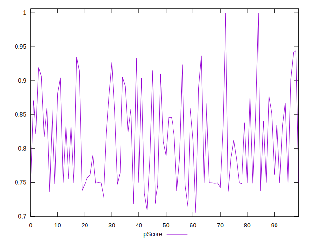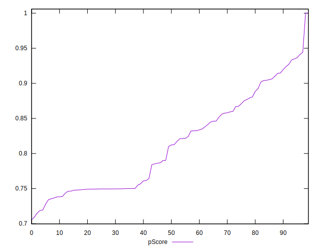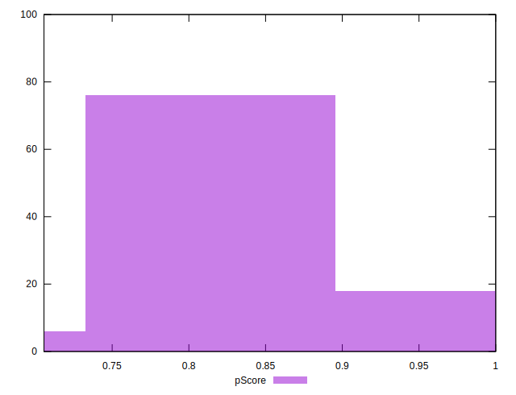
## Score Difference


```yaml
p90min: 0
p90max: 1.1102230246251565e-16
p90range: 1.1102230246251565e-16
p90mean: 1.1810883240693155e-17
p90median: 0
p90stdev: 3.423119174922788e-17
p90skewness: 2.5532425695667107
p90eccentricity: 1
p90discretization: 47
outlandishness: 1.4932839999999998
confidence: 1.463590624989346e-17
p90confidence: 1.384000283635259e-17

```

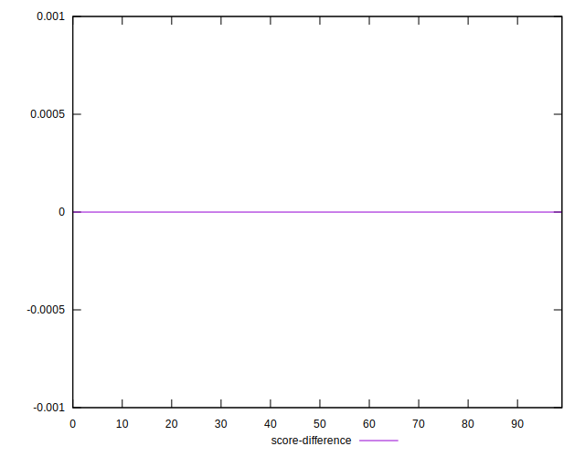
## P Score Difference


```yaml
p90min: -0.004743333334724209
p90max: 0.004840000023444535
p90range: 0.009583333358168744
p90mean: -0.00022598108499185436
p90median: -0.00048666666666663527
p90stdev: 0.0025170986889773367
p90skewness: 0.2697683562074997
p90eccentricity: 1
p90discretization: 1.0561797752808988
outlandishness: 0.8857967351247269
confidence: 0.0010659942787037112
p90confidence: 0.001017687413573952

```

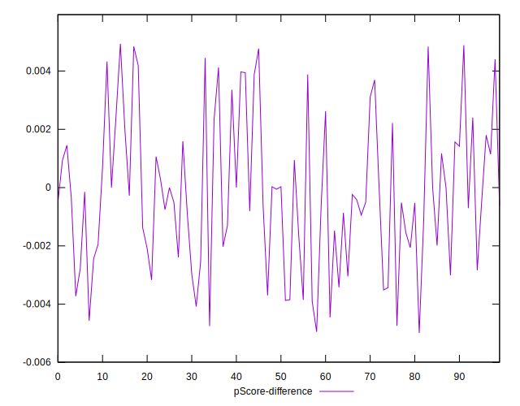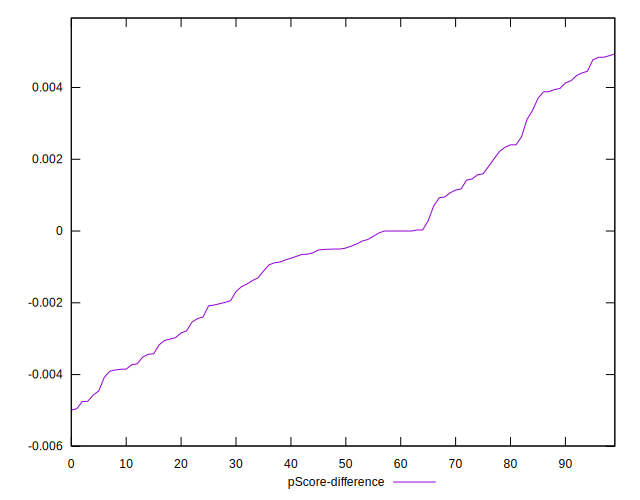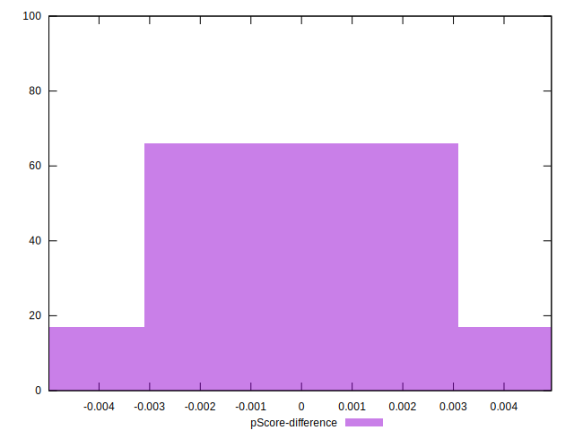