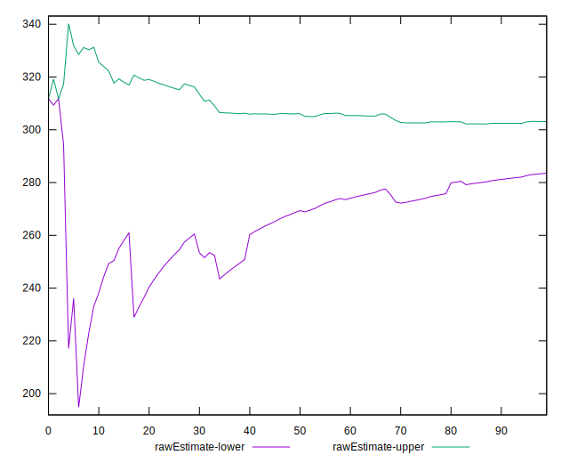

# //uses-rel-preconnect/samples/pages+cached+noadtech+nomedia

[→ Parent](../..)


## Raw


```yaml
p90min: 145.5329999923706
p90max: 343.284
p90range: 197.7510000076294
p90mean: 293.33115957414833
p90median: 301.041
p90stdev: 34.50495078090614
p90skewness: -2.626000109927423
p90eccentricity: 1.0000000000000002
p90discretization: 1.175
outlandishness: 0.9740797373210814
confidence: 21.182689608449248
p90confidence: 13.950686268079437

```


## Score


```yaml
p90min: 0.73
p90max: 0.88
p90range: 0.15000000000000002
p90mean: 0.757659574468085
p90median: 0.75
p90stdev: 0.027921833595025307
p90skewness: 2.8568098165095384
p90eccentricity: 1.0000000000000007
p90discretization: 7.230769230769231
outlandishness: 1.0098980031498204
confidence: 0.016842193017958428
p90confidence: 0.011289068139441328

```


## Raw Estimate


## Score Estimate


## P Score


```yaml
p90min: 0.7259533333333333
p90max: 0.8787225000063579
p90range: 0.15276916667302454
p90mean: 0.7568571660759743
p90median: 0.7494216666666667
p90stdev: 0.02788367513008938
p90skewness: 2.812779031819474
p90eccentricity: 1.0000000000000002
p90discretization: 1.175
outlandishness: 1.0101570179988846
confidence: 0.01681469146935025
p90confidence: 0.011273640301964533

```


## Score Difference


```yaml
p90min: 0
p90max: 1.1102230246251565e-16
p90range: 1.1102230246251565e-16
p90mean: 1.1810883240693154e-18
p90median: 0
p90stdev: 1.139000331521095e-17
p90skewness: 9.539955591519904
p90eccentricity: 1.0000000000000002
p90discretization: 47
outlandishness: 14.137600000000003
confidence: 8.528132291650278e-18
p90confidence: 4.605088813249998e-18

```


## P Score Difference


```yaml
p90min: -0.0039022222222222513
p90max: 0.0034733333333333283
p90range: 0.00737555555555558
p90mean: -0.0007571069729652288
p90median: -0.0005483333333333174
p90stdev: 0.0016511597892446437
p90skewness: 0.14040170728131357
p90eccentricity: 1.0000000000000004
p90discretization: 1.175
outlandishness: 0.8765578408390584
confidence: 0.000756973798010573
p90confidence: 0.0006675799175742302

```

