# //uses-rel-preconnect/samples/pages+cached

[→ Parent](../..)


## Raw


```yaml
p90min: 300.556
p90max: 438.36
p90range: 137.80400000000003
p90mean: 327.6676170212387
p90median: 307.98699999999997
p90stdev: 37.00510387009326
p90skewness: 1.4936399935536877
p90eccentricity: 1.0000000000000002
p90discretization: 1
outlandishness: 1.0184033364897647
confidence: 16.596079424785472
p90confidence: 14.961522411300946

```

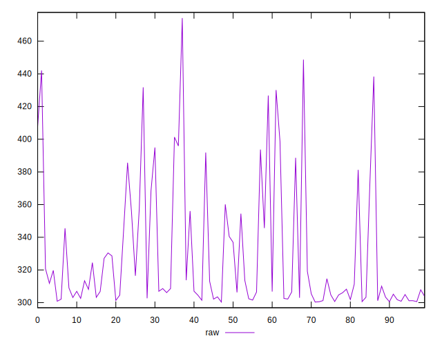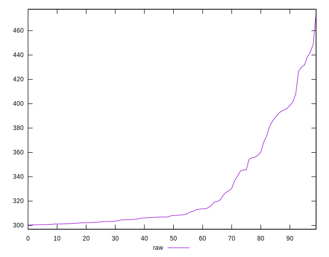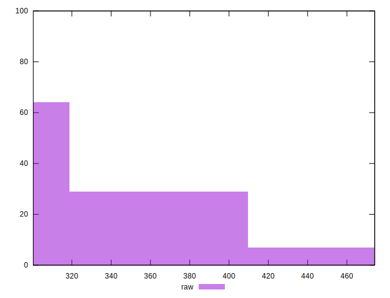
## Score


```yaml
p90min: 0.67
p90max: 0.75
p90range: 0.07999999999999996
p90mean: 0.7356382978723405
p90median: 0.75
p90stdev: 0.021165935631228667
p90skewness: -1.4115522046399436
p90eccentricity: 0.9999999999999984
p90discretization: 10.444444444444445
outlandishness: 0.9952796256077174
confidence: 0.009471230637954135
p90confidence: 0.008557593066471856

```

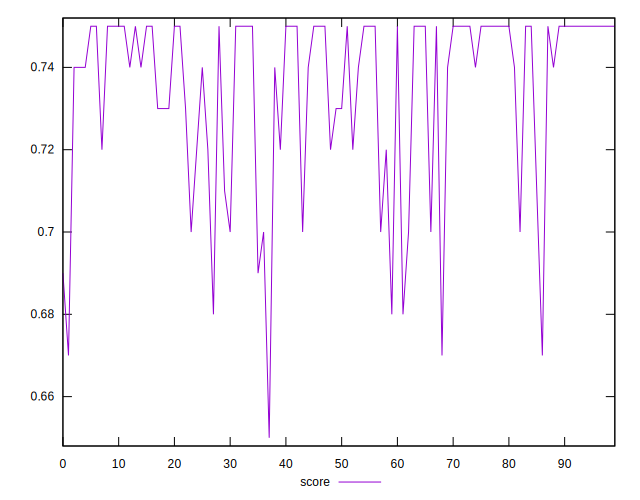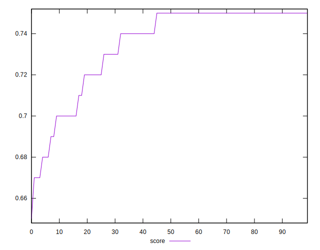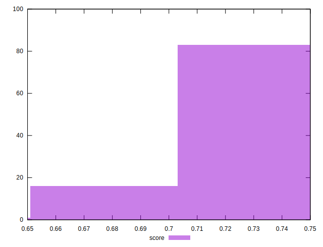
## Raw Estimate

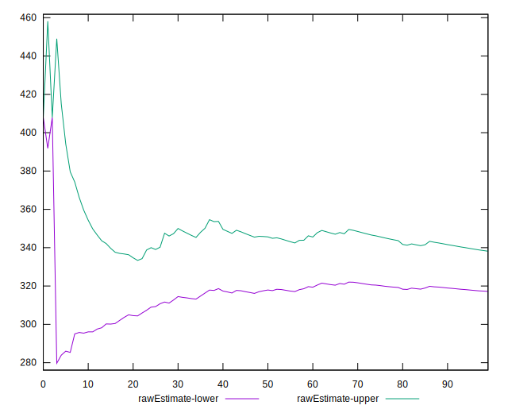
## Score Estimate

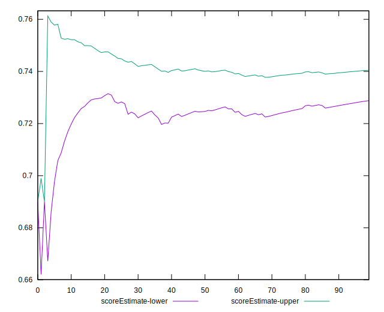
## P Score


```yaml
p90min: 0.6731333333333334
p90max: 0.7496911111111111
p90range: 0.07655777777777772
p90mean: 0.7346291016548675
p90median: 0.7455627777777778
p90stdev: 0.020558391038940704
p90skewness: -1.4936399935537672
p90eccentricity: 1.0000000000000002
p90discretization: 1
outlandishness: 0.9954656833758668
confidence: 0.009220044124880821
p90confidence: 0.008311956895167194

```

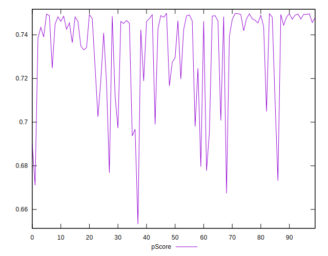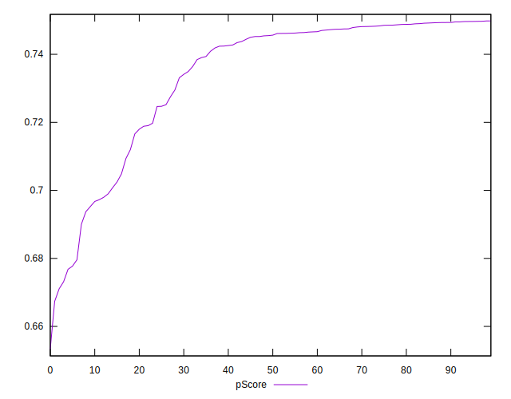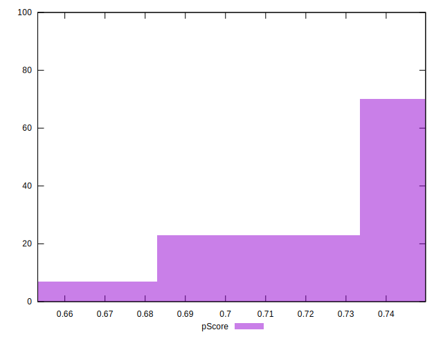
## Score Difference


```yaml
p90min: 0
p90max: 1.1102230246251565e-16
p90range: 1.1102230246251565e-16
p90mean: 8.267618268485208e-18
p90median: 0
p90stdev: 2.91468095031857e-17
p90skewness: 3.241763593892425
p90eccentricity: 0.9999999999999976
p90discretization: 47
outlandishness: 1.8032653061224493
confidence: 1.3055982858434593e-17
p90confidence: 1.1784337780288285e-17

```

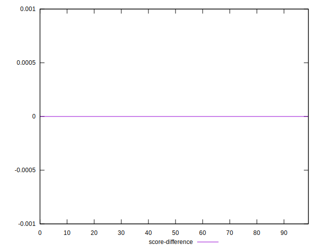
## P Score Difference


```yaml
p90min: -0.004772222222222178
p90max: 0.004666666636864325
p90range: 0.009438888859086503
p90mean: -0.000997234042609544
p90median: -0.0011575000004635516
p90stdev: 0.002302232369914035
p90skewness: 0.6492156462566532
p90eccentricity: 1.0000000000000007
p90discretization: 1.0217391304347827
outlandishness: 0.8853184744046867
confidence: 0.0009954061777876701
p90confidence: 0.0009308148767643093

```

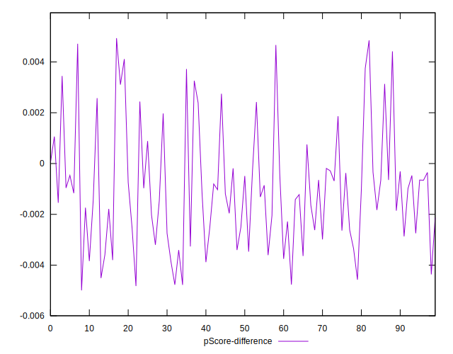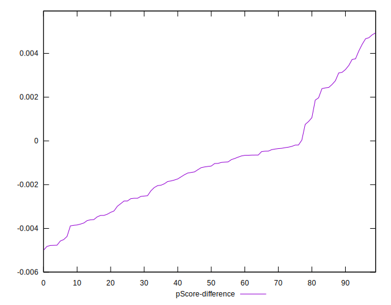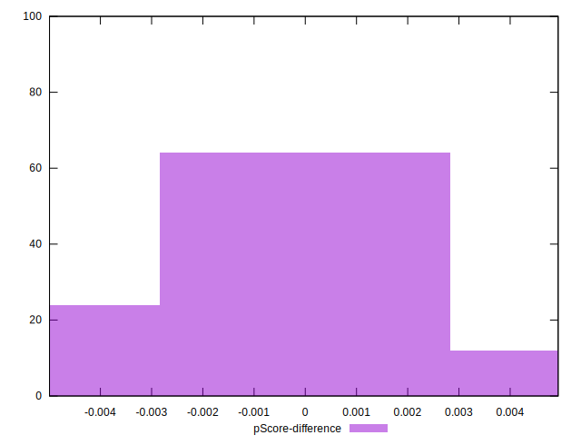