# //uses-rel-preconnect/samples/pages

[→ Parent](../..)


## Raw


```yaml
p90min: 300.392
p90max: 428.094
p90range: 127.702
p90mean: 327.17471276515334
p90median: 315.346
p90stdev: 30.93031740596892
p90skewness: 1.6601111530842532
p90eccentricity: 1
p90discretization: 1
outlandishness: 1.0181735512031371
confidence: 14.635214785002645
p90confidence: 12.505427323825248

```

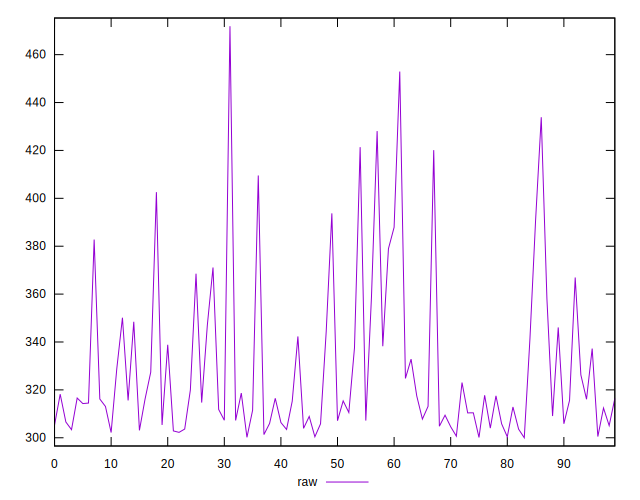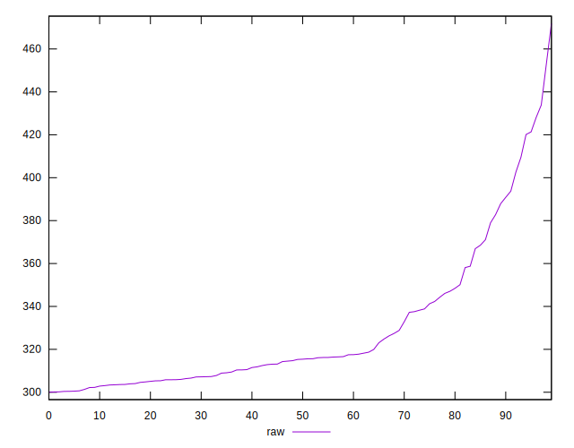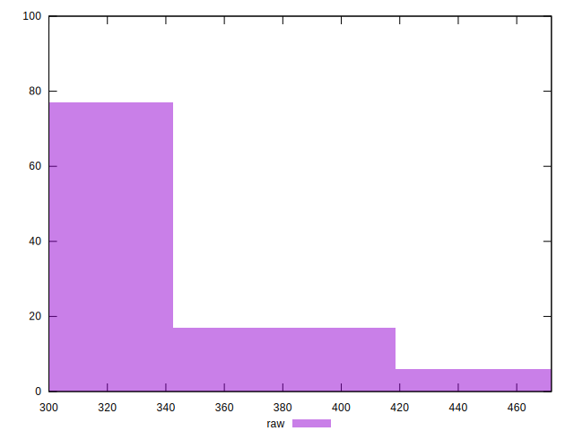
## Score


```yaml
p90min: 0.68
p90max: 0.75
p90range: 0.06999999999999995
p90mean: 0.7351063829787233
p90median: 0.74
p90stdev: 0.01790903022256935
p90skewness: -1.5453103708770002
p90eccentricity: 1
p90discretization: 11.75
outlandishness: 0.9956342976998035
confidence: 0.008322349580323761
p90confidence: 0.007240794620662743

```

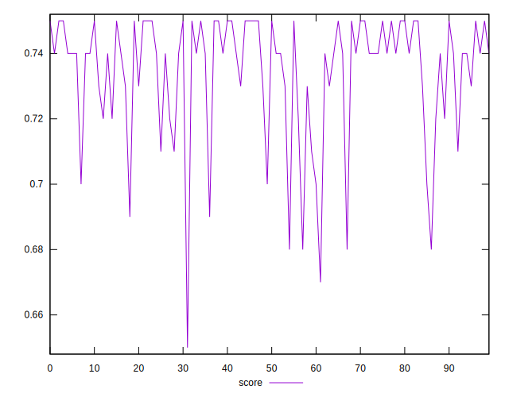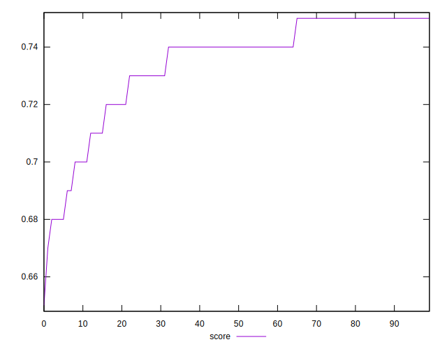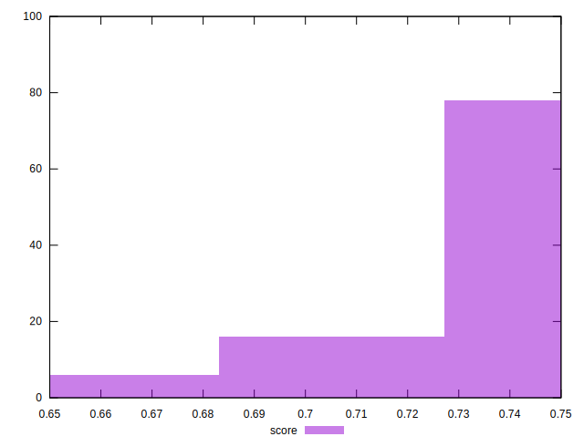
## Raw Estimate

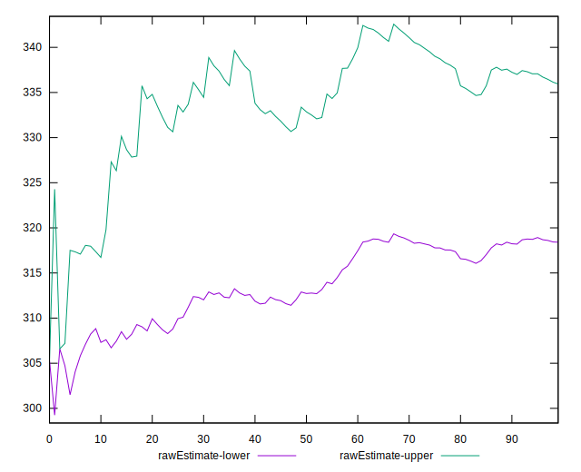
## Score Estimate

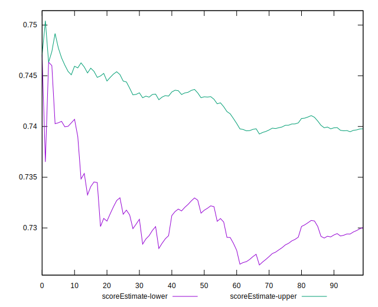
## P Score


```yaml
p90min: 0.6788366666666666
p90max: 0.7497822222222222
p90range: 0.0709455555555556
p90mean: 0.7349029373526924
p90median: 0.7414744444444444
p90stdev: 0.01718350966998273
p90skewness: -1.660111153084238
p90eccentricity: 0.9999999999999999
p90discretization: 1
outlandishness: 0.9955303750103249
confidence: 0.00813067488055703
p90confidence: 0.006947459624347359

```

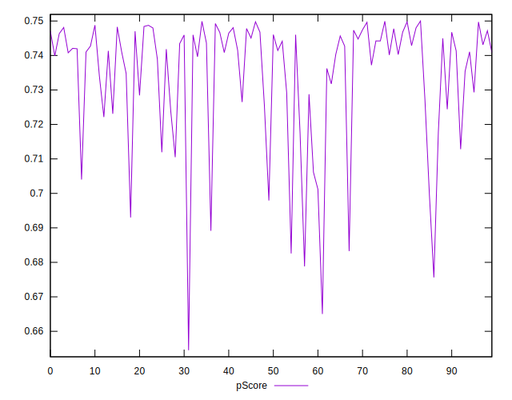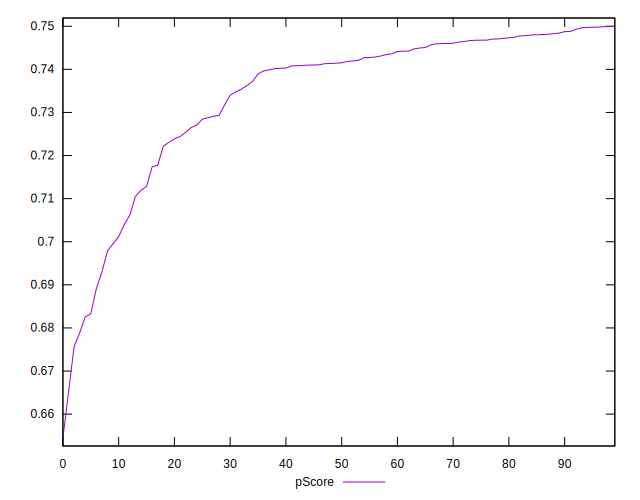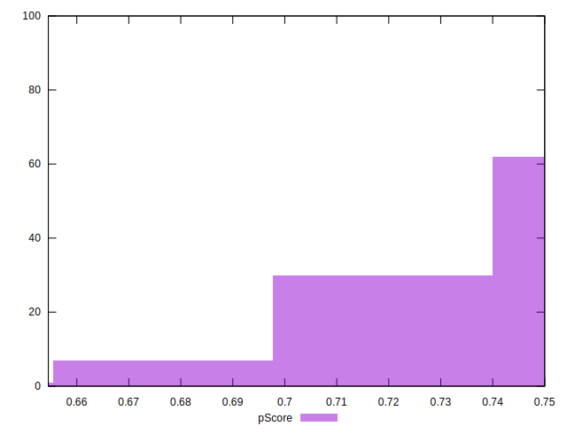
## Score Difference


```yaml
p90min: 0
p90max: 1.1102230246251565e-16
p90range: 1.1102230246251565e-16
p90mean: 3.543264972207946e-18
p90median: 0
p90stdev: 1.951478180216297e-17
p90skewness: 5.326002287485491
p90eccentricity: 1.000000000000004
p90discretization: 47
outlandishness: 3.5344000000000007
confidence: 1.03354137829037e-17
p90confidence: 7.890015558655782e-18

```

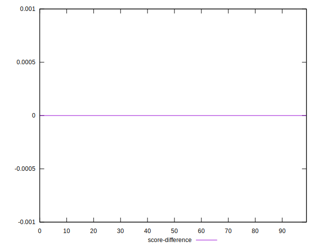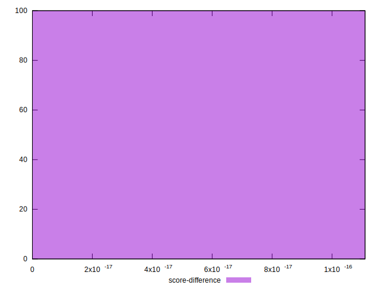
## P Score Difference


```yaml
p90min: -0.004588888888888865
p90max: 0.00451888888888885
p90range: 0.009107777777777715
p90mean: -0.0002563652477802592
p90median: -0.00032333333333334213
p90stdev: 0.002570102828687547
p90skewness: 0.16253679335859106
p90eccentricity: 1.0000000000000002
p90discretization: 1
outlandishness: 0.8857197750258368
confidence: 0.0010818109658482704
p90confidence: 0.001039117501351842

```

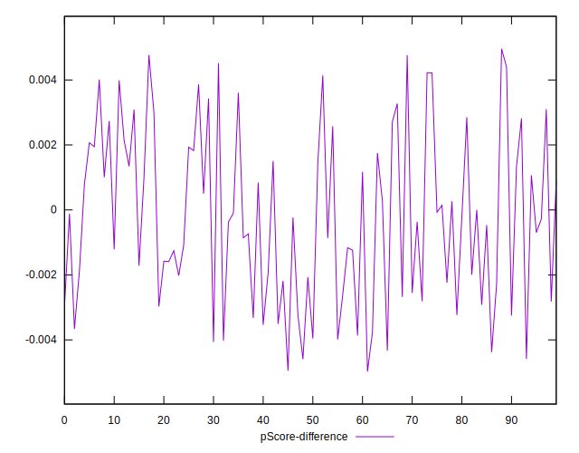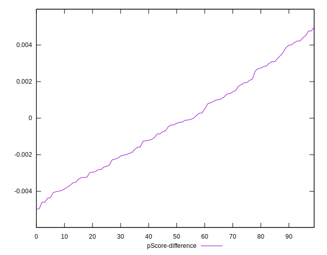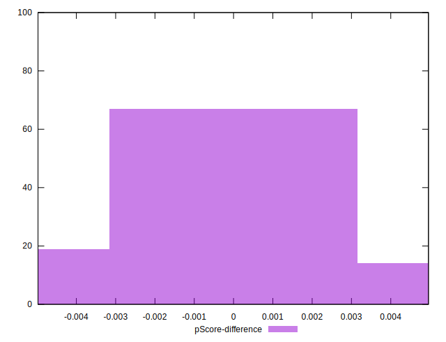