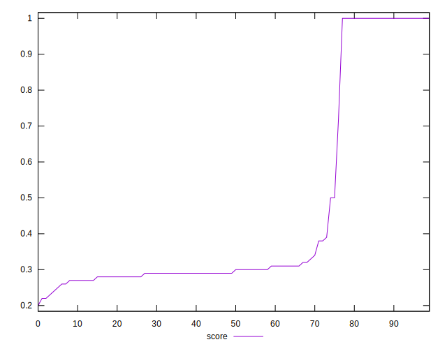

# //uses-rel-preload/samples/pages

[→ Parent](../..)


## Raw


```yaml
p90min: 0
p90max: 3018
p90range: 3018
p90mean: 1912.7340425531916
p90median: 2484
p90stdev: 1065.090708109257
p90skewness: -1.1181721485612879
p90eccentricity: 0.9999999999999999
p90discretization: 1.323943661971831
outlandishness: 0.9797204386528022
confidence: 433.6353414997634
p90confidence: 430.6265037219279

```


## Score


```yaml
p90min: 0.23
p90max: 1
p90range: 0.77
p90mean: 0.4523404255319147
p90median: 0.295
p90stdev: 0.2904048001329254
p90skewness: 1.3011467753879697
p90eccentricity: 1.0000000000000016
p90discretization: 5.529411764705882
outlandishness: 1.0413597696927974
confidence: 0.1175347374351507
p90confidence: 0.11741347736222921

```


## Raw Estimate


## Score Estimate


## P Score


```yaml
p90min: 0.23317647058823526
p90max: 1
p90range: 0.7668235294117647
p90mean: 0.4526341259908216
p90median: 0.29600000000000004
p90stdev: 0.290141175146515
p90skewness: 1.3028609675277265
p90eccentricity: 1.0000000000000007
p90discretization: 1.323943661971831
outlandishness: 1.041428260030481
confidence: 0.11742453433091146
p90confidence: 0.11730689122329538

```


## Score Difference


```yaml
p90min: 0
p90max: 0
p90range: 0
p90mean: 0
p90median: 0
p90stdev: 0
p90skewness: .nan
p90eccentricity: .nan
p90discretization: 94
outlandishness: .nan
confidence: 0
p90confidence: 0

```


## P Score Difference


```yaml
p90min: -0.004588235294117615
p90max: 0.004705882352941171
p90range: 0.009294117647058786
p90mean: 0.0003324989570296174
p90median: 0
p90stdev: 0.002389944939349252
p90skewness: -0.02368857492385628
p90eccentricity: 1
p90discretization: 1.5932203389830508
outlandishness: 0.8969539669620549
confidence: 0.0010199668676205357
p90confidence: 0.0009662779193209438

```

