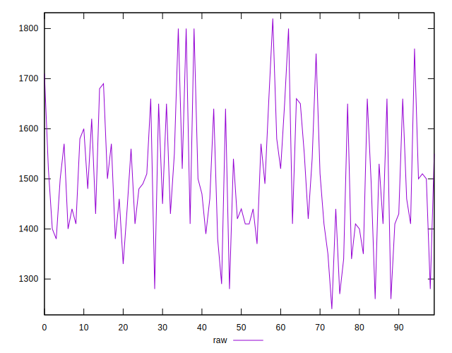

# //uses-text-compression/samples/pages+cached+noadtech+nomedia+nocss

[→ Parent](../..)


## Raw


```yaml
p90min: 1270
p90max: 1800
p90range: 530
p90mean: 1499.5744680851064
p90median: 1490
p90stdev: 122.47374789149474
p90skewness: 0.3879412596235195
p90eccentricity: 0.9999999999999999
p90discretization: 2.41025641025641
outlandishness: 1.0024362152391708
confidence: 53.67588156569676
p90confidence: 49.51732415904721

```


## Score


```yaml
p90min: 0.38
p90max: 0.44
p90range: 0.06
p90mean: 0.41138297872340435
p90median: 0.41
p90stdev: 0.014989433429301528
p90skewness: -0.2554648134517036
p90eccentricity: 0.9999999999999992
p90discretization: 13.428571428571429
outlandishness: 0.999110619352857
confidence: 0.006471562457918154
p90confidence: 0.006060373319650224

```


## Raw Estimate


## Score Estimate


## P Score


```yaml
p90min: 0.3764705882352941
p90max: 0.4388235294117647
p90range: 0.06235294117647061
p90mean: 0.41181476846057563
p90median: 0.41294117647058826
p90stdev: 0.014408676222528798
p90skewness: -0.3879412596235372
p90eccentricity: 0.9999999999999994
p90discretization: 2.41025641025641
outlandishness: 0.9989572376985817
confidence: 0.006314809595964329
p90confidence: 0.005825567548123203

```


## Score Difference


```yaml
p90min: 0
p90max: 5.551115123125783e-17
p90range: 5.551115123125783e-17
p90mean: 1.1220339078658496e-17
p90median: 0
p90stdev: 2.229255325038682e-17
p90skewness: 1.4834762399128538
p90eccentricity: 1.0000000000000007
p90discretization: 47
outlandishness: 1.1846603878116344
confidence: 9.013987730404081e-18
p90confidence: 9.013095497087213e-18

```


## P Score Difference


```yaml
p90min: -0.004117647058823504
p90max: 0.004117647058823559
p90range: 0.008235294117647063
p90mean: 0.0004317897371714726
p90median: 0.0005882352941176672
p90stdev: 0.0026070195761760877
p90skewness: -0.3441417584414611
p90eccentricity: 1.0000000000000002
p90discretization: 4.2727272727272725
outlandishness: 0.8581739970594384
confidence: 0.001086381035949062
p90confidence: 0.0010540433004211029

```

