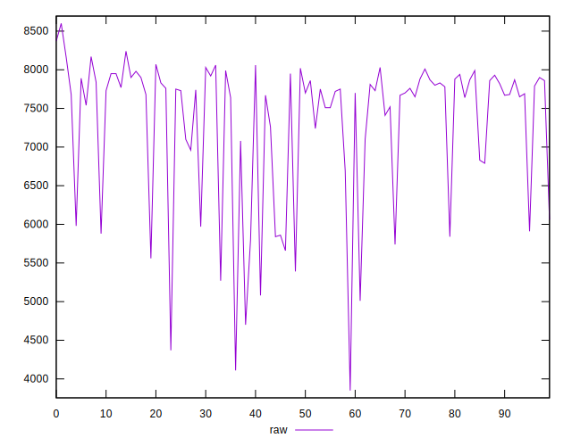

# //uses-text-compression/samples/pages+cached

[→ Parent](../..)


## Raw


```yaml
p90min: 4700
p90max: 8170
p90range: 3470
p90mean: 7339.893617021276
p90median: 7730
p90stdev: 869.4012303424465
p90skewness: -1.4768786437395836
p90eccentricity: 1.0000000000000002
p90discretization: 1.4461538461538461
outlandishness: 0.9823687191641682
confidence: 402.66514221969186
p90confidence: 351.50734984677524

```


## Score


```yaml
p90min: 0
p90max: 0.04
p90range: 0.04
p90mean: 0.000425531914893617
p90median: 0
p90stdev: 0.00410368117489062
p90skewness: 9.539955591519893
p90eccentricity: 1.0000000000000022
p90discretization: 47
outlandishness: 67.65062500000002
confidence: 0.007320406446959277
p90confidence: 0.0016591581010688586

```


## Raw Estimate


## Score Estimate


## P Score


```yaml
p90min: 0
p90max: 0.03529411764705881
p90range: 0.03529411764705881
p90mean: 0.0003754693366708384
p90median: 0
p90stdev: 0.0036208951543152458
p90skewness: 9.539955591519934
p90eccentricity: 1.0000000000000053
p90discretization: 47
outlandishness: 86.60163600000001
confidence: 0.007311063382548852
p90confidence: 0.0014639630303548725

```


## Score Difference


```yaml
p90min: 0
p90max: 0
p90range: 0
p90mean: 0
p90median: 0
p90stdev: 0
p90skewness: .nan
p90eccentricity: .nan
p90discretization: 94
outlandishness: .nan
confidence: 0
p90confidence: 0

```


## P Score Difference


```yaml
p90min: 0
p90max: 0
p90range: 0
p90mean: 0
p90median: 0
p90stdev: 0
p90skewness: .nan
p90eccentricity: .nan
p90discretization: 94
outlandishness: .inf
confidence: 0.0003579552003051195
p90confidence: 0

```

