# //uses-webp-images/samples/pages+cached+noadtech

[→ Parent](../..)


## Raw


```yaml
p90min: 150
p90max: 600
p90range: 450
p90mean: 317.5531914893617
p90median: 300
p90stdev: 105.71626186036515
p90skewness: 0.13115357110736445
p90eccentricity: 0.9999999999999988
p90discretization: 9.4
outlandishness: 1.0224631090236218
confidence: 46.025012589128906
p90confidence: 42.742110023938885

```

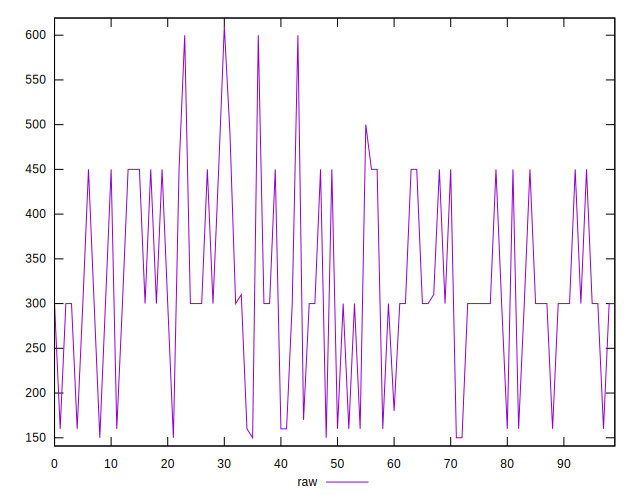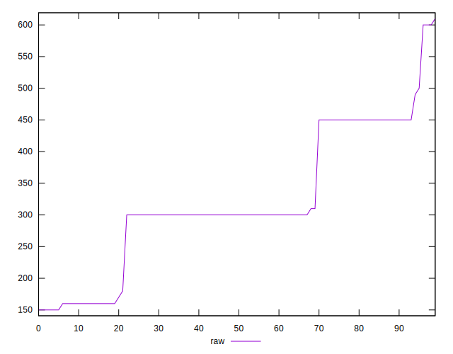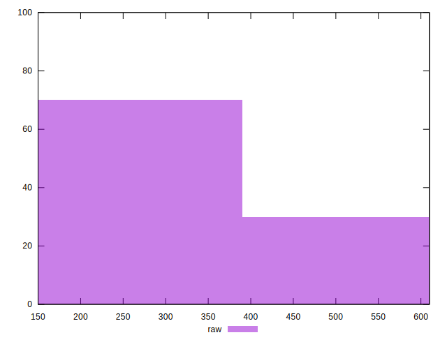
## Score


```yaml
p90min: 0.58
p90max: 0.88
p90range: 0.30000000000000004
p90mean: 0.7494680851063832
p90median: 0.75
p90stdev: 0.07155368496802518
p90skewness: 0.40703459087655647
p90eccentricity: 0.9999999999999992
p90discretization: 10.444444444444445
outlandishness: 0.9968853247555387
confidence: 0.030825965618382654
p90confidence: 0.028929848839729207

```

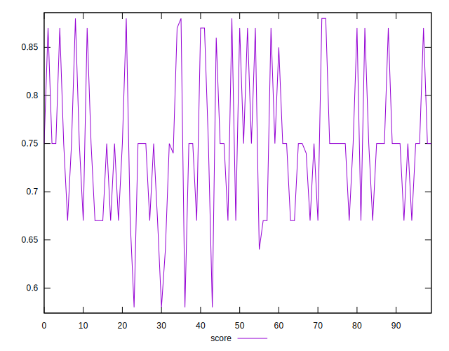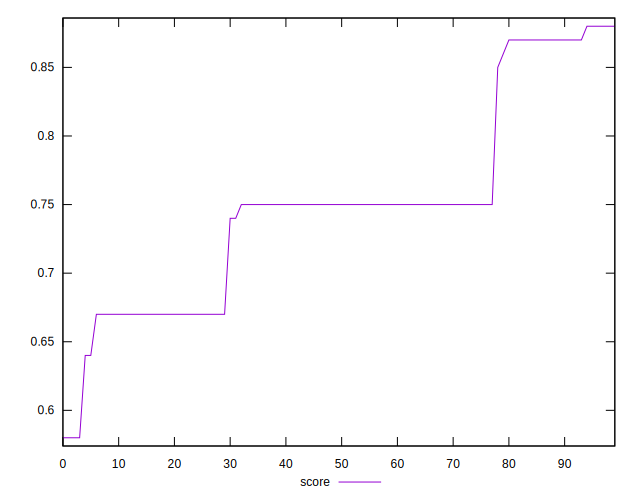
## Raw Estimate

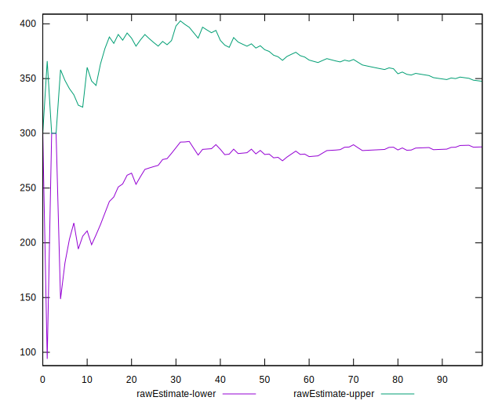
## Score Estimate

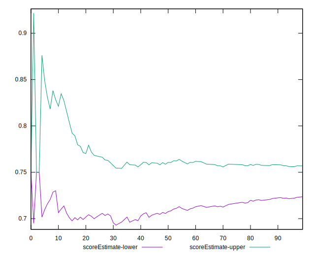
## P Score


```yaml
p90min: 0.5833333333333334
p90max: 0.875
p90range: 0.29166666666666663
p90mean: 0.7481087470449171
p90median: 0.75
p90stdev: 0.07122217792588403
p90skewness: 0.35339887296418343
p90eccentricity: 0.9999999999999992
p90discretization: 9.4
outlandishness: 0.9968156217460591
confidence: 0.030572946610529356
p90confidence: 0.028795817327267836

```

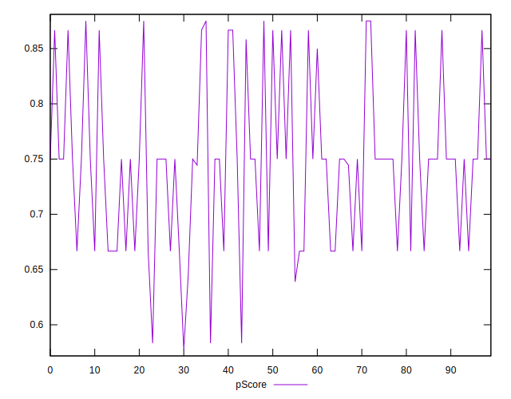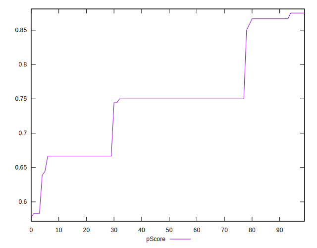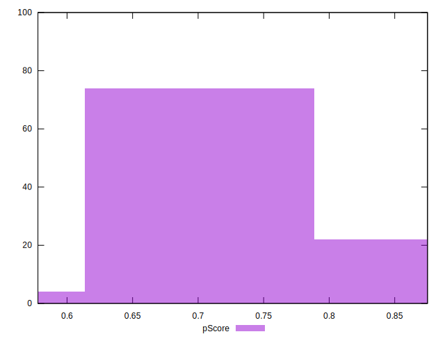
## Score Difference


```yaml
p90min: 0
p90max: 0
p90range: 0
p90mean: 0
p90median: 0
p90stdev: 0
p90skewness: .nan
p90eccentricity: .nan
p90discretization: 94
outlandishness: .nan
confidence: 0
p90confidence: 0

```


## P Score Difference


```yaml
p90min: -0.0050000000000000044
p90max: 0.0033333333333334103
p90range: 0.008333333333333415
p90mean: -0.0014539007092198705
p90median: 0
p90stdev: 0.0019041008634951874
p90skewness: 0.13424281877127214
p90eccentricity: 0.9999999999999994
p90discretization: 11.75
outlandishness: 0.9052826293872683
confidence: 0.0008609614007605723
p90confidence: 0.0007698464471973642

```

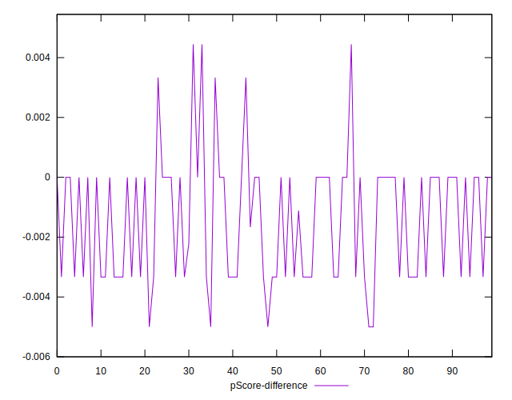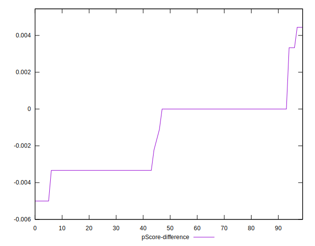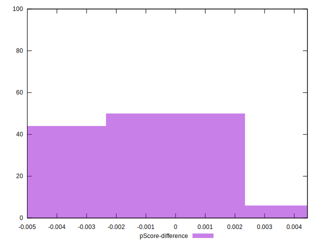