# //uses-webp-images/samples/pages+cached

[→ Parent](../..)


## Raw


```yaml
p90min: 150
p90max: 500
p90range: 350
p90mean: 334.8936170212766
p90median: 310
p90stdev: 100.11423986170684
p90skewness: -0.17266887340482434
p90eccentricity: 1.0000000000000004
p90discretization: 4.947368421052632
outlandishness: 1.0066182840923585
confidence: 45.44750354761875
p90confidence: 40.47715819524628

```

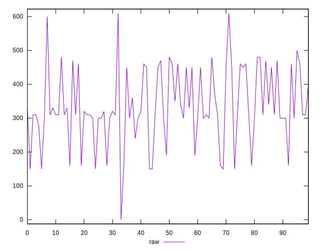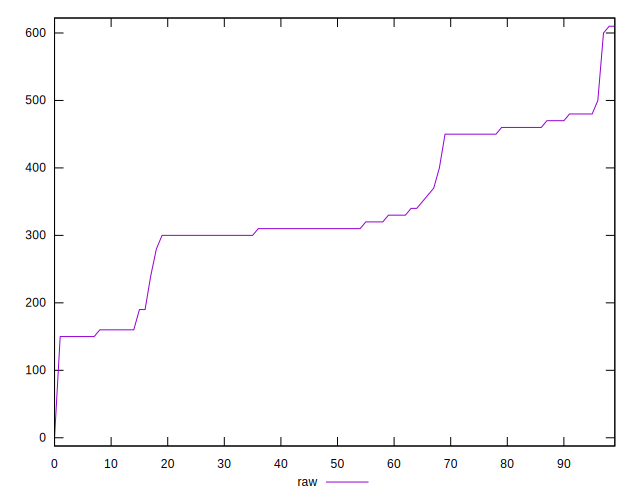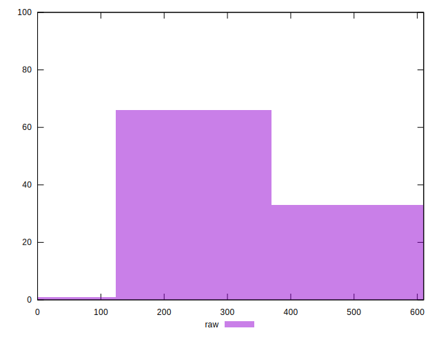
## Score


```yaml
p90min: 0.64
p90max: 0.88
p90range: 0.24
p90mean: 0.7365957446808508
p90median: 0.74
p90stdev: 0.06704322504508153
p90skewness: 0.7514069478179672
p90eccentricity: 1.000000000000001
p90discretization: 6.266666666666667
outlandishness: 1.0021849009848947
confidence: 0.030528262117340953
p90confidence: 0.027106226145430148

```

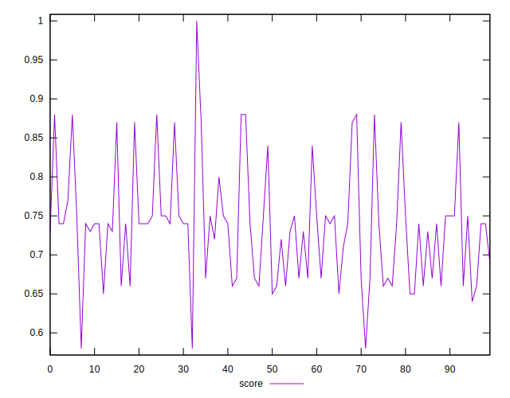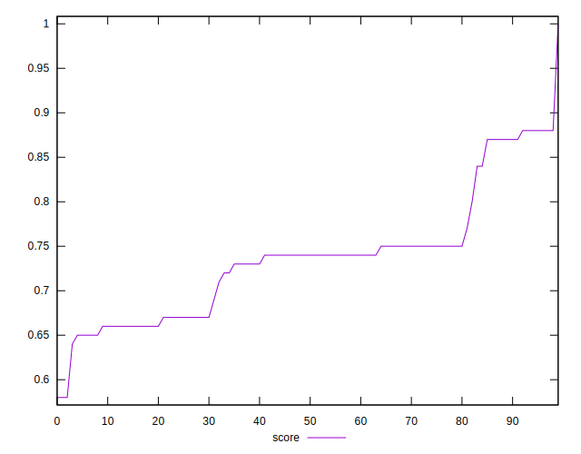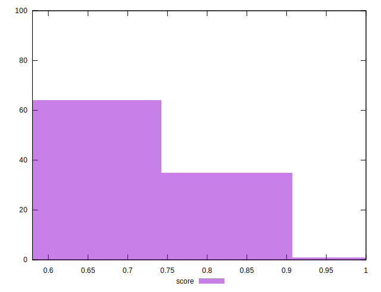
## Raw Estimate

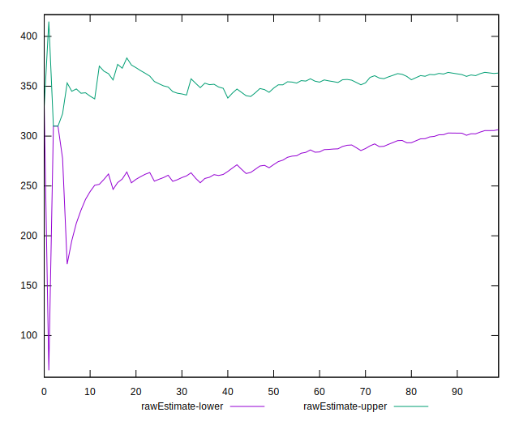
## Score Estimate

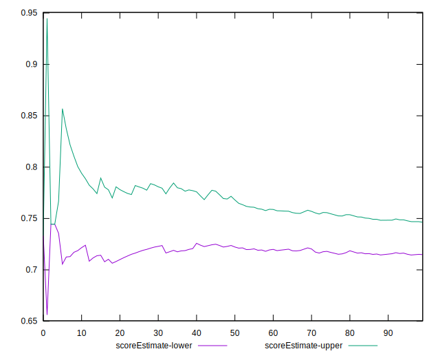
## P Score


```yaml
p90min: 0.6388888888888888
p90max: 0.875
p90range: 0.23611111111111116
p90mean: 0.7366134751773047
p90median: 0.7444444444444445
p90stdev: 0.06656311249899467
p90skewness: 0.6499328303627906
p90eccentricity: 1.0000000000000007
p90discretization: 4.947368421052632
outlandishness: 1.0018799696757728
confidence: 0.030314490963932468
p90confidence: 0.026912111986382194

```

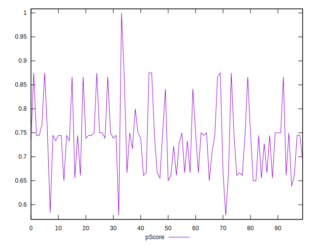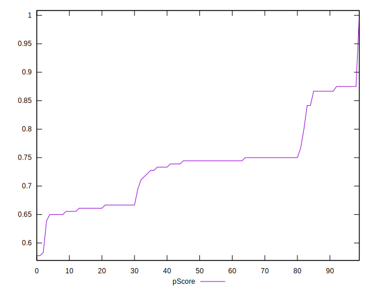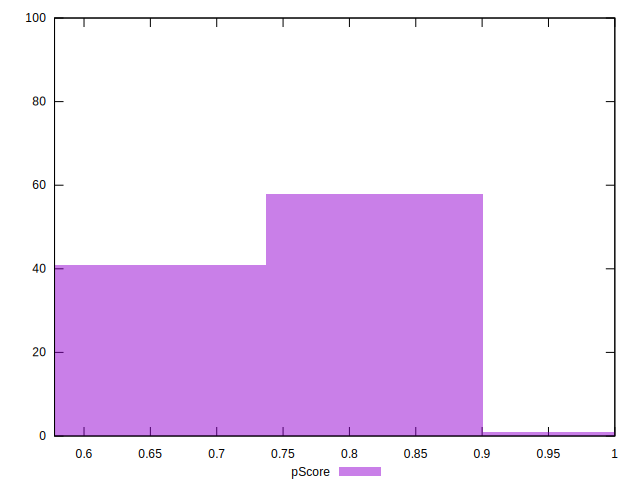
## Score Difference


```yaml
p90min: 0
p90max: 0
p90range: 0
p90mean: 0
p90median: 0
p90stdev: 0
p90skewness: .nan
p90eccentricity: .nan
p90discretization: 94
outlandishness: .inf
confidence: 4.330179641073931e-18
p90confidence: 0

```


## P Score Difference


```yaml
p90min: -0.0050000000000000044
p90max: 0.004444444444444473
p90range: 0.009444444444444478
p90mean: -0.00008274231678487465
p90median: 0
p90stdev: 0.002968574402334249
p90skewness: 0.12617432184109997
p90eccentricity: 1.0000000000000007
p90discretization: 6.266666666666667
outlandishness: 1.3028591836734233
confidence: 0.0012160496235100156
p90confidence: 0.0012002234233973587

```

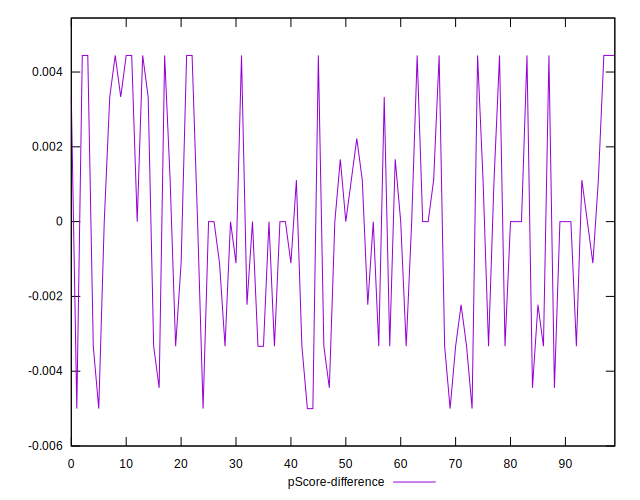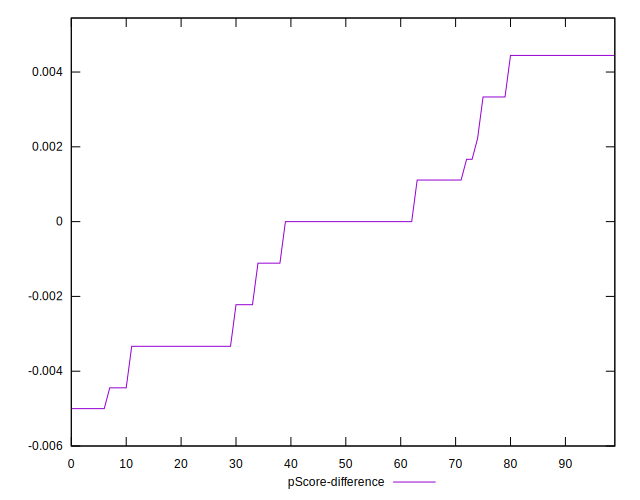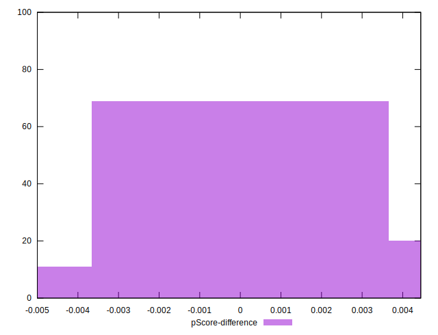