# //bootup-time/samples/pages+cached+noadtech+nomedia+nocss

[→ Parent](../..)


## Raw


```yaml
p90min: 237.46000000000004
p90max: 1262.164
p90range: 1024.704
p90mean: 658.7962127659575
p90median: 635.5620000000001
p90stdev: 262.627442477462
p90skewness: 0.39579646465062557
p90eccentricity: 1.0000000000000002
p90discretization: 1
outlandishness: 1.045769474748174
confidence: 123.49829061137206
p90confidence: 106.18282224644098

```

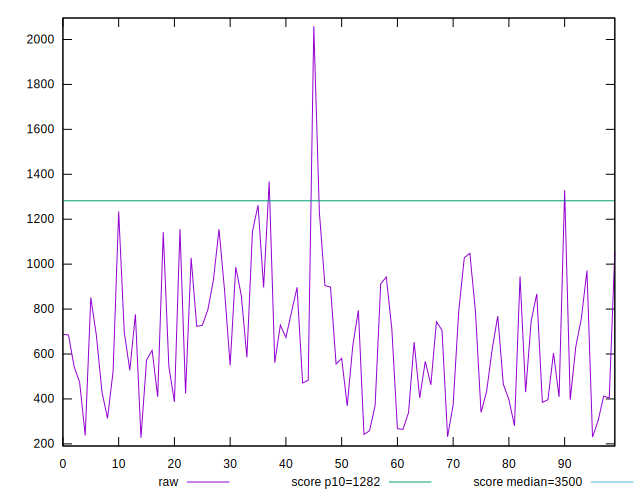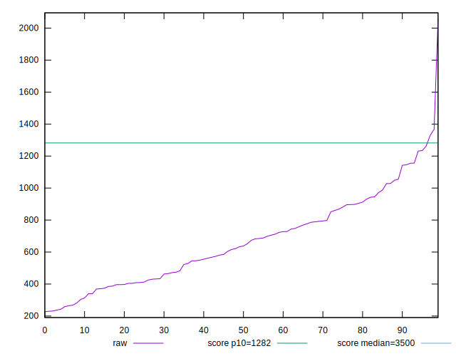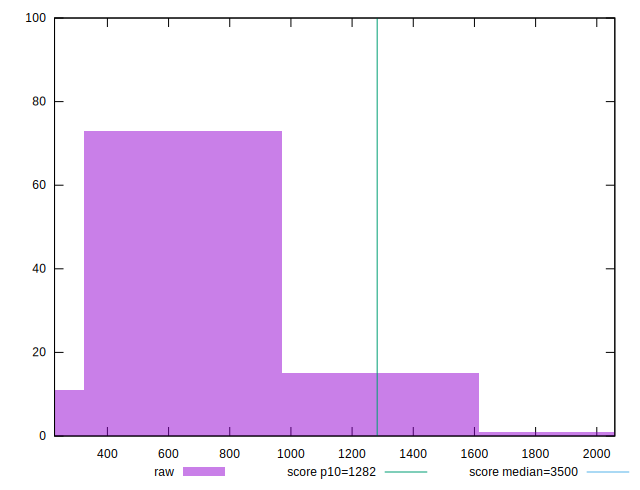
## Score


```yaml
p90min: 0.9
p90max: 1
p90range: 0.09999999999999998
p90mean: 0.9771276595744677
p90median: 0.99
p90stdev: 0.02490929675312361
p90skewness: -1.228085656880357
p90eccentricity: 0.9999999999999996
p90discretization: 9.4
outlandishness: 0.9929965187068341
confidence: 0.013987663037088134
p90confidence: 0.010071070275330253

```

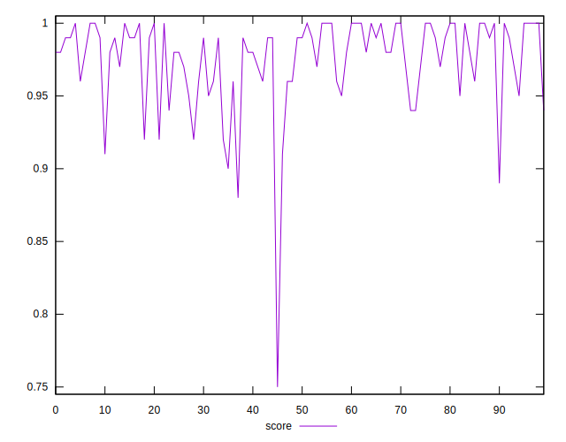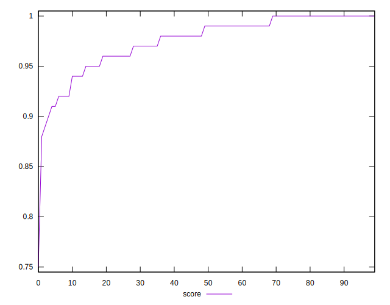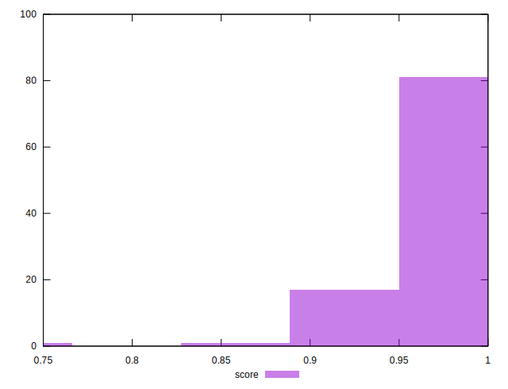
## Raw Estimate

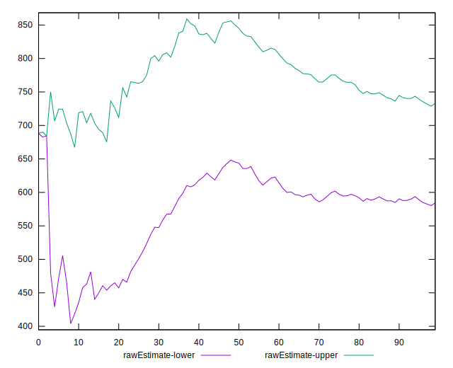
## Score Estimate

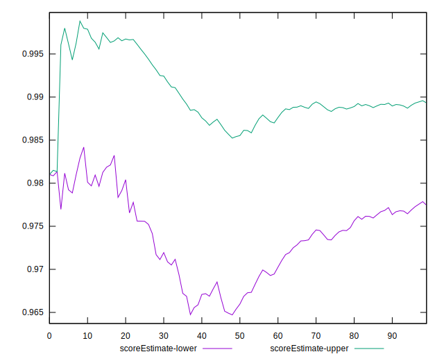
## P Score


```yaml
p90min: 0.903447568781677
p90max: 0.999701626790482
p90range: 0.09625405800880504
p90mean: 0.9767718078501575
p90median: 0.9852550161130755
p90stdev: 0.024114796092348505
p90skewness: -1.2925897404040685
p90eccentricity: 1.000000000000001
p90discretization: 1
outlandishness: 0.9931712137736792
confidence: 0.013685470178756425
p90confidence: 0.009749845952228518

```

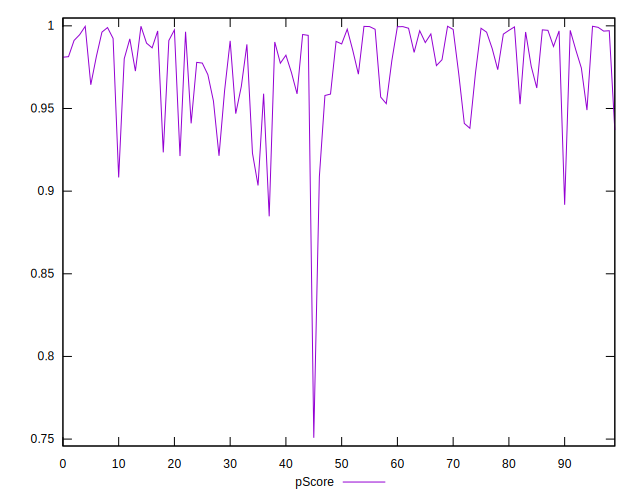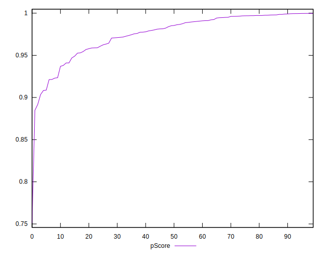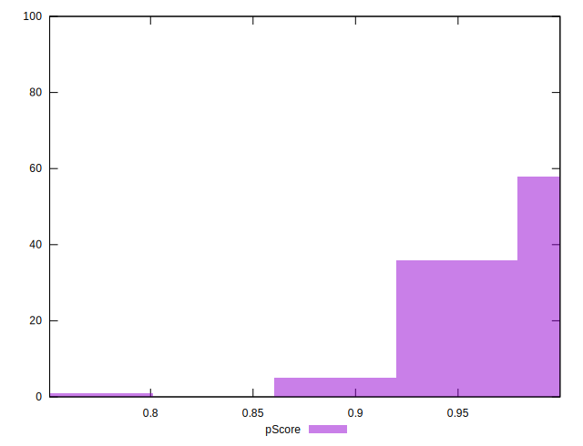
## Score Difference


```yaml
p90min: 0
p90max: 1.1102230246251565e-16
p90range: 1.1102230246251565e-16
p90mean: 7.086529944415892e-18
p90median: 0
p90stdev: 2.7139343474843184e-17
p90skewness: 3.5685919470918015
p90eccentricity: 0.9999999999999984
p90discretization: 47
outlandishness: 1.9881000000000004
confidence: 1.2454613861688437e-17
p90confidence: 1.0972699794392905e-17

```

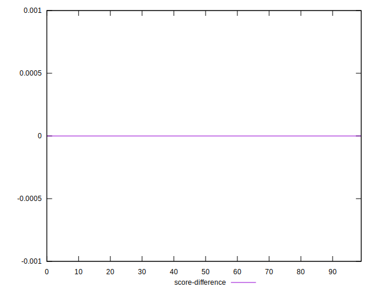
## P Score Difference


```yaml
p90min: -0.004447556630466032
p90max: 0.004637114801464226
p90range: 0.009084671431930258
p90mean: -0.0002873785810132482
p90median: -0.0004793882151682416
p90stdev: 0.0023606946332777683
p90skewness: 0.30844250657287536
p90eccentricity: 0.9999999999999991
p90discretization: 1
outlandishness: 0.8761083615713811
confidence: 0.0010099080274168248
p90confidence: 0.0009544517368742677

```

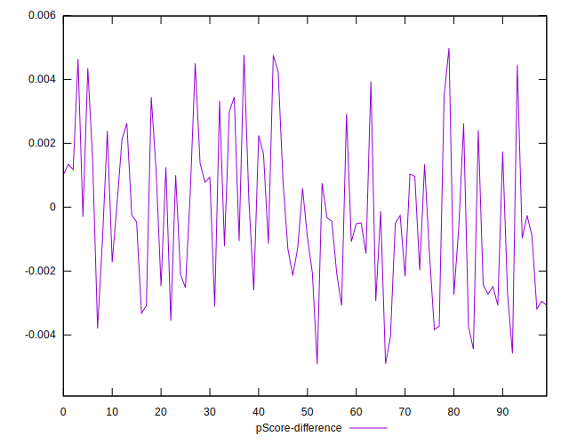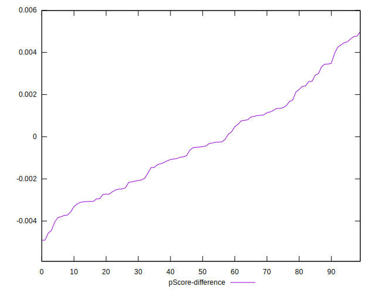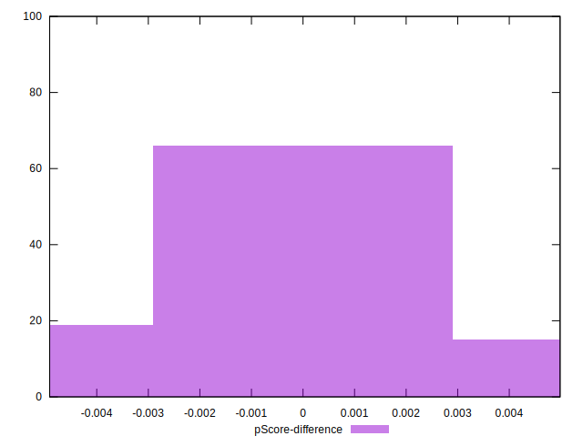