# //bootup-time/samples/pages+cached+noadtech+nomedia

[→ Parent](../..)


## Raw


```yaml
p90min: 255.24
p90max: 1059.768
p90range: 804.528
p90mean: 591.0740000000002
p90median: 554.056
p90stdev: 200.1957910027932
p90skewness: 0.4454063116900589
p90eccentricity: 1
p90discretization: 1
outlandishness: 1.0195030487468122
confidence: 88.05186920478327
p90confidence: 80.94110002369416

```

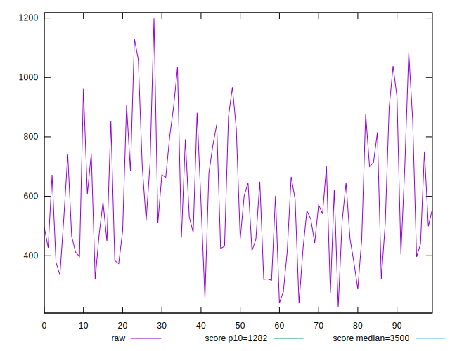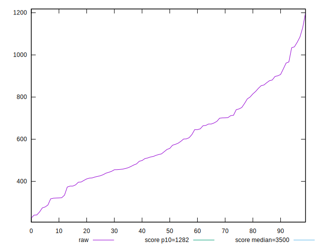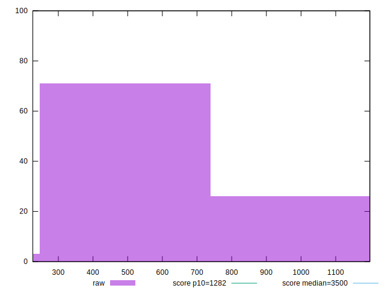
## Score


```yaml
p90min: 0.94
p90max: 1
p90range: 0.06000000000000005
p90mean: 0.984787234042553
p90median: 0.99
p90stdev: 0.016093392552188654
p90skewness: -1.0795129762848679
p90eccentricity: 1.0000000000000002
p90discretization: 13.428571428571429
outlandishness: 0.9971846569055661
confidence: 0.0074832646688828795
p90confidence: 0.006506714700455925

```

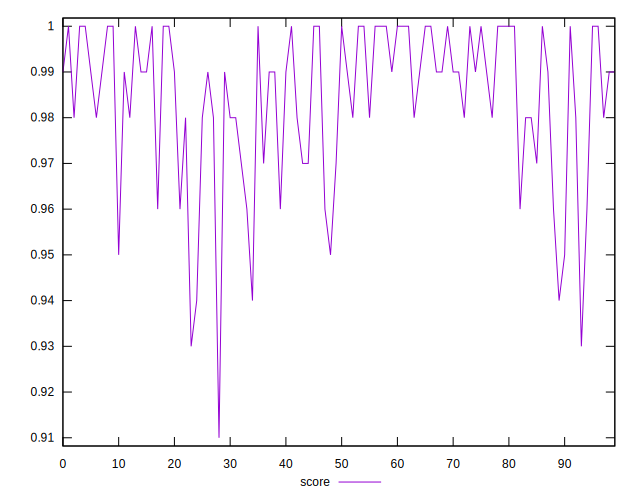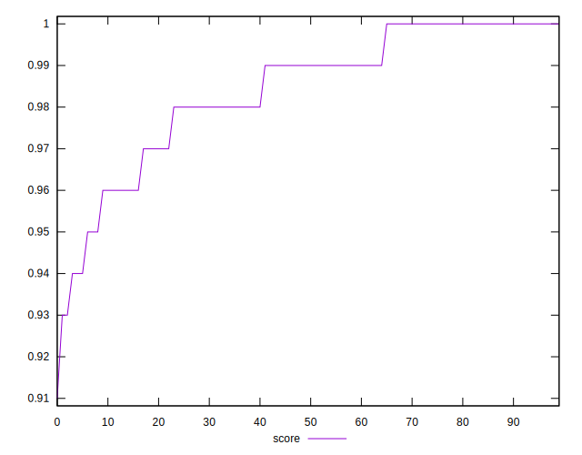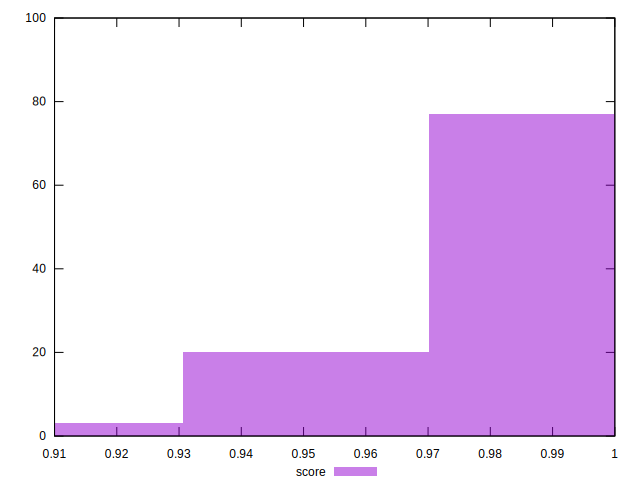
## Raw Estimate

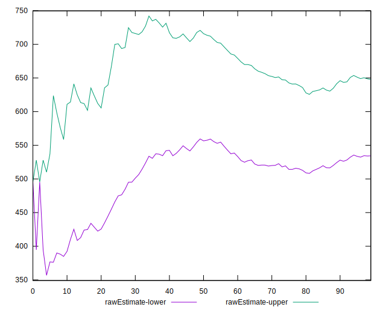
## Score Estimate

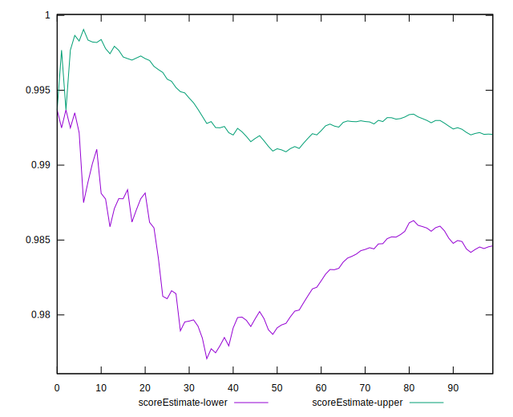
## P Score


```yaml
p90min: 0.9363040064715077
p90max: 0.9995825567568994
p90range: 0.06327855028539175
p90mean: 0.984350388137228
p90median: 0.9906633113472336
p90stdev: 0.015480029317787568
p90skewness: -1.276558641088067
p90eccentricity: 1.0000000000000004
p90discretization: 1
outlandishness: 0.9972649535788558
confidence: 0.007240159885205376
p90confidence: 0.00625872599570927

```

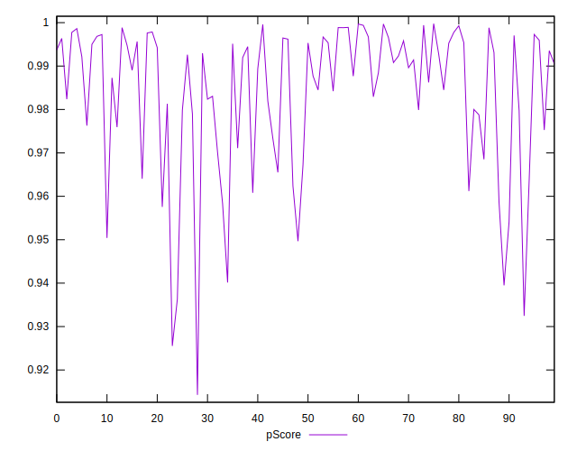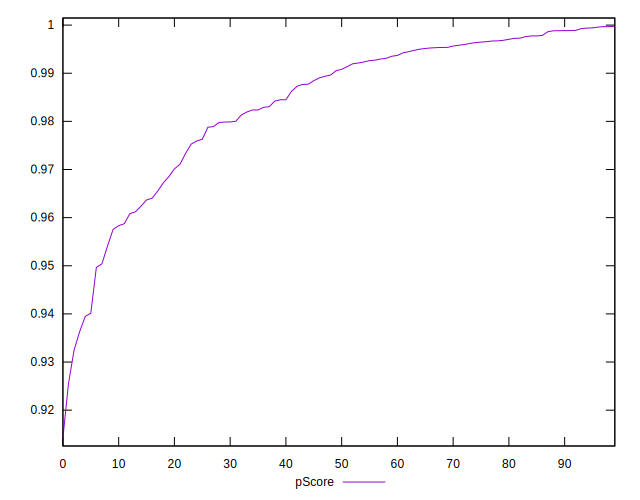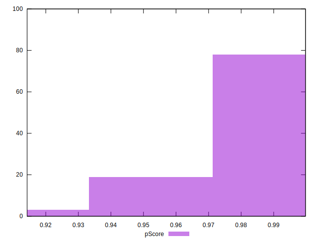
## Score Difference


```yaml
p90min: 0
p90max: 1.1102230246251565e-16
p90range: 1.1102230246251565e-16
p90mean: 3.543264972207946e-18
p90median: 0
p90stdev: 1.951478180216297e-17
p90skewness: 5.326002287485482
p90eccentricity: 1.000000000000004
p90discretization: 47
outlandishness: 3.5344000000000007
confidence: 1.0335413782903698e-17
p90confidence: 7.890015558655782e-18

```

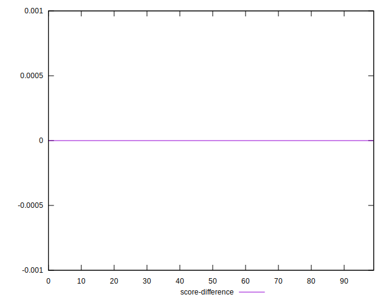
## P Score Difference


```yaml
p90min: -0.004681975484670642
p90max: 0.004489282589332122
p90range: 0.009171258074002764
p90mean: -0.0004211307169671465
p90median: -0.0006014970480415771
p90stdev: 0.0026496134595918276
p90skewness: 0.21474769333985558
p90eccentricity: 1.0000000000000002
p90discretization: 1
outlandishness: 0.8871421999101803
confidence: 0.001106661978064292
p90confidence: 0.001071264420608904

```

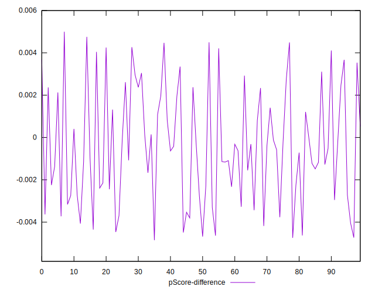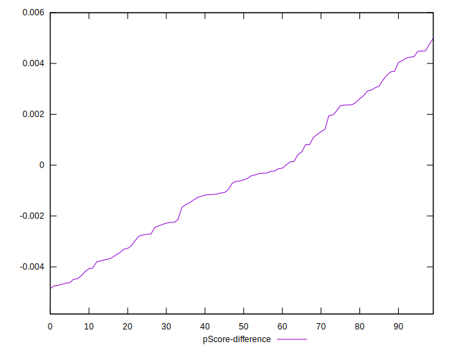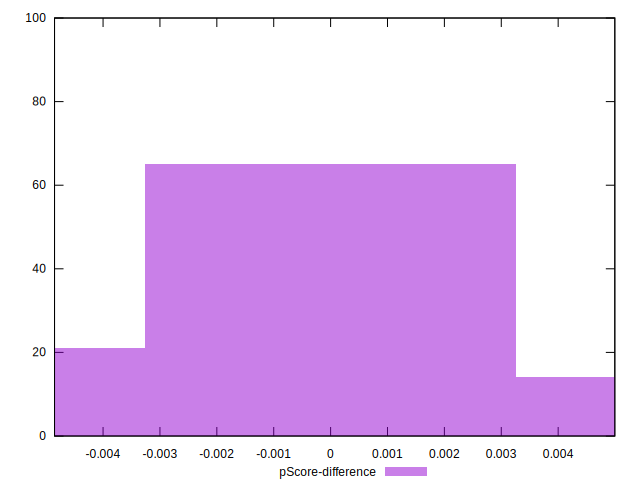