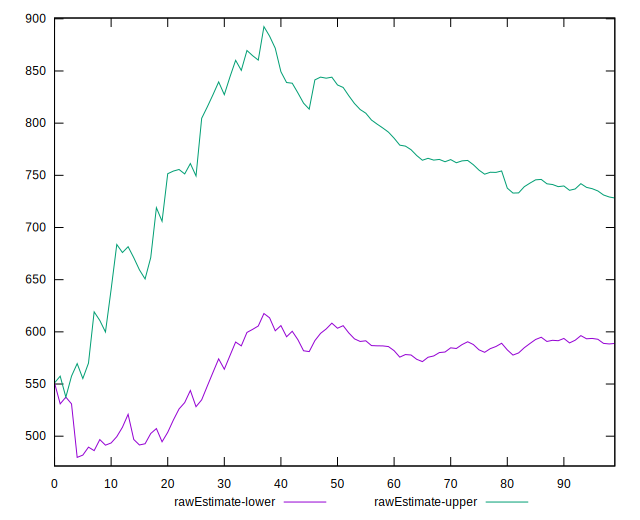

# //bootup-time/samples/pages+cached+noadtech

[→ Parent](../..)


## Raw


```yaml
p90min: 290.41599999999994
p90max: 1411.9159999999997
p90range: 1121.4999999999998
p90mean: 658.5725957446809
p90median: 625.642
p90stdev: 245.88227303253296
p90skewness: 0.5686585635967958
p90eccentricity: 0.9999999999999997
p90discretization: 1
outlandishness: 1.0457242490853635
confidence: 114.92311036148602
p90confidence: 99.41258782659348

```


## Score


```yaml
p90min: 0.88
p90max: 1
p90range: 0.12
p90mean: 0.9777659574468085
p90median: 0.99
p90stdev: 0.023752010231572872
p90skewness: -1.543782835607296
p90eccentricity: 1.0000000000000007
p90discretization: 8.545454545454545
outlandishness: 0.9935345839840076
confidence: 0.012561152137350389
p90confidence: 0.009603168110016477

```


## Raw Estimate


## Score Estimate


## P Score


```yaml
p90min: 0.8766460344319195
p90max: 0.9992539809858496
p90range: 0.12260794655393015
p90mean: 0.9776331120349732
p90median: 0.9859882374132971
p90stdev: 0.023348741068394643
p90skewness: -1.7149735974640379
p90eccentricity: 0.9999999999999999
p90discretization: 1
outlandishness: 0.9934475778499078
confidence: 0.012497984564468956
p90confidence: 0.00944012247599101

```


## Score Difference


```yaml
p90min: 0
p90max: 1.1102230246251565e-16
p90range: 1.1102230246251565e-16
p90mean: 4.724353296277262e-18
p90median: 0
p90stdev: 2.240957533134066e-17
p90skewness: 4.532597979574665
p90eccentricity: 0.9999999999999994
p90discretization: 47
outlandishness: 2.706025000000001
confidence: 1.1103983576888547e-17
p90confidence: 9.060408659427041e-18

```


## P Score Difference


```yaml
p90min: -0.004187175743216365
p90max: 0.004148602326074835
p90range: 0.0083357780692912
p90mean: -0.00018889285806610715
p90median: -0.00046279159985007645
p90stdev: 0.0024064945392309385
p90skewness: 0.10466534405855941
p90eccentricity: 1.0000000000000002
p90discretization: 1
outlandishness: 0.8591397370606646
confidence: 0.0010244890068260358
p90confidence: 0.0009729690830695212

```

