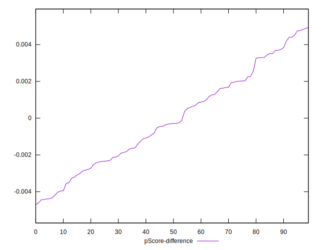

# //bootup-time/samples/pages+cached

[→ Parent](../..)


## Raw


```yaml
p90min: 1468.8999999999992
p90max: 4971.6399999999985
p90range: 3502.7399999999993
p90mean: 2775.6932340425533
p90median: 2779.013999999999
p90stdev: 878.0801038439757
p90skewness: 0.5007073891033514
p90eccentricity: 0.9999999999999996
p90discretization: 1
outlandishness: 1.025907296523661
confidence: 385.82916073418977
p90confidence: 355.0163025808039

```


## Score


```yaml
p90min: 0.33
p90max: 0.87
p90range: 0.54
p90mean: 0.6301063829787233
p90median: 0.615
p90stdev: 0.14449099714906094
p90skewness: -0.14962200813949483
p90eccentricity: 0.9999999999999992
p90discretization: 1.9183673469387754
outlandishness: 0.9914282066302565
confidence: 0.06164545077934085
p90confidence: 0.058419111581632974

```


## Raw Estimate


## Score Estimate


## P Score


```yaml
p90min: 0.3271259792701673
p90max: 0.8660465871899536
p90range: 0.5389206079197864
p90mean: 0.6300628471153193
p90median: 0.6157493716086808
p90stdev: 0.14467024086054345
p90skewness: -0.15250289332309297
p90eccentricity: 1.0000000000000002
p90discretization: 1
outlandishness: 0.9913978673160361
confidence: 0.061630985713503936
p90confidence: 0.05849158155269007

```


## Score Difference


```yaml
p90min: 0
p90max: 1.1102230246251565e-16
p90range: 1.1102230246251565e-16
p90mean: 1.0629794916623839e-17
p90median: 0
p90stdev: 3.059451946392798e-17
p90skewness: 2.7284399615299004
p90eccentricity: 1.0000000000000042
p90discretization: 31.333333333333332
outlandishness: 1.570844444444444
confidence: 1.3456039788476229e-17
p90confidence: 1.2369660958916474e-17

```


## P Score Difference


```yaml
p90min: -0.004423564394044344
p90max: 0.0047574310520323015
p90range: 0.009180995446076645
p90mean: -0.00006584586038705943
p90median: -0.00029744191134506437
p90stdev: 0.0026075983508532415
p90skewness: 0.12419515173139668
p90eccentricity: 0.9999999999999991
p90discretization: 1
outlandishness: 0.6466099097743424
confidence: 0.0010903963879829897
p90confidence: 0.0010542773046366763

```

