# //bootup-time/samples/pages

[→ Parent](../..)


## Raw


```yaml
p90min: 1382.8319999999994
p90max: 5226.840000000001
p90range: 3844.0080000000016
p90mean: 3066.822382978722
p90median: 2950.79
p90stdev: 988.6475350085119
p90skewness: 0.34319430657032046
p90eccentricity: 0.9999999999999999
p90discretization: 1
outlandishness: 1.013295018907582
confidence: 427.6246343101194
p90confidence: 399.7197874064503

```

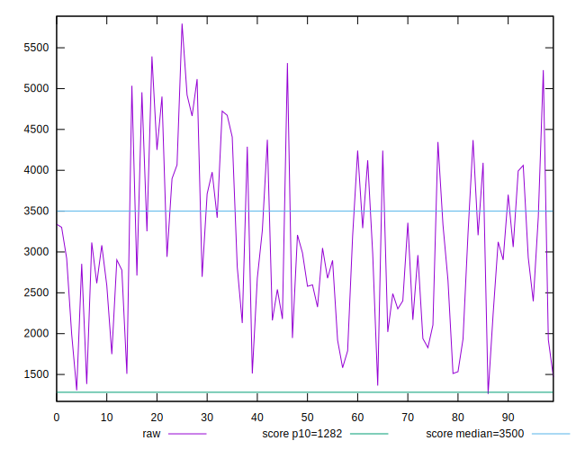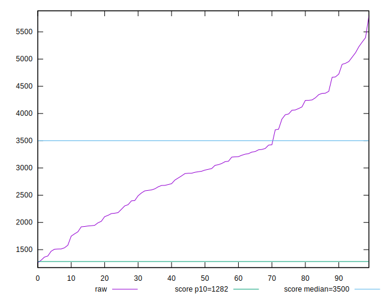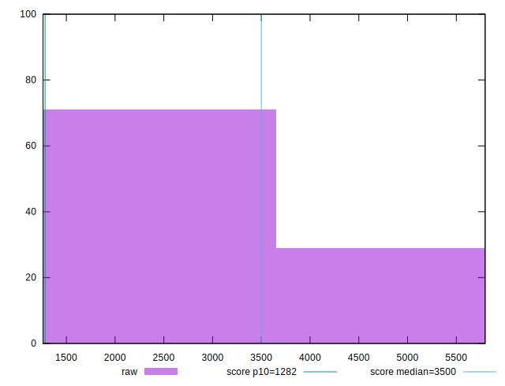
## Score


```yaml
p90min: 0.3
p90max: 0.88
p90range: 0.5800000000000001
p90mean: 0.5848936170212766
p90median: 0.585
p90stdev: 0.15468392399417694
p90skewness: 0.03940005918110209
p90eccentricity: 1.0000000000000002
p90discretization: 2
outlandishness: 1.0010479280868159
confidence: 0.06576251359249688
p90confidence: 0.06254021076744562

```

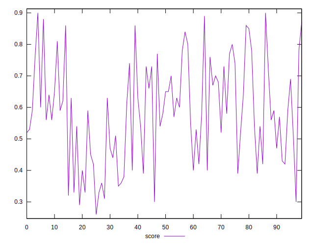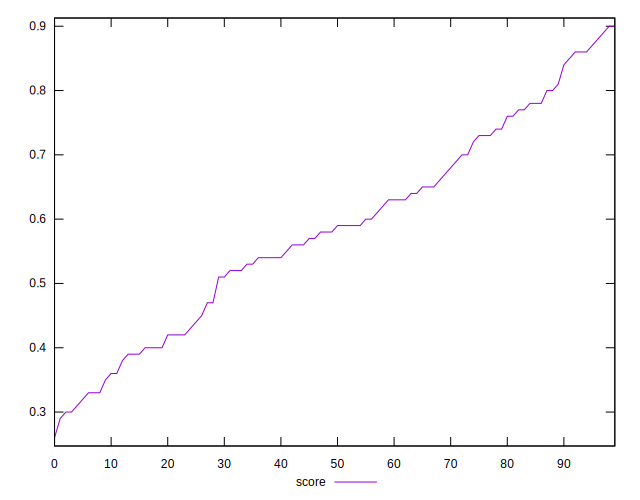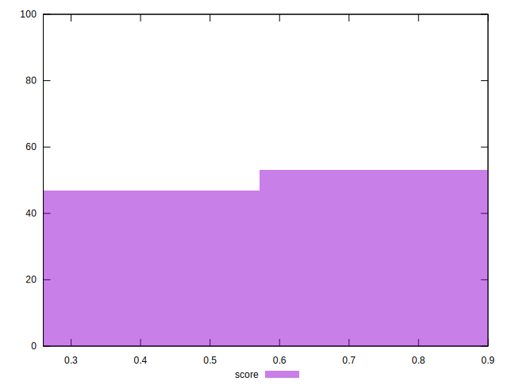
## Raw Estimate

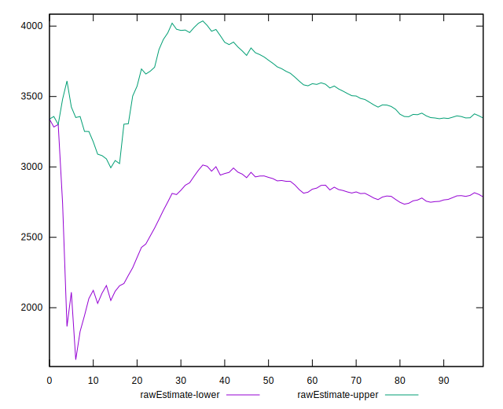
## Score Estimate

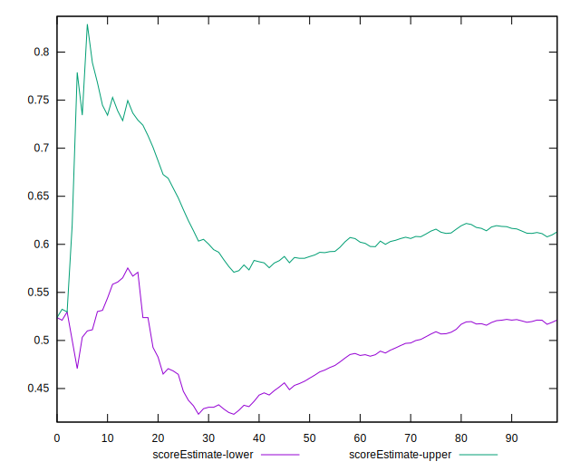
## P Score


```yaml
p90min: 0.3044176398931356
p90max: 0.8819797282008088
p90range: 0.5775620883076733
p90mean: 0.5852874540335247
p90median: 0.5862108087835749
p90stdev: 0.15429388051821194
p90skewness: 0.041493975710075216
p90eccentricity: 1.0000000000000007
p90discretization: 1
outlandishness: 1.0007116837125591
confidence: 0.06561012248296151
p90confidence: 0.062382512407037884

```

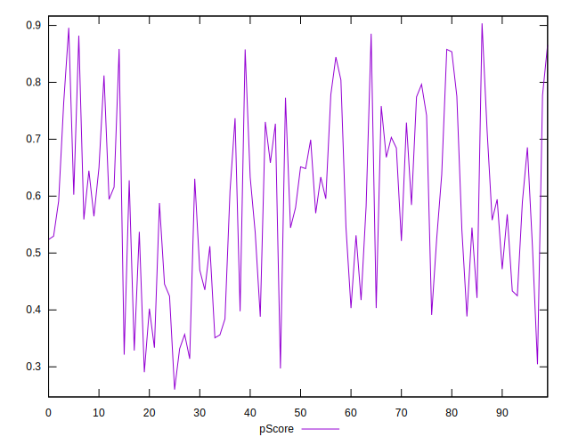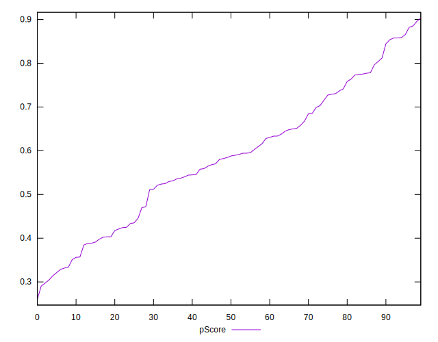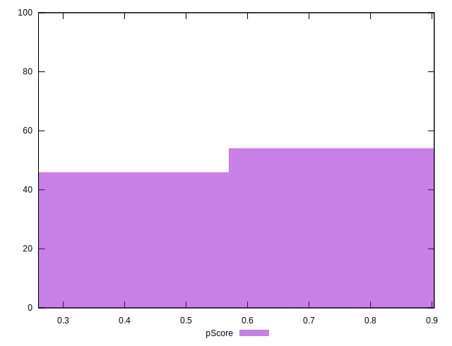
## Score Difference


```yaml
p90min: 0
p90max: 1.1102230246251565e-16
p90range: 1.1102230246251565e-16
p90mean: 4.133809134242604e-18
p90median: 0
p90stdev: 1.8534057062702675e-17
p90skewness: 4.750478415618713
p90eccentricity: 0.9999999999999971
p90discretization: 31.333333333333332
outlandishness: 3.047518367346939
confidence: 1.0045002419388039e-17
p90confidence: 7.493499034333553e-18

```

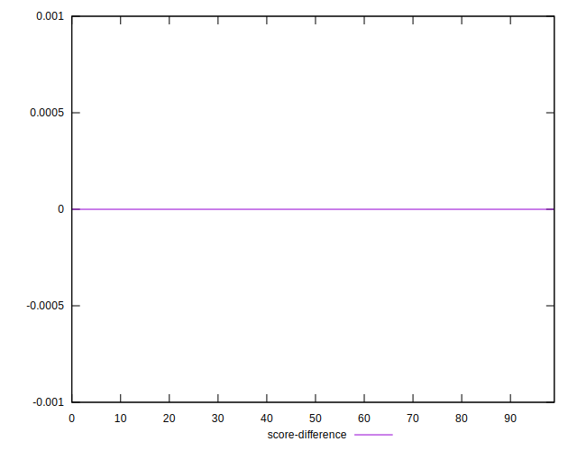
## P Score Difference


```yaml
p90min: -0.0046079459199189765
p90max: 0.00466588646102839
p90range: 0.009273832380947367
p90mean: 0.00031142343167588575
p90median: 0.00036249824885523085
p90stdev: 0.0028582326864378172
p90skewness: -0.05769354805834407
p90eccentricity: 1.0000000000000004
p90discretization: 1
outlandishness: 0.9014905953929475
confidence: 0.0011785129484013918
p90confidence: 0.0011556111974438444

```

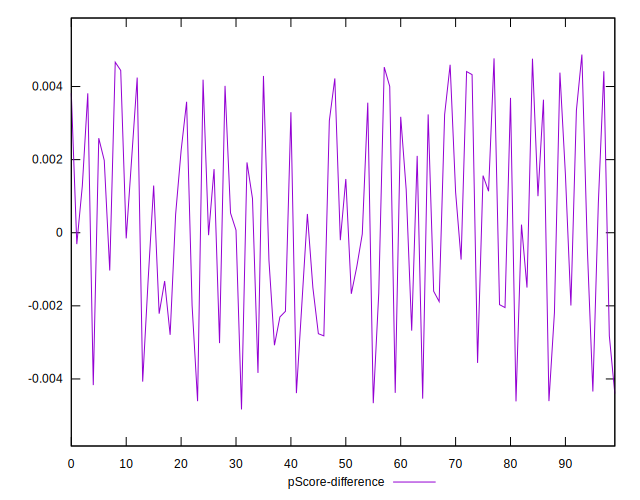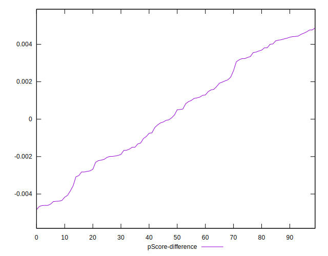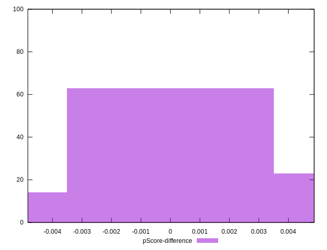