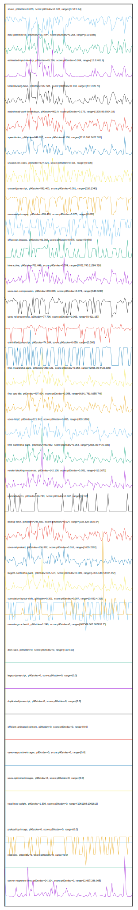

# //correlation/pages+cached+noadtech

[→ Parent](../..)

[0. score, p90stdev=0.078, score:p90stdev=0.078, range=[0.18:0.64]](../../meta/score/samples/pages+cached+noadtech)  
[1. third-party-summary, p90stdev=NaN, score:p90stdev=0.491, range=[NaN:NaN]](../../third-party-summary/samples/pages+cached+noadtech/)  
[2. max-potential-fid, p90stdev=137.044, score:p90stdev=0.268, range=[112:1086]](../../max-potential-fid/samples/pages+cached+noadtech/)  
[3. estimated-input-latency, p90stdev=45.296, score:p90stdev=0.264, range=[12.8:481.6]](../../estimated-input-latency/samples/pages+cached+noadtech/)  
[4. total-blocking-time, p90stdev=187.584, score:p90stdev=0.193, range=[44:1709.73]](../../total-blocking-time/samples/pages+cached+noadtech/)  
[5. mainthread-work-breakdown, p90stdev=902.9, score:p90stdev=0.173, range=[1338.86:6504.18]](../../mainthread-work-breakdown/samples/pages+cached+noadtech/)  
[6. speed-index, p90stdev=849.657, score:p90stdev=0.106, range=[2118.168:7427.026]](../../speed-index/samples/pages+cached+noadtech/)  
[7. unused-css-rules, p90stdev=127.521, score:p90stdev=0.101, range=[0:600]](../../unused-css-rules/samples/pages+cached+noadtech/)  
[8. unused-javascript, p90stdev=592.403, score:p90stdev=0.081, range=[320:2340]](../../unused-javascript/samples/pages+cached+noadtech/)  
[9. uses-webp-images, p90stdev=109.416, score:p90stdev=0.075, range=[0:610]](../../uses-webp-images/samples/pages+cached+noadtech/)  
[10. offscreen-images, p90stdev=91.382, score:p90stdev=0.075, range=[0:450]](../../offscreen-images/samples/pages+cached+noadtech/)  
[11. interactive, p90stdev=761.649, score:p90stdev=0.074, range=[6532.795:11399.326]](../../interactive/samples/pages+cached+noadtech/)  
[12. uses-text-compression, p90stdev=633.048, score:p90stdev=0.074, range=[640:3240]](../../uses-text-compression/samples/pages+cached+noadtech/)  
[13. uses-rel-preconnect, p90stdev=77.796, score:p90stdev=0.063, range=[0:421.157]](../../uses-rel-preconnect/samples/pages+cached+noadtech/)  
[14. unminified-javascript, p90stdev=74.164, score:p90stdev=0.059, range=[0:300]](../../unminified-javascript/samples/pages+cached+noadtech/)  
[15. first-meaningful-paint, p90stdev=269.121, score:p90stdev=0.058, range=[2096.06:4422.305]](../../first-meaningful-paint/samples/pages+cached+noadtech/)  
[16. first-cpu-idle, p90stdev=497.904, score:p90stdev=0.058, range=[6241.761:9255.748]](../../first-cpu-idle/samples/pages+cached+noadtech/)  
[17. uses-http2, p90stdev=221.942, score:p90stdev=0.055, range=[300:1860]](../../uses-http2/samples/pages+cached+noadtech/)  
[18. first-contentful-paint, p90stdev=253.952, score:p90stdev=0.054, range=[2096.06:4422.305]](../../first-contentful-paint/samples/pages+cached+noadtech/)  
[19. render-blocking-resources, p90stdev=142.108, score:p90stdev=0.051, range=[412:2072]](../../render-blocking-resources/samples/pages+cached+noadtech/)  
[20. unminified-css, p90stdev=46.249, score:p90stdev=0.037, range=[0:150]](../../unminified-css/samples/pages+cached+noadtech/)  
[21. bootup-time, p90stdev=245.882, score:p90stdev=0.024, range=[238.328:1610.54]](../../bootup-time/samples/pages+cached+noadtech/)  
[22. uses-rel-preload, p90stdev=136.382, score:p90stdev=0.016, range=[1605:2582]](../../uses-rel-preload/samples/pages+cached+noadtech/)  
[23. largest-contentful-paint, p90stdev=695.574, score:p90stdev=0.009, range=[7376.646:13592.352]](../../largest-contentful-paint/samples/pages+cached+noadtech/)  
[24. cumulative-layout-shift, p90stdev=0.201, score:p90stdev=0.007, range=[0.932:4.316]](../../cumulative-layout-shift/samples/pages+cached+noadtech/)  
[25. uses-long-cache-ttl, p90stdev=1.246, score:p90stdev=0, range=[867509.067:867933.75]](../../uses-long-cache-ttl/samples/pages+cached+noadtech/)  
[26. uses-passive-event-listeners, p90stdev=NaN, score:p90stdev=0, range=[NaN:NaN]](../../uses-passive-event-listeners/samples/pages+cached+noadtech/)  
[27. no-document-write, p90stdev=NaN, score:p90stdev=0, range=[NaN:NaN]](../../no-document-write/samples/pages+cached+noadtech/)  
[28. dom-size, p90stdev=0, score:p90stdev=0, range=[110:110]](../../dom-size/samples/pages+cached+noadtech/)  
[29. legacy-javascript, p90stdev=0, score:p90stdev=0, range=[0:0]](../../legacy-javascript/samples/pages+cached+noadtech/)  
[30. duplicated-javascript, p90stdev=0, score:p90stdev=0, range=[0:0]](../../duplicated-javascript/samples/pages+cached+noadtech/)  
[31. efficient-animated-content, p90stdev=0, score:p90stdev=0, range=[0:0]](../../efficient-animated-content/samples/pages+cached+noadtech/)  
[32. uses-responsive-images, p90stdev=0, score:p90stdev=0, range=[0:0]](../../uses-responsive-images/samples/pages+cached+noadtech/)  
[33. uses-optimized-images, p90stdev=0, score:p90stdev=0, range=[0:0]](../../uses-optimized-images/samples/pages+cached+noadtech/)  
[34. total-byte-weight, p90stdev=1.398, score:p90stdev=0, range=[1061168:1061612]](../../total-byte-weight/samples/pages+cached+noadtech/)  
[35. preload-lcp-image, p90stdev=0, score:p90stdev=0, range=[0:0]](../../preload-lcp-image/samples/pages+cached+noadtech/)  
[36. unsized-images, p90stdev=NaN, score:p90stdev=0, range=[NaN:NaN]](../../unsized-images/samples/pages+cached+noadtech/)  
[37. font-display, p90stdev=NaN, score:p90stdev=0, range=[NaN:NaN]](../../font-display/samples/pages+cached+noadtech/)  
[38. redirects, p90stdev=0, score:p90stdev=0, range=[0:0]](../../redirects/samples/pages+cached+noadtech/)  
[39. server-response-time, p90stdev=24.104, score:p90stdev=0, range=[2.697:286.995]](../../server-response-time/samples/pages+cached+noadtech/)  
