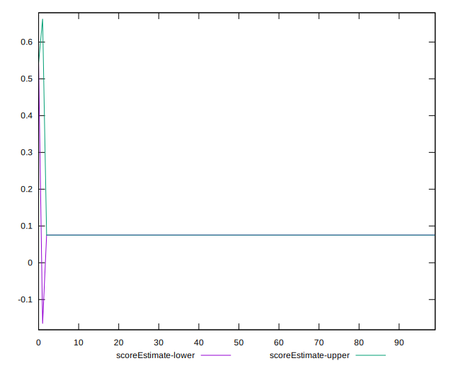

# //cumulative-layout-shift/samples/pages+cached+noadtech+nomedia+nocss

[→ Parent](../..)


## Raw


```yaml
p90min: 0.6988059895833333
p90max: 0.6988059895833333
p90range: 0
p90mean: 0.6988059895833341
p90median: 0.6988059895833333
p90stdev: 7.771561172376096e-16
p90skewness: -1
p90eccentricity: 1
p90discretization: 94
outlandishness: 0.9734288972125134
confidence: 0.025646400954926676
p90confidence: 3.1421175592286797e-16

```


## Score


```yaml
p90min: 0.08
p90max: 0.08
p90range: 0
p90mean: 0.08000000000000006
p90median: 0.08
p90stdev: 5.551115123125783e-17
p90skewness: -1
p90eccentricity: 1
p90discretization: 94
outlandishness: 1.243225
confidence: 0.025244336120875902
p90confidence: 2.244369685163343e-17

```


## Raw Estimate


## Score Estimate


## P Score


```yaml
p90min: 0.07526408149672303
p90max: 0.07526408149672303
p90range: 0
p90mean: 0.07526408149672294
p90median: 0.07526408149672303
p90stdev: 9.71445146547012e-17
p90skewness: 1
p90eccentricity: 1
p90discretization: 94
outlandishness: 1.263951053476923
confidence: 0.0256614081482655
p90confidence: 3.9276469490358497e-17

```


## Score Difference


```yaml
p90min: 0
p90max: 0
p90range: 0
p90mean: 0
p90median: 0
p90stdev: 0
p90skewness: .nan
p90eccentricity: .nan
p90discretization: 94
outlandishness: .nan
confidence: 0
p90confidence: 0

```


## P Score Difference


```yaml
p90min: -0.004735918503276967
p90max: -0.004735918503276967
p90range: 0
p90mean: -0.004735918503276977
p90median: -0.004735918503276967
p90stdev: 9.540979117872439e-18
p90skewness: 1
p90eccentricity: 1
p90discretization: 94
outlandishness: 0.9368410423564628
confidence: 0.00041707202738959054
p90confidence: 3.857510396374496e-18

```

