# //cumulative-layout-shift/samples/pages+cached+noadtech+nomedia

[→ Parent](../..)


## Raw


```yaml
p90min: 1.0302503187391492
p90max: 1.6597258911132813
p90range: 0.6294755723741321
p90mean: 1.0715122631605065
p90median: 1.0344603203667533
p90stdev: 0.1406434664773212
p90skewness: 3.674640067191806
p90eccentricity: 0.9999999999999999
p90discretization: 7.230769230769231
outlandishness: 1.0270171095326868
confidence: 0.06691397195251314
p90confidence: 0.05686351761342027

```

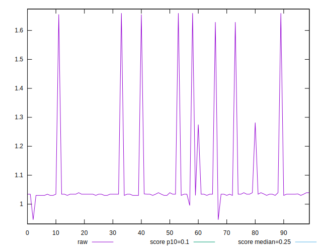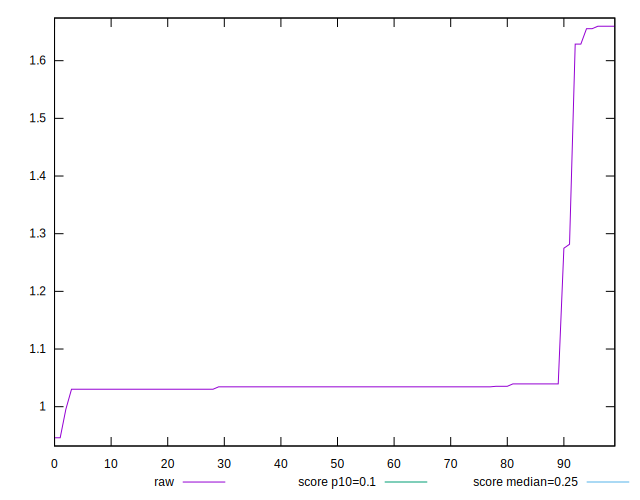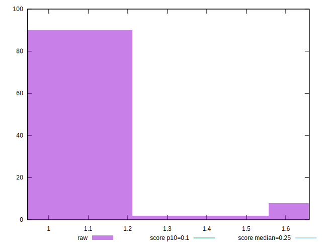
## Score


```yaml
p90min: 0
p90max: 0.02
p90range: 0.02
p90mean: 0.01872340425531916
p90median: 0.02
p90stdev: 0.004666321744566236
p90skewness: -3.5562094871771577
p90eccentricity: 1.0000000000000024
p90discretization: 31.333333333333332
outlandishness: 0.9762787319214877
confidence: 0.0023107634584190666
p90confidence: 0.0018866391405022347

```

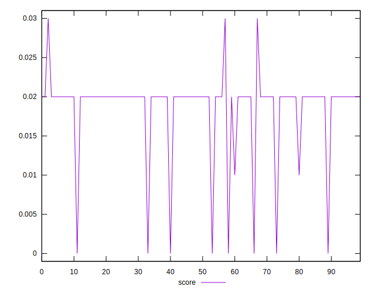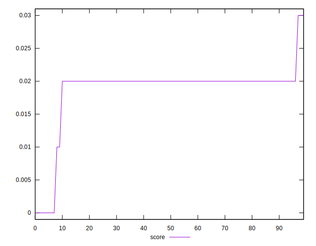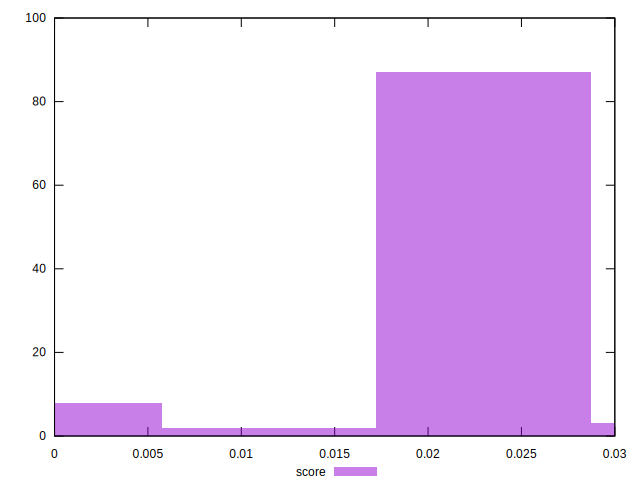
## Raw Estimate

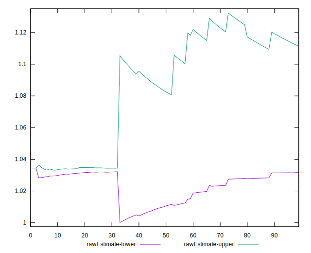
## Score Estimate

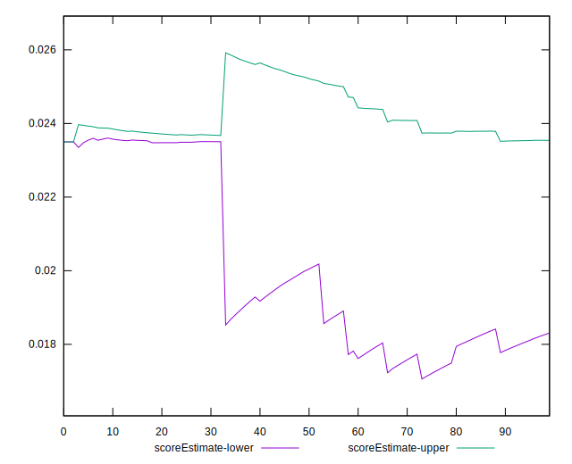
## P Score


```yaml
p90min: 0.004054126984273931
p90max: 0.02381832188081562
p90range: 0.019764194896541687
p90mean: 0.022262135497896293
p90median: 0.023500050050571486
p90stdev: 0.004638933839212628
p90skewness: -3.4035655567671053
p90eccentricity: 1.0000000000000007
p90discretization: 10.444444444444445
outlandishness: 0.9713837562554157
confidence: 0.0022144000583605872
p90confidence: 0.0018755659447294278

```

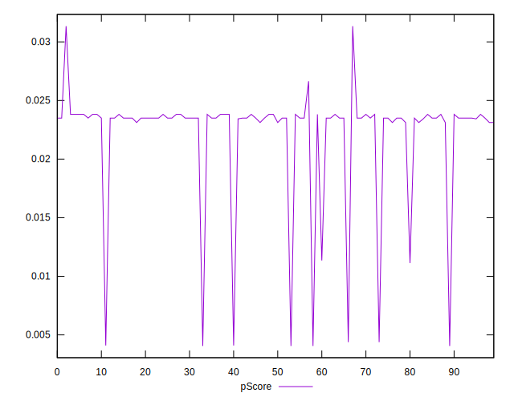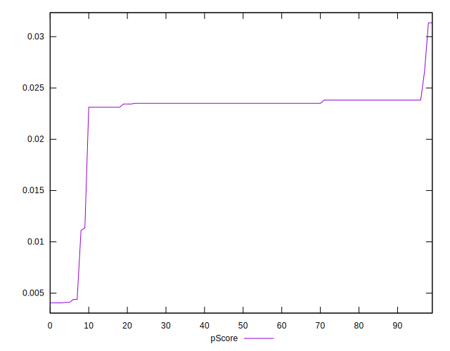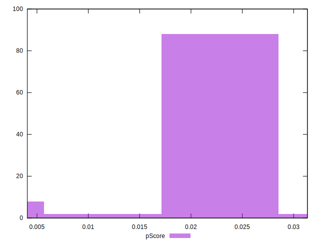
## Score Difference


```yaml
p90min: 0
p90max: 0
p90range: 0
p90mean: 0
p90median: 0
p90stdev: 0
p90skewness: .nan
p90eccentricity: .nan
p90discretization: 94
outlandishness: .nan
confidence: 0
p90confidence: 0

```


## P Score Difference


```yaml
p90min: 0.0013413346129429182
p90max: 0.0040969197158846615
p90range: 0.0027555851029417433
p90mean: 0.0035336152209285428
p90median: 0.0035000500505714856
p90stdev: 0.0003956116269795291
p90skewness: -3.4806200017057076
p90eccentricity: 1
p90discretization: 11.75
outlandishness: 0.9484295657304862
confidence: 0.0003364906403603383
p90confidence: 0.0001599496178690374

```

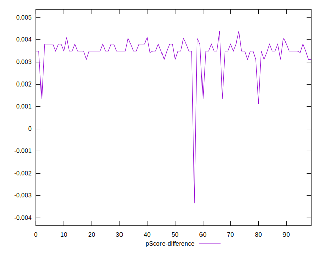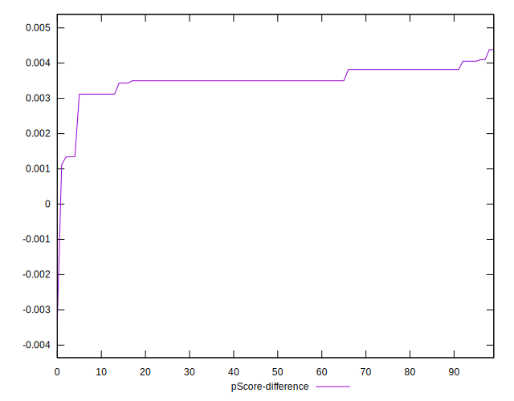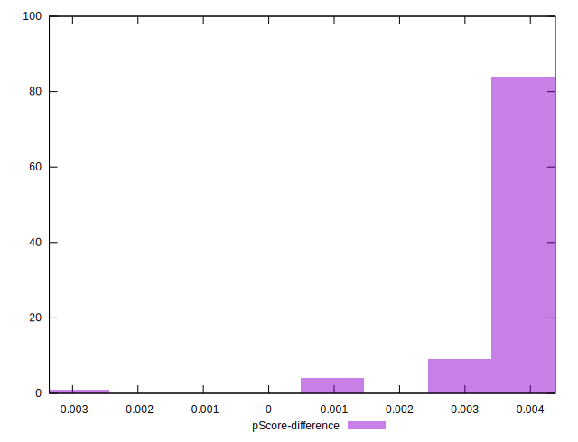