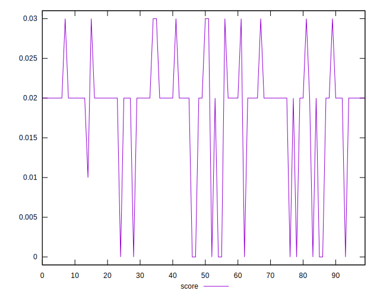
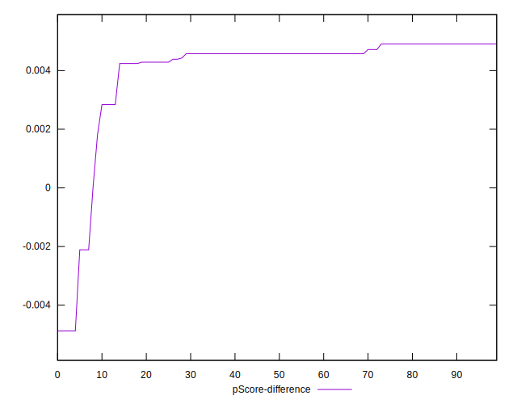

# //cumulative-layout-shift/samples/pages+cached+noadtech

[→ Parent](../..)


## Raw


```yaml
p90min: 0.9321282912360298
p90max: 1.6416703355577256
p90range: 0.7095420443216958
p90mean: 1.0914731268285298
p90median: 1.020477737850613
p90stdev: 0.20064554039412155
p90skewness: 2.3139638755375316
p90eccentricity: 1.0000000000000002
p90discretization: 7.230769230769231
outlandishness: 1.0717228436010053
confidence: 0.15035581208685223
p90confidence: 0.08112293806477765

```


## Score


```yaml
p90min: 0
p90max: 0.03
p90range: 0.03
p90mean: 0.01851063829787235
p90median: 0.02
p90stdev: 0.007431595402797002
p90skewness: -1.4642794371386347
p90eccentricity: 1.000000000000004
p90discretization: 23.5
outlandishness: 0.9773708680142689
confidence: 0.003187217235370623
p90confidence: 0.0030046661012220048

```


## Raw Estimate


## Score Estimate


## P Score


```yaml
p90min: 0.004241318068433697
p90max: 0.03283929049190676
p90range: 0.02859797242347306
p90mean: 0.022385332427665952
p90median: 0.024576314396556442
p90stdev: 0.006799277545491468
p90skewness: -2.1568062168567312
p90eccentricity: 1.0000000000000016
p90discretization: 8.545454545454545
outlandishness: 0.9757775357396288
confidence: 0.002991510881468412
p90confidence: 0.0027490138585920827

```


## Score Difference


```yaml
p90min: 0
p90max: 0
p90range: 0
p90mean: 0
p90median: 0
p90stdev: 0
p90skewness: .nan
p90eccentricity: .nan
p90discretization: 94
outlandishness: .nan
confidence: 0
p90confidence: 0

```


## P Score Difference


```yaml
p90min: -0.004883147088297651
p90max: 0.004911334870355184
p90range: 0.009794481958652835
p90mean: 0.004055011579622442
p90median: 0.004576314396556442
p90stdev: 0.0018792994389688093
p90skewness: -3.5159951148601487
p90eccentricity: 0.9999999999999988
p90discretization: 7.230769230769231
outlandishness: 0.8839920993135304
confidence: 0.000934209799925895
p90confidence: 0.000759818990709572

```

