# //cumulative-layout-shift/samples/pages+cached

[→ Parent](../..)


## Raw


```yaml
p90min: 0.9641888381110297
p90max: 1.6814017808702255
p90range: 0.7172129427591958
p90mean: 1.0776259599690177
p90median: 1.0473761346605088
p90stdev: 0.13068527979898686
p90skewness: 4.055845602975532
p90eccentricity: 0.9999999999999999
p90discretization: 1.0804597701149425
outlandishness: 1.0273474273732695
confidence: 0.0649836771708603
p90confidence: 0.05283732615380844

```

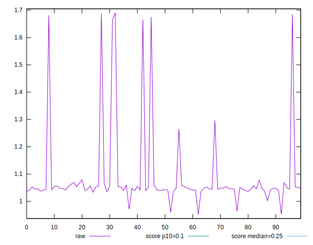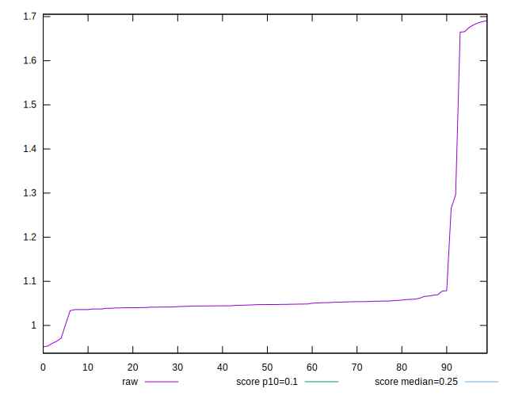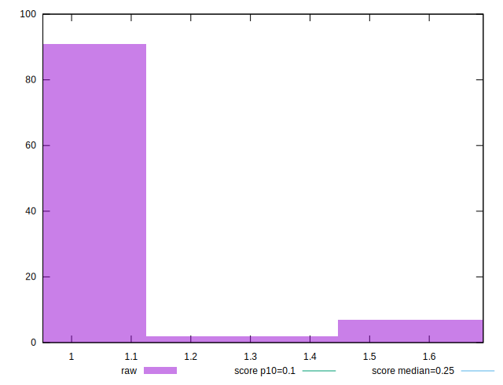
## Score


```yaml
p90min: 0
p90max: 0.03
p90range: 0.03
p90mean: 0.019255319148936183
p90median: 0.02
p90stdev: 0.004667534248612829
p90skewness: -2.7604862836791364
p90eccentricity: 1.0000000000000044
p90discretization: 23.5
outlandishness: 0.9736564817923753
confidence: 0.0023190606609081593
p90confidence: 0.0018871293676484841

```

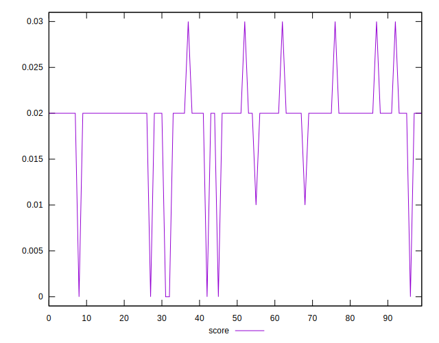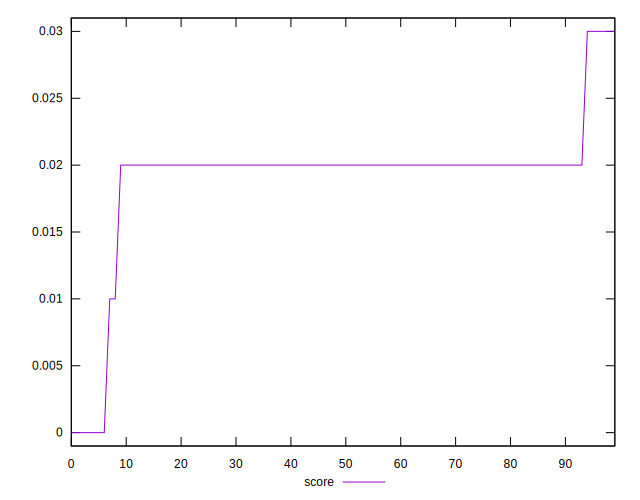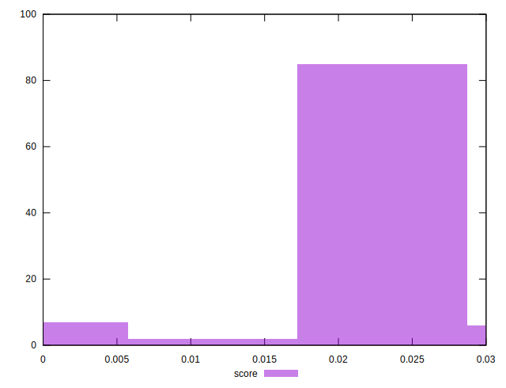
## Raw Estimate

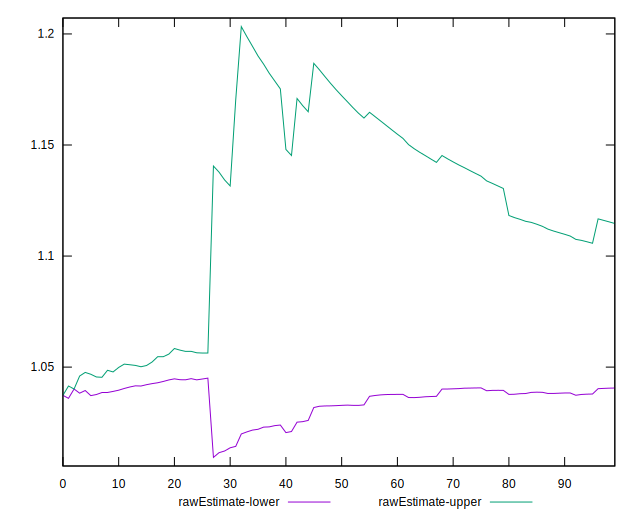
## Score Estimate

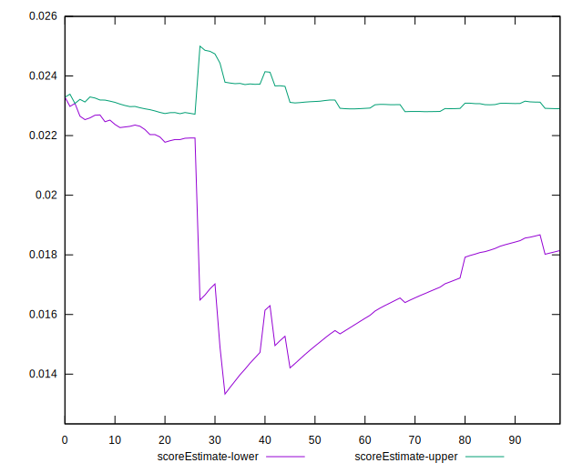
## P Score


```yaml
p90min: 0.0038416877088908175
p90max: 0.029519134887453058
p90range: 0.02567744717856224
p90mean: 0.02164369755984859
p90median: 0.02255357403385344
p90stdev: 0.004257439941674774
p90skewness: -3.235347876416716
p90eccentricity: 0.9999999999999999
p90discretization: 1.0804597701149425
outlandishness: 0.9750535337065891
confidence: 0.0021063643468471156
p90confidence: 0.0017213242618030892

```

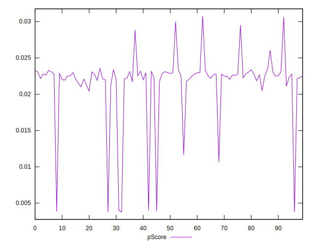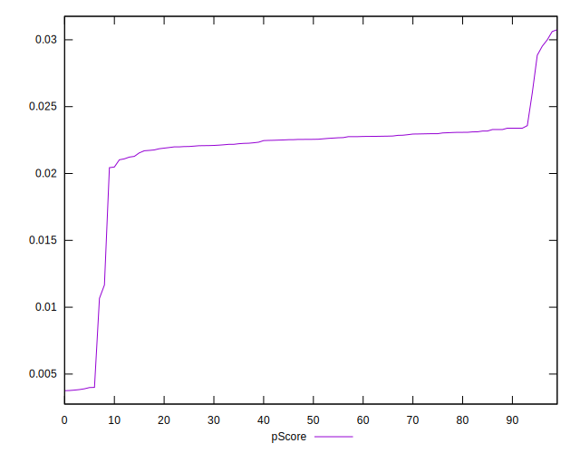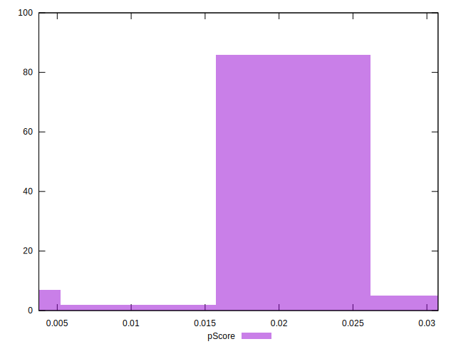
## Score Difference


```yaml
p90min: 0
p90max: 0
p90range: 0
p90mean: 0
p90median: 0
p90stdev: 0
p90skewness: .nan
p90eccentricity: .nan
p90discretization: 94
outlandishness: .nan
confidence: 0
p90confidence: 0

```


## P Score Difference


```yaml
p90min: -0.000006503399361895701
p90max: 0.0038416877088908175
p90range: 0.003848191108252713
p90mean: 0.0024563746100689948
p90median: 0.002559567303630734
p90stdev: 0.0007843621580879579
p90skewness: -0.8899632144951337
p90eccentricity: 0.9999999999999999
p90discretization: 1.0804597701149425
outlandishness: 0.9325015581137898
confidence: 0.000441339873270096
p90confidence: 0.0003171252281308563

```

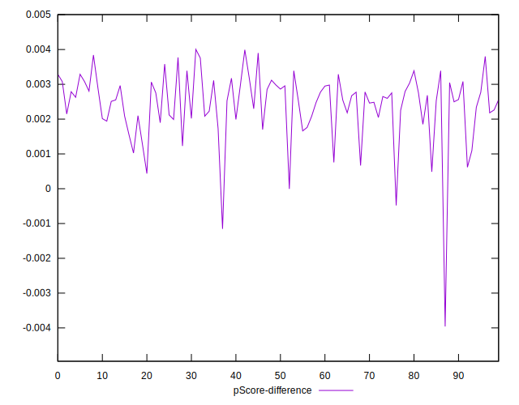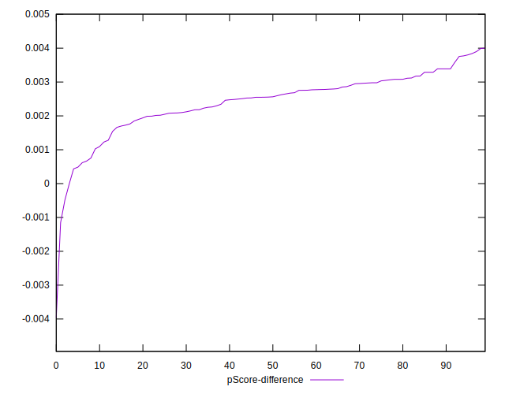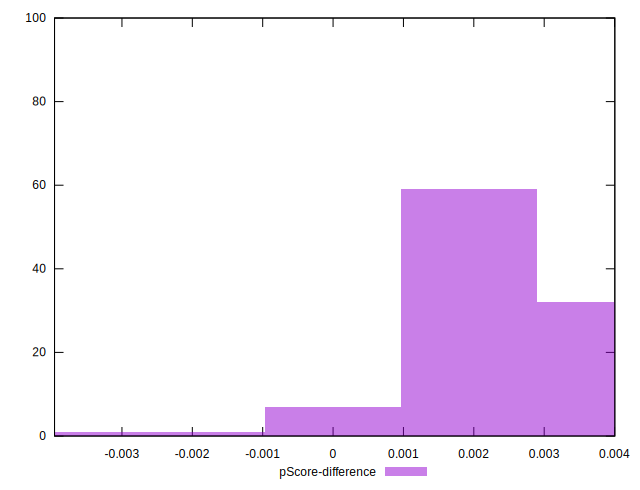