# //cumulative-layout-shift/samples/pages

[→ Parent](../..)


## Raw


```yaml
p90min: 1.0373834588792588
p90max: 1.6841131659613717
p90range: 0.646729707082113
p90mean: 1.224564540475255
p90median: 1.057524348364936
p90stdev: 0.2760385590980343
p90skewness: 0.9763532531530807
p90eccentricity: 0.9999999999999996
p90discretization: 1.1058823529411765
outlandishness: 1.0111812382925724
confidence: 0.11085603029922063
p90confidence: 0.11160506677205154

```

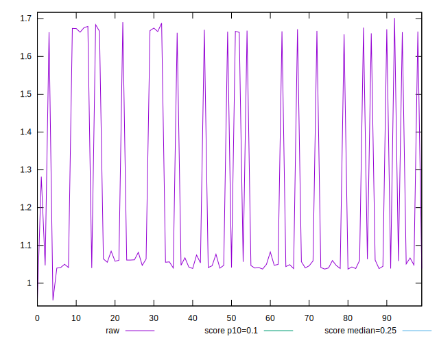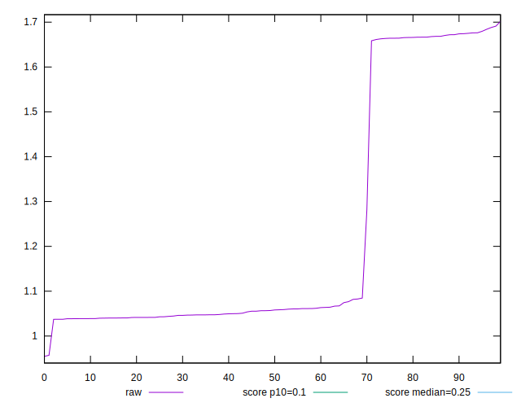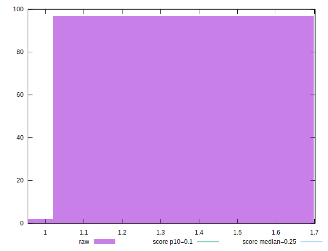
## Score


```yaml
p90min: 0
p90max: 0.02
p90range: 0.02
p90mean: 0.014361702127659583
p90median: 0.02
p90stdev: 0.008939335812147113
p90skewness: -0.9693492903263105
p90eccentricity: 0.9999999999999987
p90discretization: 31.333333333333332
outlandishness: 0.991425865569273
confidence: 0.003645954484511558
p90confidence: 0.0036142601724643425

```

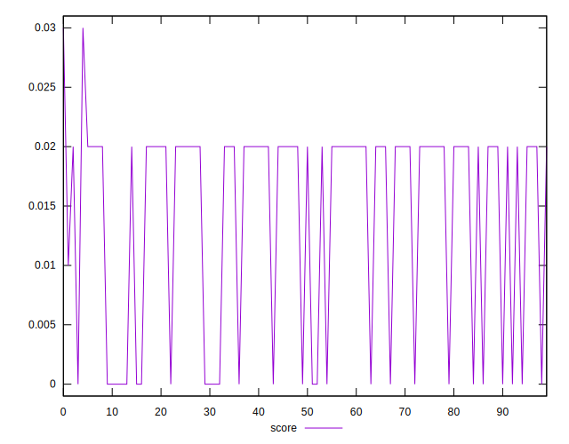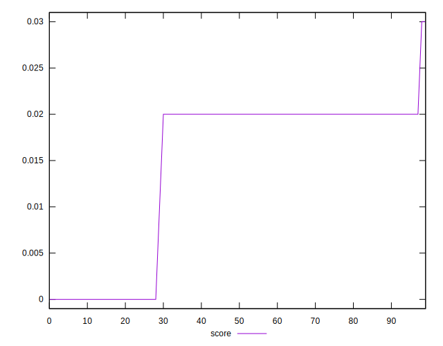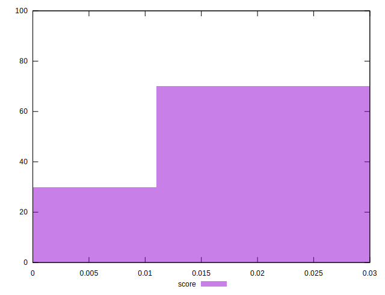
## Raw Estimate

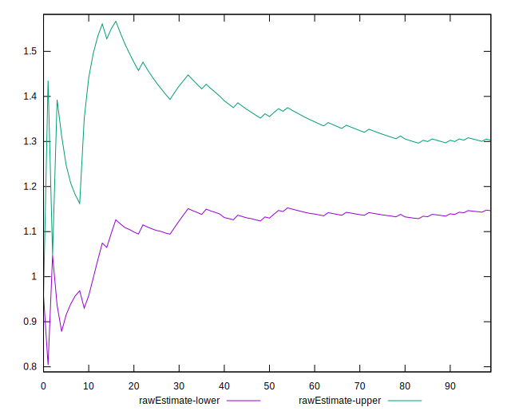
## Score Estimate

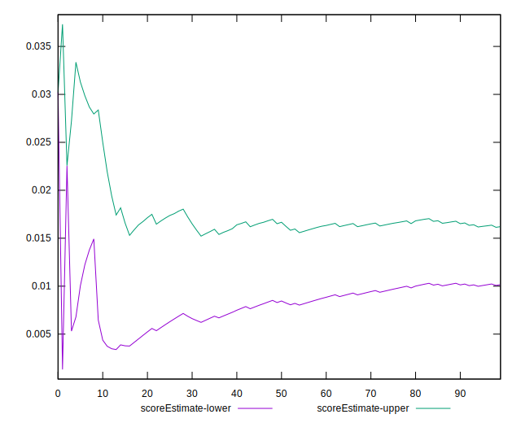
## P Score


```yaml
p90min: 0.003816015839132214
p90max: 0.02328192535959639
p90range: 0.019465909520464175
p90mean: 0.01710679685552682
p90median: 0.021840489374034516
p90stdev: 0.008237634195002855
p90skewness: -0.93689504935257
p90eccentricity: 1.0000000000000009
p90discretization: 1.1058823529411765
outlandishness: 0.9912658833858082
confidence: 0.0033500436220351183
p90confidence: 0.0033305554027708135

```

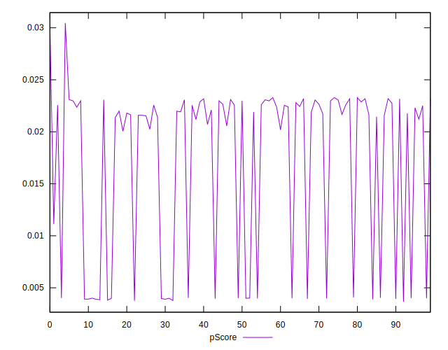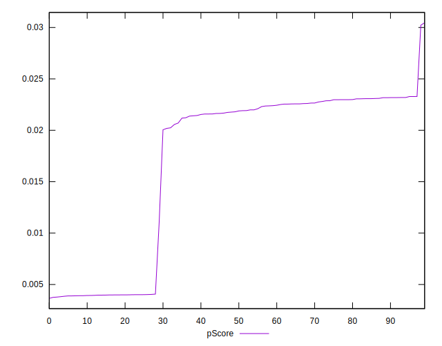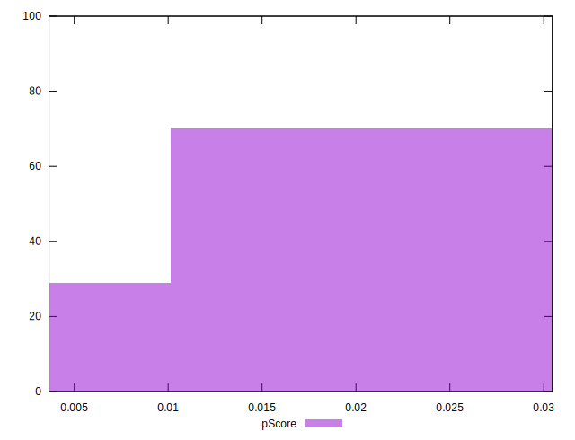
## Score Difference


```yaml
p90min: 0
p90max: 0
p90range: 0
p90mean: 0
p90median: 0
p90stdev: 0
p90skewness: .nan
p90eccentricity: .nan
p90discretization: 94
outlandishness: .nan
confidence: 0
p90confidence: 0

```


## P Score Difference


```yaml
p90min: 0.0002410315239369694
p90max: 0.0040144359596452905
p90range: 0.003773404435708321
p90mean: 0.002772369254303511
p90median: 0.0029753130013247427
p90stdev: 0.0009759670299314651
p90skewness: -0.506547525901456
p90eccentricity: 1.0000000000000002
p90discretization: 1.1058823529411765
outlandishness: 0.9710373107368969
confidence: 0.0004200028608401009
p90confidence: 0.00039459293621416975

```

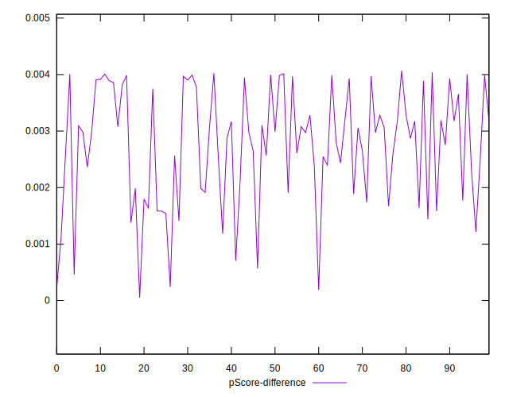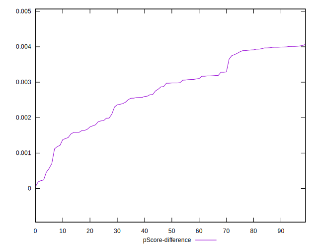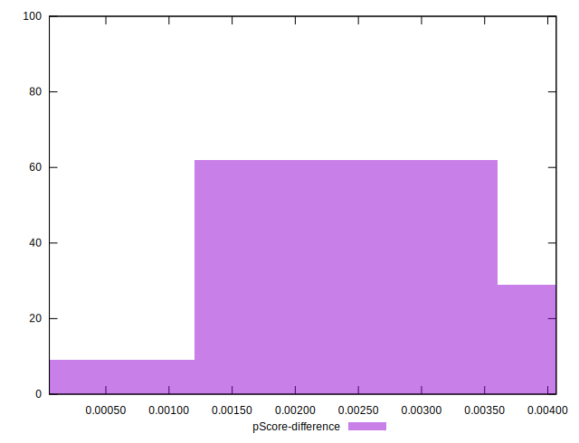