# //estimated-input-latency/samples/pages+cached+noadtech+nomedia+nocss

[→ Parent](../..)


## Raw


```yaml
p90min: 12.8
p90max: 250.4
p90range: 237.6
p90mean: 58.451813576494466
p90median: 37.300000000000004
p90stdev: 54.794059519269325
p90skewness: 1.4588382038061207
p90eccentricity: 0.9999999999999997
p90discretization: 1.492063492063492
outlandishness: 1.4071176635912226
confidence: 36.16534261408476
p90confidence: 22.153769717324128

```

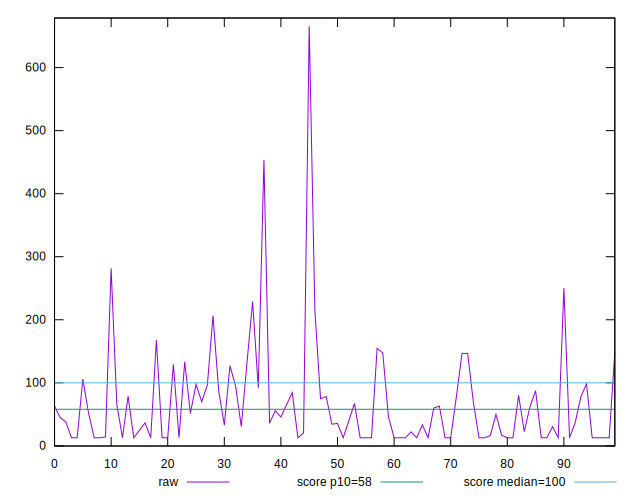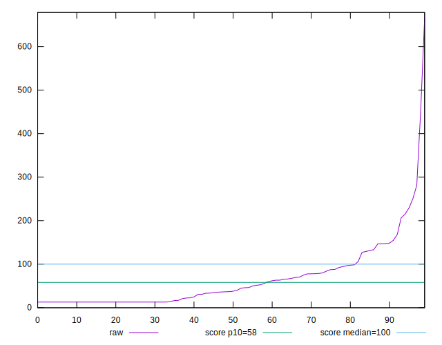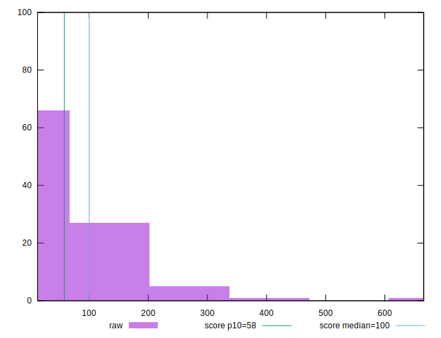
## Score


```yaml
p90min: 0.02
p90max: 1
p90range: 0.98
p90mean: 0.7951063829787234
p90median: 0.99
p90stdev: 0.3028578231168669
p90skewness: -1.3709672152557175
p90eccentricity: 0.9999999999999988
p90discretization: 2.8484848484848486
outlandishness: 0.956203470398389
confidence: 0.12760961109195446
p90confidence: 0.12244835533789307

```

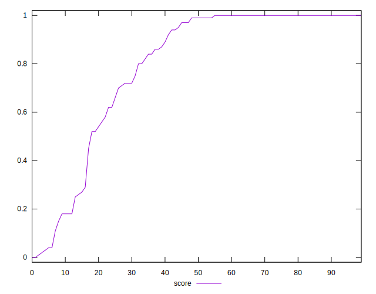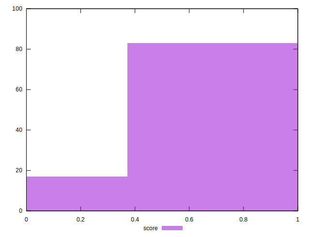
## Raw Estimate

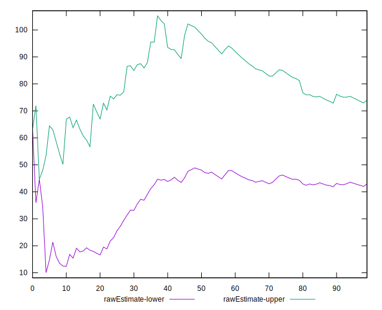
## Score Estimate

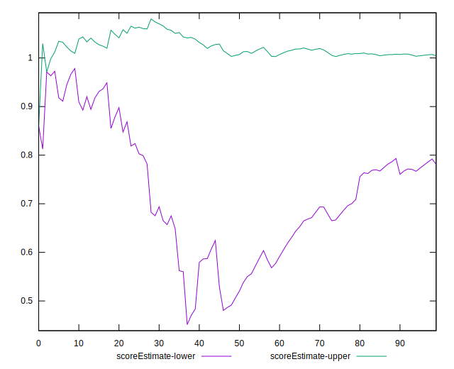
## P Score


```yaml
p90min: 0.015406758662889264
p90max: 0.9999993380488856
p90range: 0.9845925793859964
p90mean: 0.7948099009815972
p90median: 0.9898075527077426
p90stdev: 0.3028363017800173
p90skewness: -1.372250205894073
p90eccentricity: 0.9999999999999987
p90discretization: 1.492063492063492
outlandishness: 0.9561725310699021
confidence: 0.12761830620395173
p90confidence: 0.12243965405266695

```

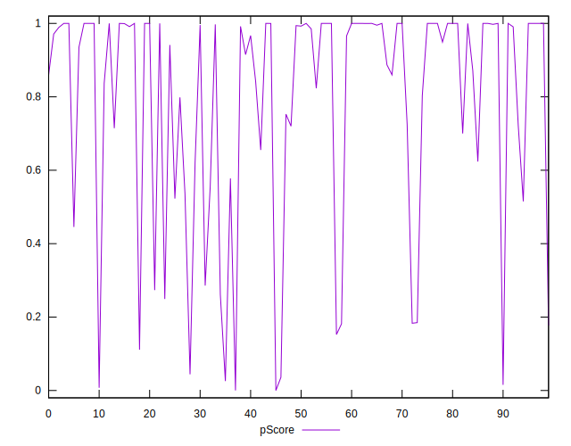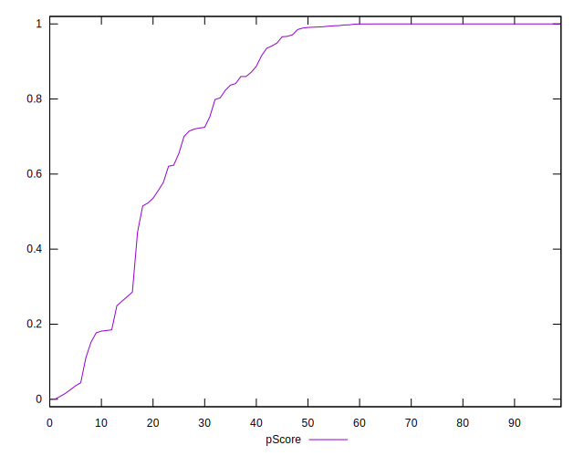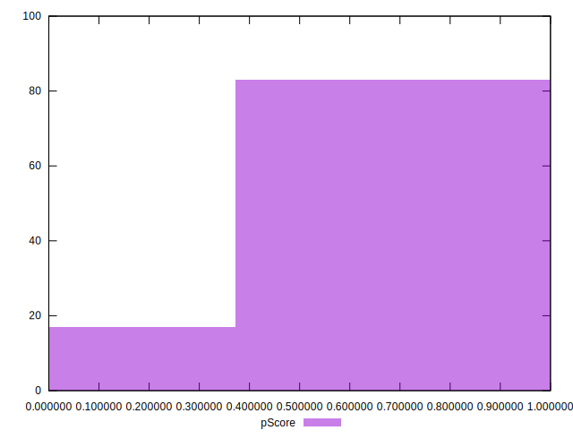
## Score Difference


```yaml
p90min: 0
p90max: 1.1102230246251565e-16
p90range: 1.1102230246251565e-16
p90mean: 2.362176648138631e-18
p90median: 0
p90stdev: 1.6021061506108986e-17
p90skewness: 6.634888026970368
p90eccentricity: 0.9999999999999994
p90discretization: 47
outlandishness: 5.522500000000001
confidence: 9.48495164808595e-18
p90confidence: 6.477470556979047e-18

```

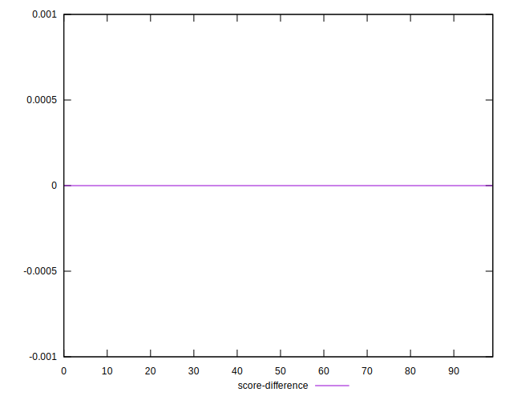
## P Score Difference


```yaml
p90min: -0.004940855065742711
p90max: 0.004112387630690308
p90range: 0.009053242696433018
p90mean: -0.00031298522873853695
p90median: -6.619511143668433e-7
p90stdev: 0.0021616220154886496
p90skewness: -0.4428486292569813
p90eccentricity: 1.0000000000000016
p90discretization: 1.5666666666666667
outlandishness: 0.9340643056660028
confidence: 0.0009428280026303874
p90confidence: 0.0008739647466746442

```

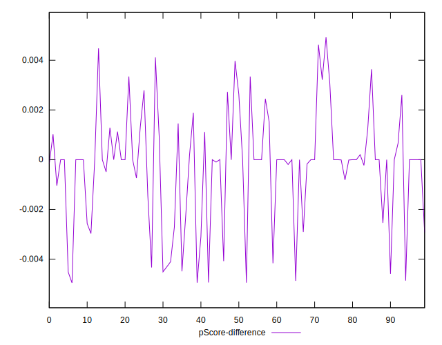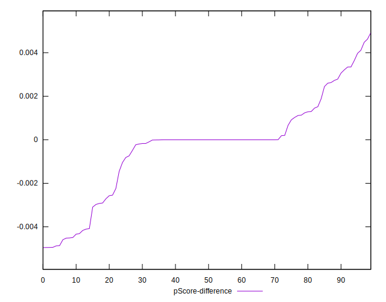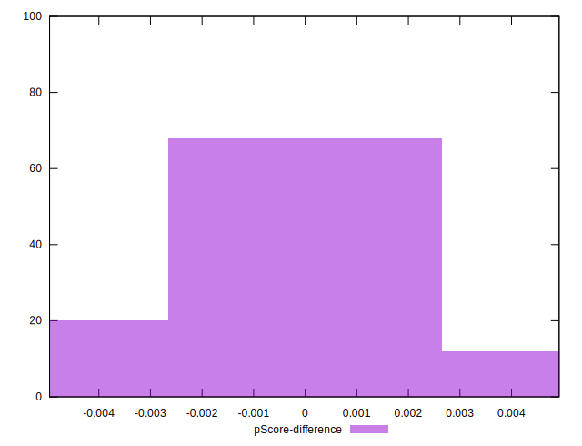