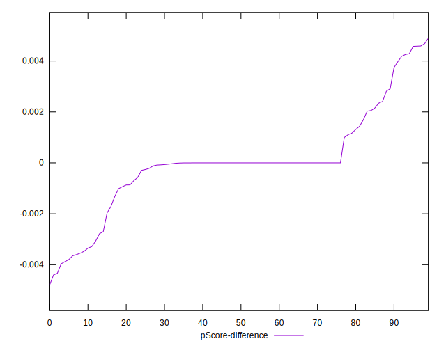

# //estimated-input-latency/samples/pages+cached+noadtech+nomedia

[→ Parent](../..)


## Raw


```yaml
p90min: 12.8
p90max: 153.0666666666667
p90range: 140.26666666666668
p90mean: 40.90348794326247
p90median: 22.800000000000004
p90stdev: 35.53801905473323
p90skewness: 1.3058079184910025
p90eccentricity: 1.0000000000000007
p90discretization: 1.5932203389830508
outlandishness: 1.1359821643495687
confidence: 15.780270165510794
p90confidence: 14.36836579103193

```


## Score


```yaml
p90min: 0.16
p90max: 1
p90range: 0.84
p90mean: 0.888723404255319
p90median: 1
p90stdev: 0.20624935353891305
p90skewness: -2.1489056281307772
p90eccentricity: 0.9999999999999997
p90discretization: 3.4814814814814814
outlandishness: 0.9574273457215143
confidence: 0.09343569119413546
p90confidence: 0.0833886140712244

```


## Raw Estimate


## Score Estimate


## P Score


```yaml
p90min: 0.15828523808789197
p90max: 0.9999993380488856
p90range: 0.8417140999609937
p90mean: 0.8887867382749247
p90median: 0.9997450868697446
p90stdev: 0.20627013089136803
p90skewness: -2.151892924573075
p90eccentricity: 1.0000000000000002
p90discretization: 1.5932203389830508
outlandishness: 0.9573420864381781
confidence: 0.09348527764616377
p90confidence: 0.08339701455634381

```


## Score Difference


```yaml
p90min: 0
p90max: 1.1102230246251565e-16
p90range: 1.1102230246251565e-16
p90mean: 3.543264972207946e-18
p90median: 0
p90stdev: 1.9514781802162982e-17
p90skewness: 5.3260022874854736
p90eccentricity: 1.0000000000000027
p90discretization: 47
outlandishness: 3.5344000000000007
confidence: 1.0335413782903698e-17
p90confidence: 7.890015558655788e-18

```


## P Score Difference


```yaml
p90min: -0.003965065275372326
p90max: 0.004582249796219129
p90range: 0.008547315071591455
p90mean: 0.000017923426299230912
p90median: -6.619511143668433e-7
p90stdev: 0.0018801389254730527
p90skewness: 0.18147567709866558
p90eccentricity: 1.0000000000000013
p90discretization: 1.6785714285714286
outlandishness: 1.6824682941595752
confidence: 0.0008411513609206454
p90confidence: 0.0007601584032455106

```

