# //estimated-input-latency/samples/pages+cached+noadtech

[→ Parent](../..)


## Raw


```yaml
p90min: 12.8
p90max: 212.96539999999987
p90range: 200.16539999999986
p90mean: 42.162999290780164
p90median: 16.366666666666667
p90stdev: 45.29605229902886
p90skewness: 1.8437346197154314
p90eccentricity: 1.0000000000000002
p90discretization: 1.7735849056603774
outlandishness: 1.423971245499021
confidence: 27.51065596316456
p90confidence: 18.313633275951457

```

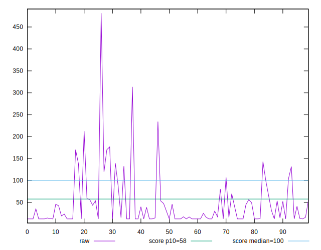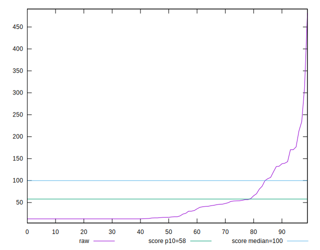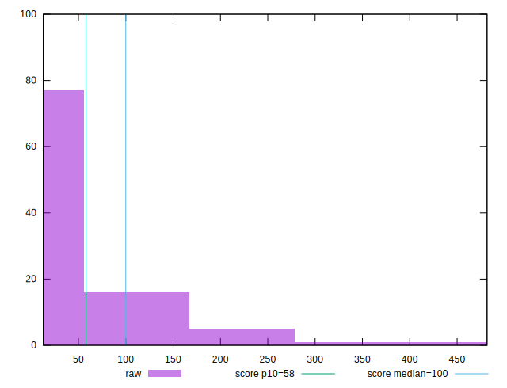
## Score


```yaml
p90min: 0.04
p90max: 1
p90range: 0.96
p90mean: 0.8743617021276597
p90median: 1
p90stdev: 0.26359446007899484
p90skewness: -2.0924168913549157
p90eccentricity: 0.9999999999999987
p90discretization: 3.76
outlandishness: 0.949727201370216
confidence: 0.11620493408169974
p90confidence: 0.10657379684195209

```

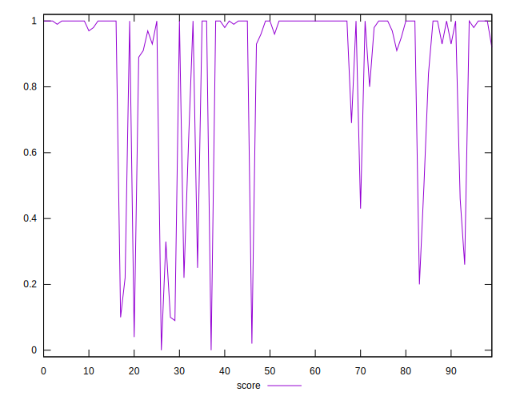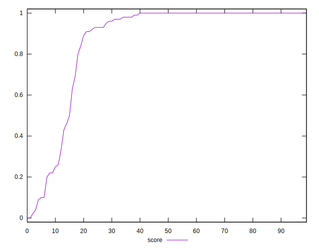
## Raw Estimate

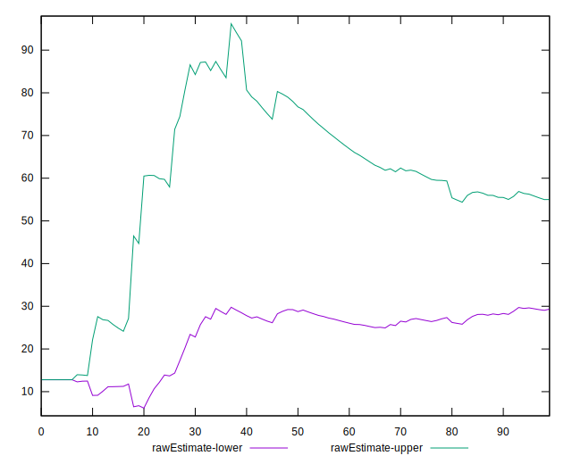
## Score Estimate

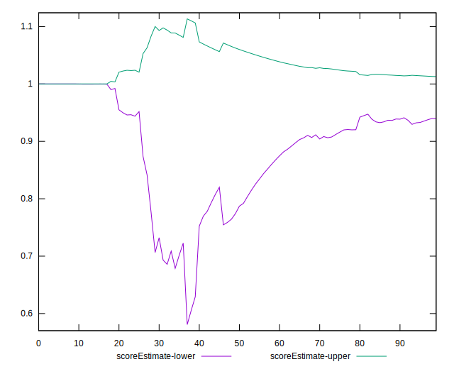
## P Score


```yaml
p90min: 0.03766026077355544
p90max: 0.9999993380488856
p90range: 0.9623390772753302
p90mean: 0.8743853242478042
p90median: 0.9999896830322716
p90stdev: 0.26324508124138624
p90skewness: -2.0928530517620882
p90eccentricity: 1.0000000000000007
p90discretization: 1.7735849056603774
outlandishness: 0.9498640086557277
confidence: 0.11602174546959089
p90confidence: 0.10643253958924268

```

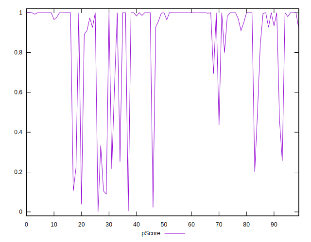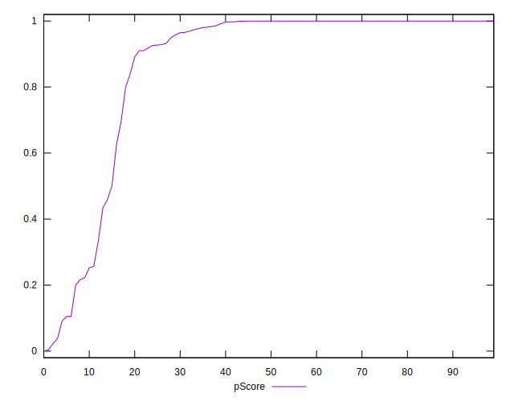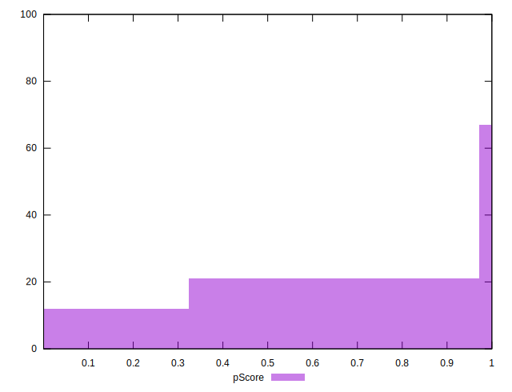
## Score Difference


```yaml
p90min: 0
p90max: 0
p90range: 0
p90mean: 0
p90median: 0
p90stdev: 0
p90skewness: .nan
p90eccentricity: .nan
p90discretization: 94
outlandishness: .inf
confidence: 6.092792000602807e-18
p90confidence: 0

```

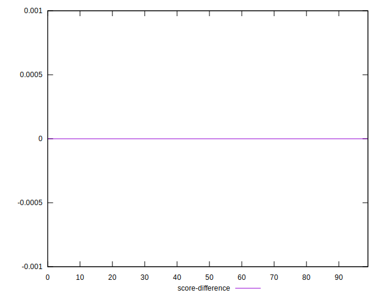
## P Score Difference


```yaml
p90min: -0.0036383467909347766
p90max: 0.00472186287570564
p90range: 0.008360209666640417
p90mean: 0.00006080849420295656
p90median: -6.619511143668433e-7
p90stdev: 0.0015575429174370427
p90skewness: 0.5080323652834621
p90eccentricity: 1.0000000000000007
p90discretization: 1.8431372549019607
outlandishness: 1.9260892247992898
confidence: 0.0007295374652742712
p90confidence: 0.0006297297083019549

```

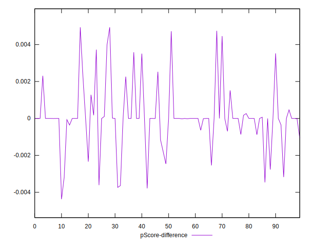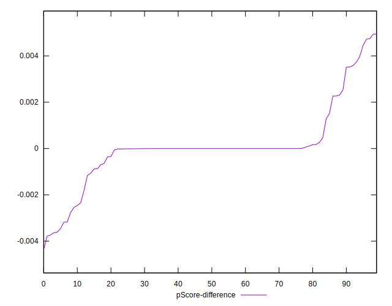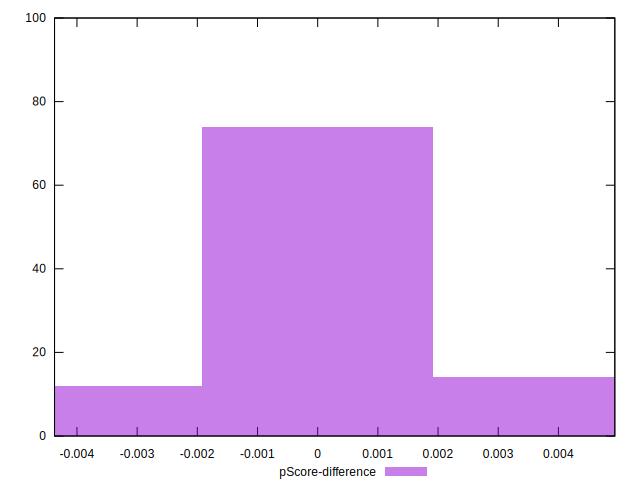