# //estimated-input-latency/samples/pages+cached

[→ Parent](../..)


## Raw


```yaml
p90min: 124.53333333333333
p90max: 1243.9999999999986
p90range: 1119.4666666666653
p90mean: 428.28510638297865
p90median: 385.60000000000025
p90stdev: 256.0502747627429
p90skewness: 1.2142806237520207
p90eccentricity: 1
p90discretization: 1.010752688172043
outlandishness: 1.1210758794196687
confidence: 128.00943534339302
p90confidence: 103.52360954669814

```

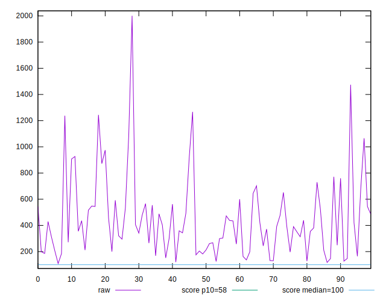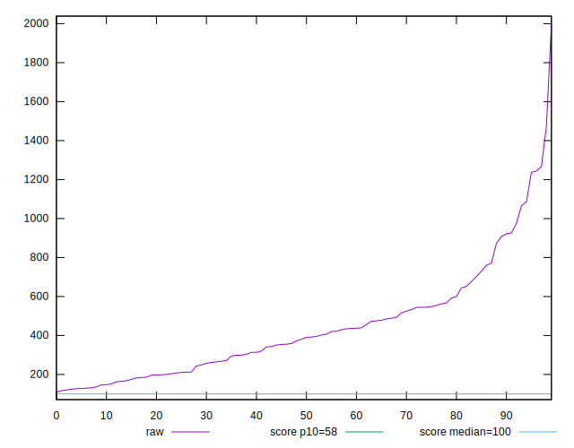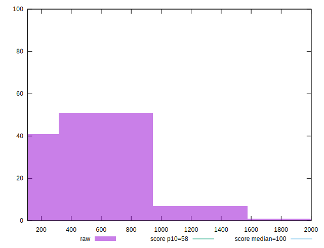
## Score


```yaml
p90min: 0
p90max: 0.3
p90range: 0.3
p90mean: 0.035638297872340435
p90median: 0
p90stdev: 0.0733768835799891
p90skewness: 2.37874800550616
p90eccentricity: 0.9999999999999992
p90discretization: 4.7
outlandishness: 1.5591435954555577
confidence: 0.035825546842750584
p90confidence: 0.02966698572195254

```

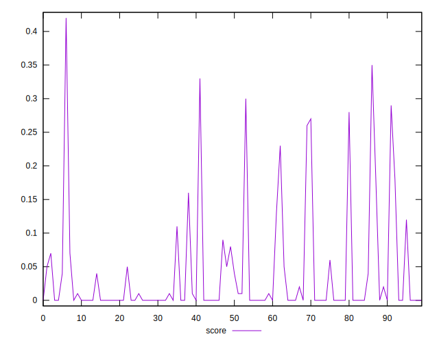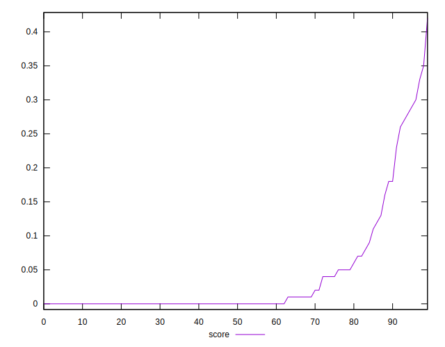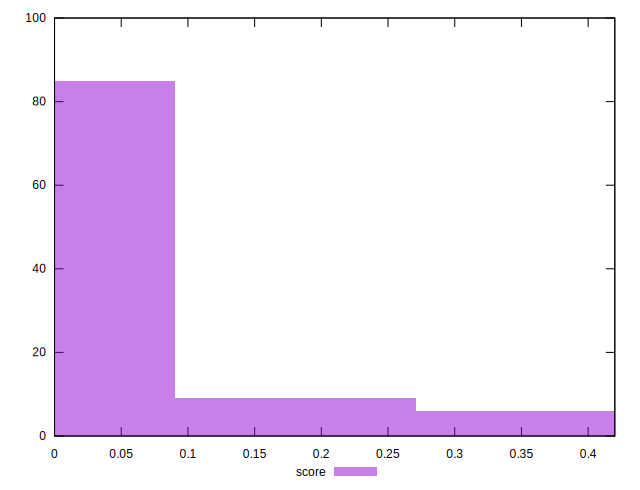
## Raw Estimate

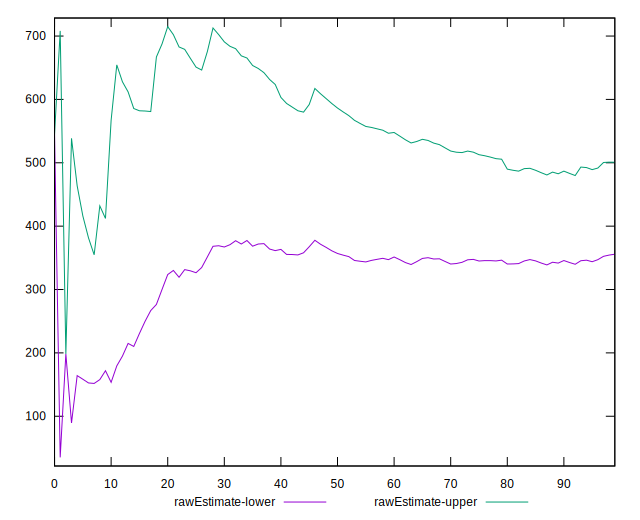
## Score Estimate

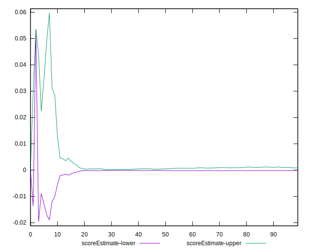
## P Score


```yaml
p90min: 1.5121646712579206e-9
p90max: 0.3028647992039756
p90range: 0.3028647976918109
p90mean: 0.03613874219356215
p90median: 0.0007533972936863975
p90stdev: 0.07348947621037767
p90skewness: 2.3713633545385875
p90eccentricity: 1.0000000000000002
p90discretization: 1.0217391304347827
outlandishness: 1.5552222634315411
confidence: 0.035969974308487744
p90confidence: 0.029712508014467096

```

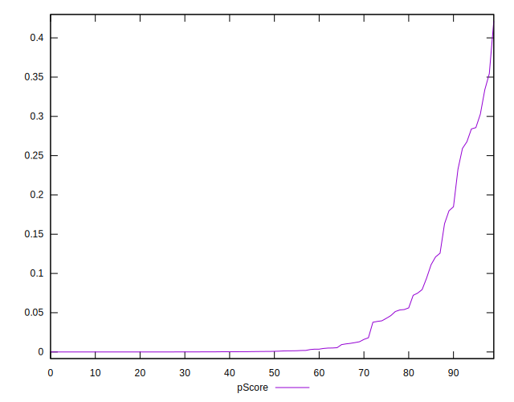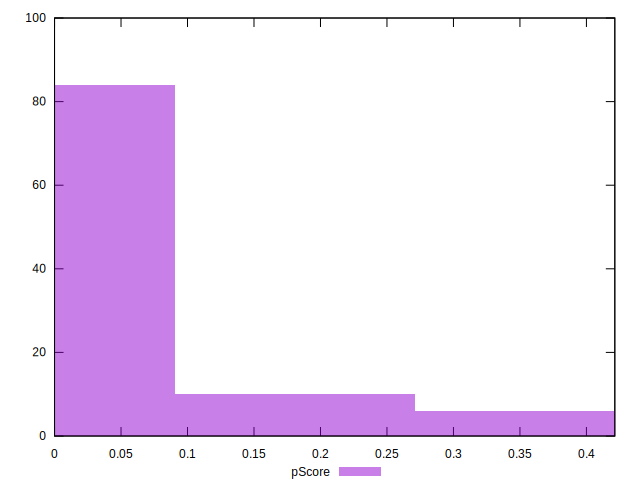
## Score Difference


```yaml
p90min: 0
p90max: 0
p90range: 0
p90mean: 0
p90median: 0
p90stdev: 0
p90skewness: .nan
p90eccentricity: .nan
p90discretization: 94
outlandishness: .inf
confidence: 2.165089820536966e-18
p90confidence: 0

```

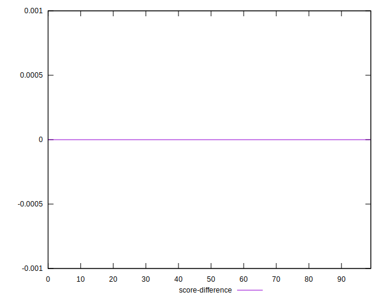
## P Score Difference


```yaml
p90min: -0.004219958940155644
p90max: 0.004491380642152321
p90range: 0.008711339582307964
p90mean: 0.0005932341799514762
p90median: 0.0001087996733253882
p90stdev: 0.0017163697526370399
p90skewness: -0.005895332574368555
p90eccentricity: 1.0000000000000002
p90discretization: 1.0217391304347827
outlandishness: 0.9170642797784359
confidence: 0.0007987929289176884
p90confidence: 0.0006939449382524708

```

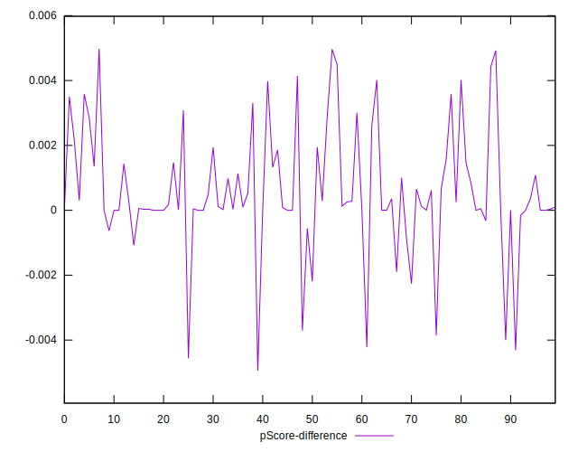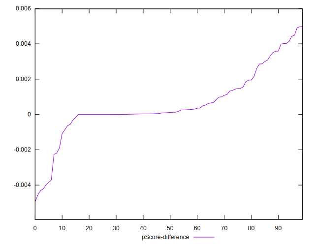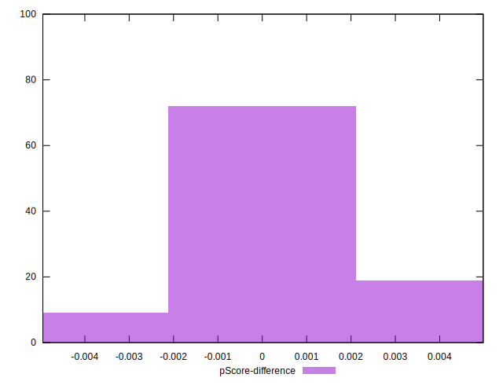