# //estimated-input-latency/samples/pages

[→ Parent](../..)


## Raw


```yaml
p90min: 128.00000000000037
p90max: 1482.3999999999987
p90range: 1354.3999999999983
p90mean: 575.0127659574471
p90median: 522.2
p90stdev: 330.0582112533391
p90skewness: 0.6610291253884105
p90eccentricity: 1
p90discretization: 1.010752688172043
outlandishness: 1.0677734954226292
confidence: 149.71044008308695
p90confidence: 133.44573608106157

```

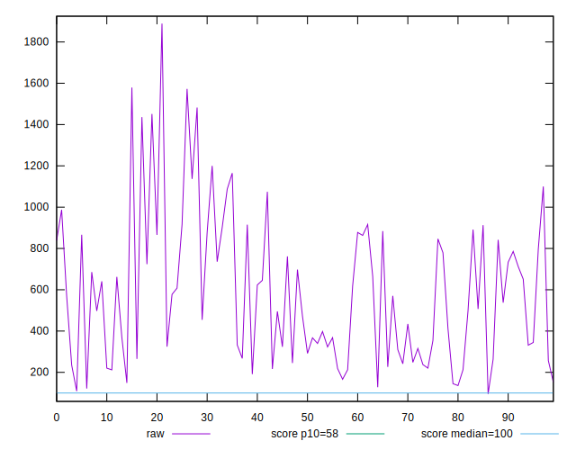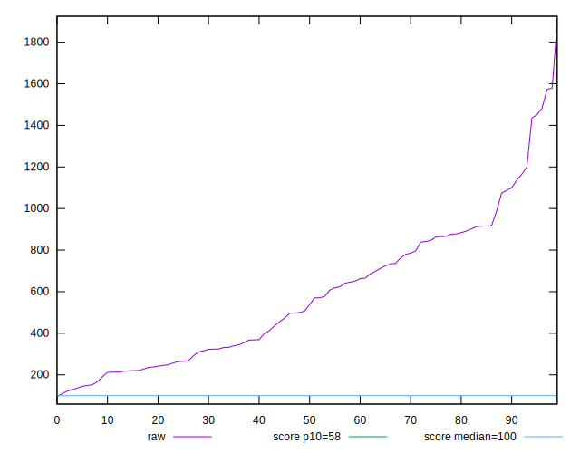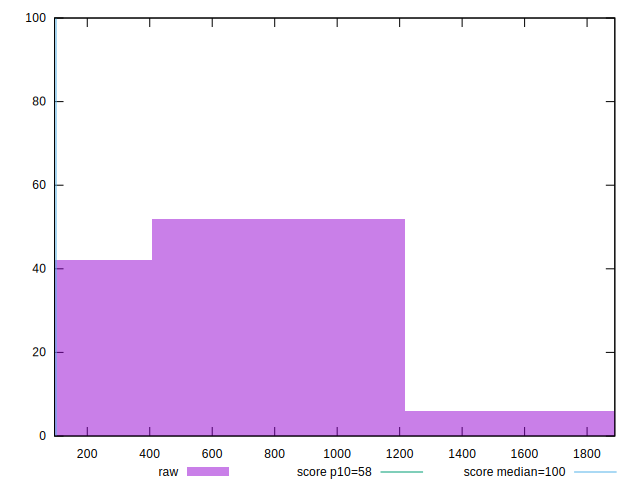
## Score


```yaml
p90min: 0
p90max: 0.28
p90range: 0.28
p90mean: 0.017340425531914894
p90median: 0
p90stdev: 0.04875417127631442
p90skewness: 3.689345789896589
p90eccentricity: 0.9999999999999989
p90discretization: 7.833333333333333
outlandishness: 2.835608054499605
confidence: 0.033896295094010175
p90confidence: 0.019711784319148967

```

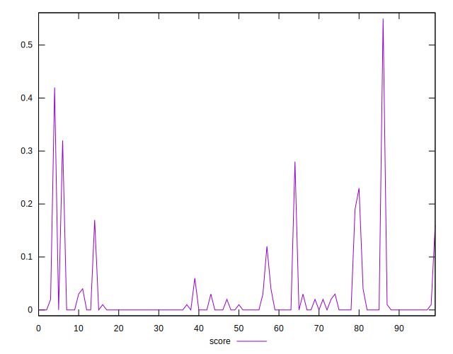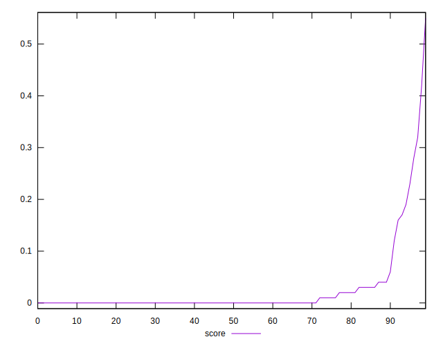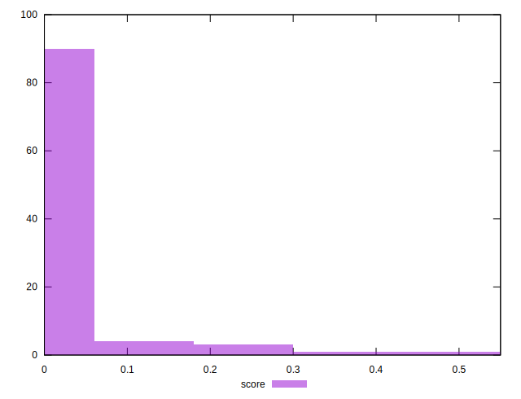
## Raw Estimate

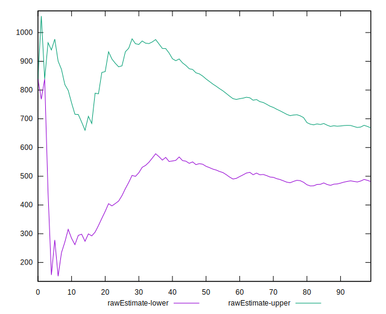
## Score Estimate

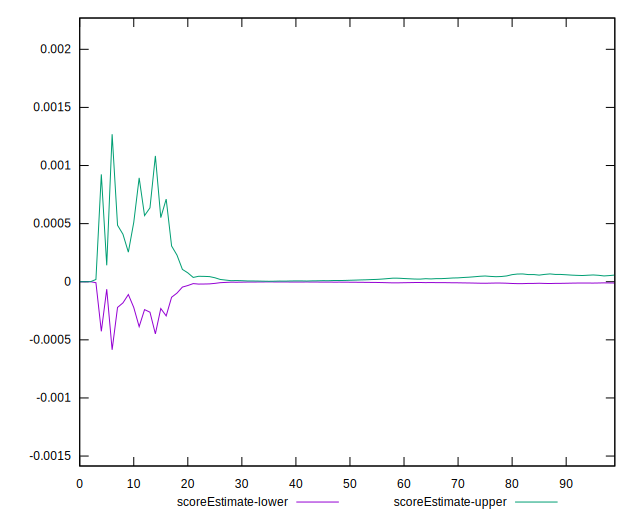
## P Score


```yaml
p90min: 1.1293488366703741e-10
p90max: 0.28069601625510254
p90range: 0.28069601614216766
p90mean: 0.017772971127655135
p90median: 0.000052596498159834804
p90stdev: 0.049034018179676814
p90skewness: 3.70085456423405
p90eccentricity: 0.9999999999999997
p90discretization: 1.0217391304347827
outlandishness: 2.771011706400479
confidence: 0.03386046430757145
p90confidence: 0.019824929136444652

```

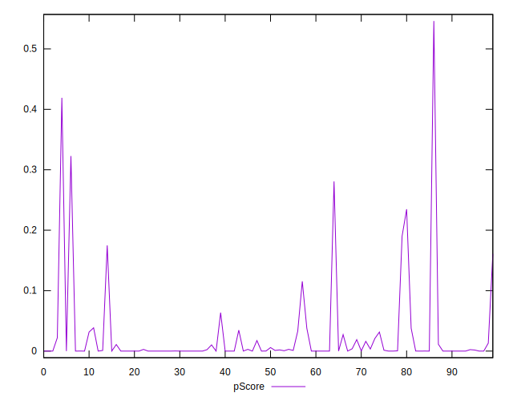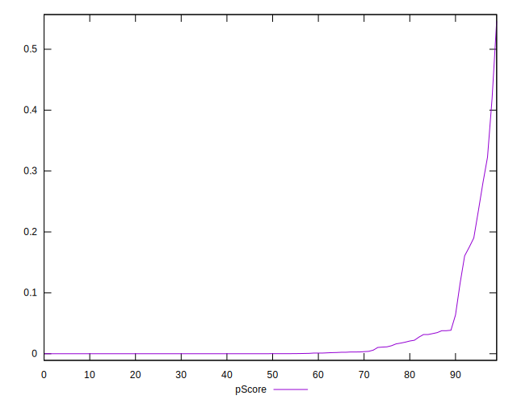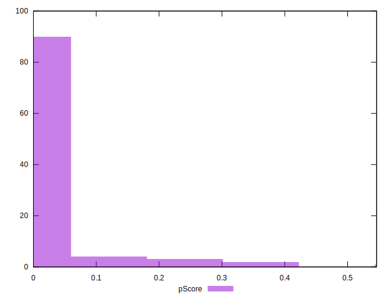
## Score Difference


```yaml
p90min: 0
p90max: 0
p90range: 0
p90mean: 0
p90median: 0
p90stdev: 0
p90skewness: .nan
p90eccentricity: .nan
p90discretization: 94
outlandishness: .nan
confidence: 0
p90confidence: 0

```


## P Score Difference


```yaml
p90min: -0.0038470912975015308
p90max: 0.0038863447586292565
p90range: 0.007733436056130787
p90mean: 0.0003925940183546422
p90median: 0.000004250170304864742
p90stdev: 0.0012929445586128984
p90skewness: 0.264296467658952
p90eccentricity: 0.9999999999999999
p90discretization: 1.0217391304347827
outlandishness: 0.9642903205106597
confidence: 0.0006537282404242003
p90confidence: 0.0005227500254604133

```

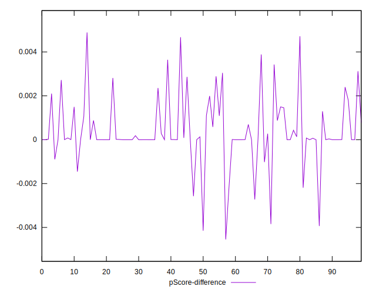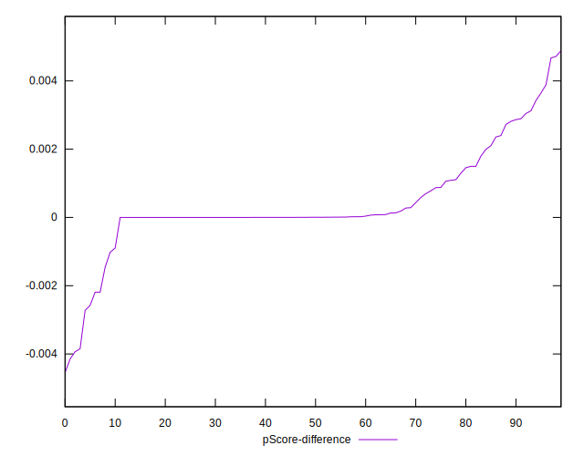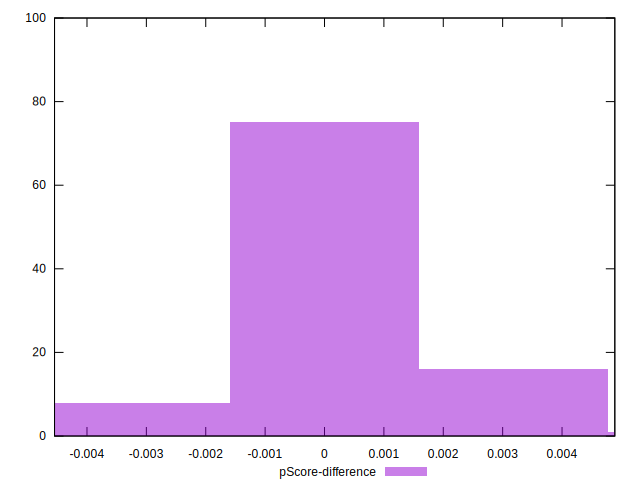