# //first-contentful-paint/samples/pages+cached+noadtech+nomedia+nocss

[→ Parent](../..)


## Raw


```yaml
p90min: 1607.2624999999998
p90max: 2260.9035
p90range: 653.6410000000001
p90mean: 1730.472592553192
p90median: 1687.1317499999998
p90stdev: 129.12690644026446
p90skewness: 1.578336230671548
p90eccentricity: 1.0000000000000002
p90discretization: 1
outlandishness: 1.022275238696026
confidence: 71.84934444792098
p90confidence: 52.20726069004028

```

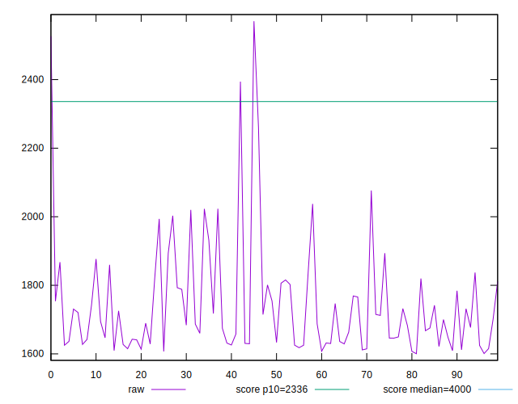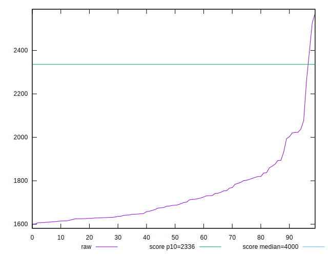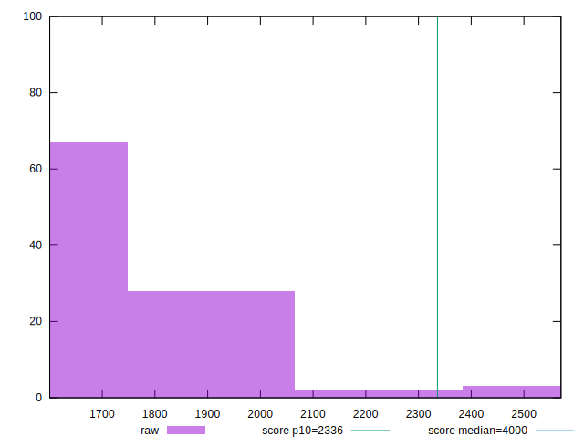
## Score


```yaml
p90min: 0.91
p90max: 0.99
p90range: 0.07999999999999996
p90mean: 0.9745744680851062
p90median: 0.98
p90stdev: 0.011546842030931202
p90skewness: -2.7363409638782046
p90eccentricity: 1
p90discretization: 13.428571428571429
outlandishness: 0.9943144029984015
confidence: 0.008612787377564355
p90confidence: 0.004668500227211861

```

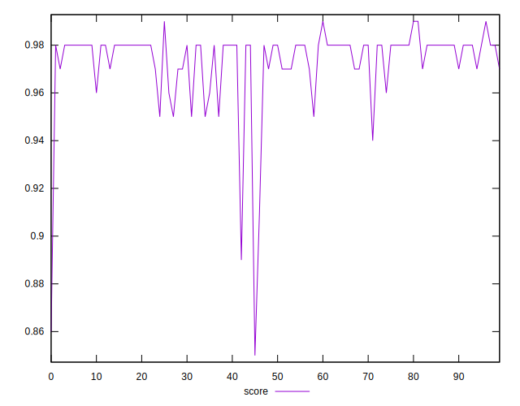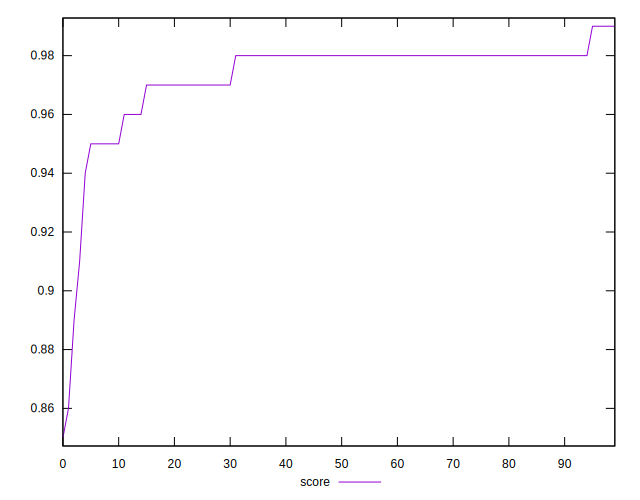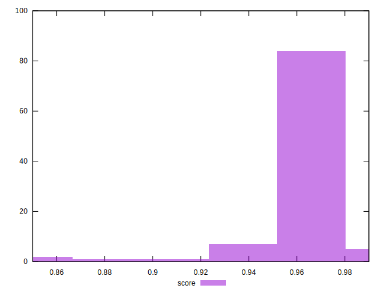
## Raw Estimate

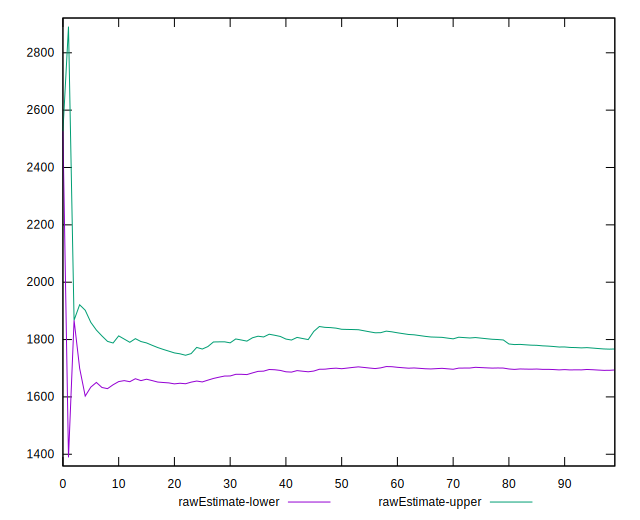
## Score Estimate


## P Score


```yaml
p90min: 0.9129912660910177
p90max: 0.9850897708128485
p90range: 0.07209850472183088
p90mean: 0.9756648650521481
p90median: 0.9801526196617564
p90stdev: 0.012121051528529464
p90skewness: -2.390363732430732
p90eccentricity: 0.9999999999999996
p90discretization: 1
outlandishness: 0.9940331817818263
confidence: 0.008602695896710427
p90confidence: 0.004900658696412683

```

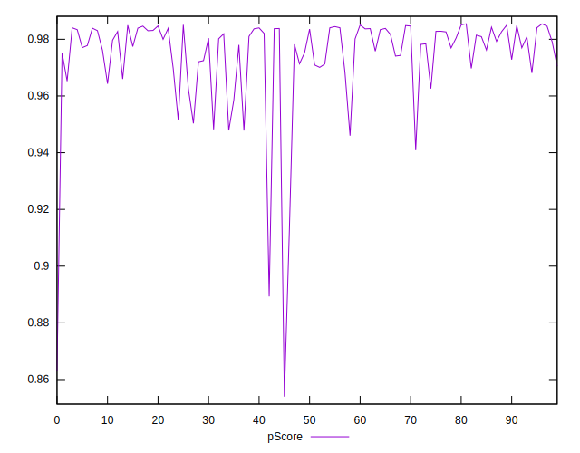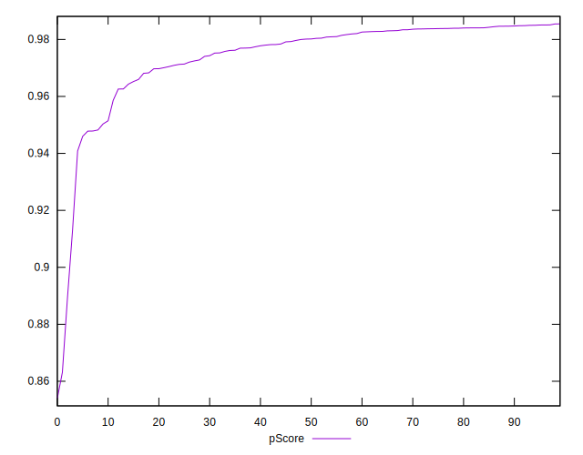
## Score Difference


```yaml
p90min: 0
p90max: 1.1102230246251565e-16
p90range: 1.1102230246251565e-16
p90mean: 4.724353296277262e-18
p90median: 0
p90stdev: 2.2409575331340657e-17
p90skewness: 4.532597979574665
p90eccentricity: 1.0000000000000016
p90discretization: 47
outlandishness: 2.706025000000001
confidence: 1.1103983576888547e-17
p90confidence: 9.06040865942704e-18

```

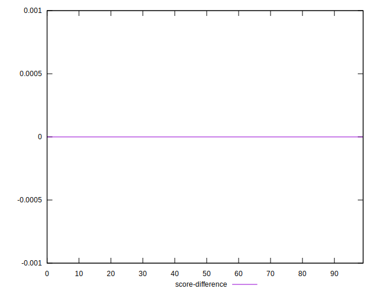
## P Score Difference


```yaml
p90min: -0.004778268531495655
p90max: 0.00483441925328254
p90range: 0.009612687784778196
p90mean: 0.00100964602112393
p90median: 0.0014532684659080974
p90stdev: 0.002871186518107527
p90skewness: -0.5121361527313215
p90eccentricity: 1.0000000000000002
p90discretization: 1
outlandishness: 0.884783310171923
confidence: 0.0011927093662945582
p90confidence: 0.0011608485572285636

```

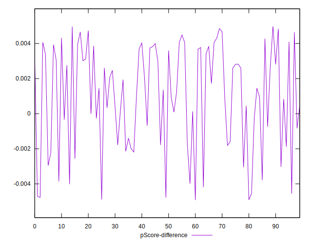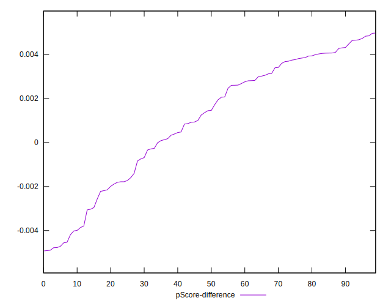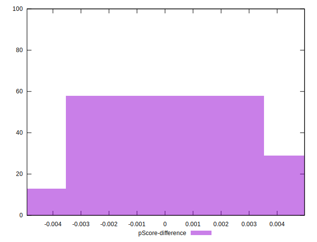