# //first-contentful-paint/samples/pages+cached+noadtech+nomedia

[→ Parent](../..)


## Raw


```yaml
p90min: 2114.2505
p90max: 2856.1765000000005
p90range: 741.9260000000004
p90mean: 2381.7532638297876
p90median: 2373.6675
p90stdev: 177.70061219475295
p90skewness: 0.5604498713975246
p90eccentricity: 0.9999999999999992
p90discretization: 1
outlandishness: 1.0174924998989263
confidence: 99.39452423432208
p90confidence: 71.84608104835984

```

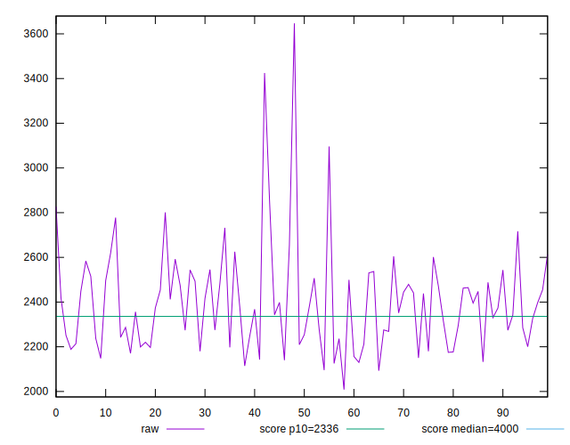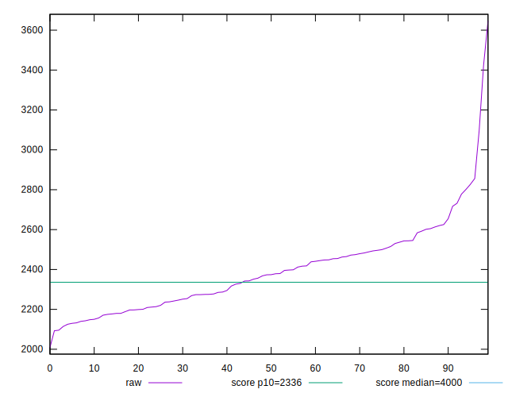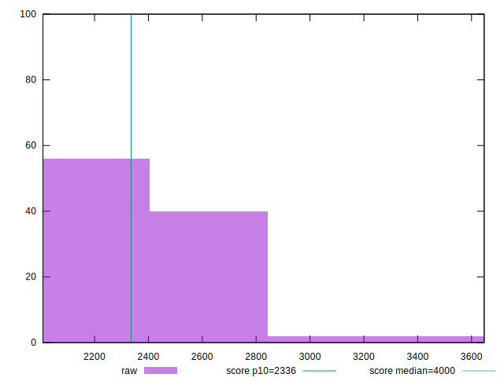
## Score


```yaml
p90min: 0.79
p90max: 0.94
p90range: 0.1499999999999999
p90mean: 0.8893617021276599
p90median: 0.89
p90stdev: 0.0339526739033595
p90skewness: -0.8225971630936274
p90eccentricity: 0.9999999999999997
p90discretization: 6.266666666666667
outlandishness: 0.9877554170520362
confidence: 0.02115958817855428
p90confidence: 0.01372739536989241

```

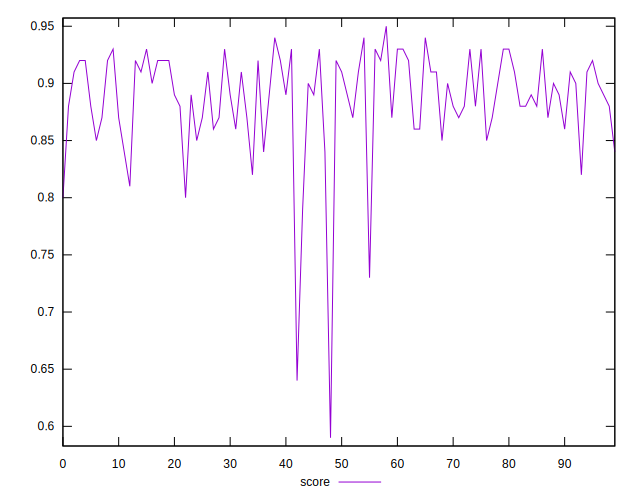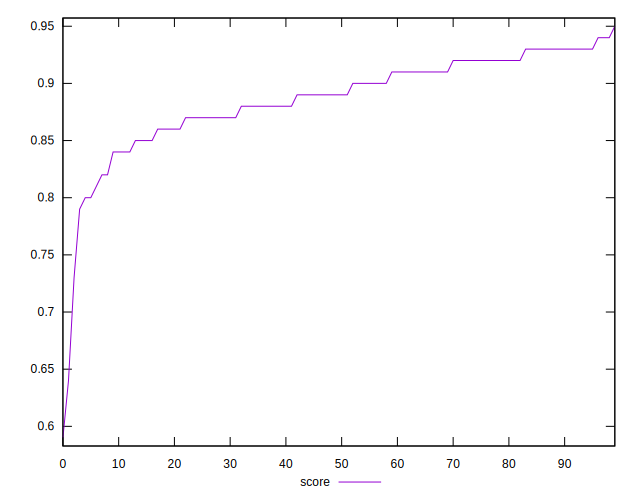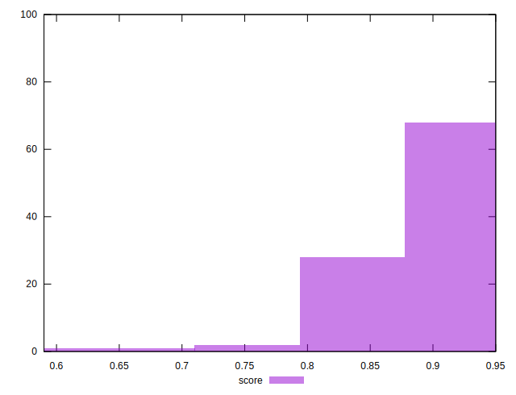
## Raw Estimate

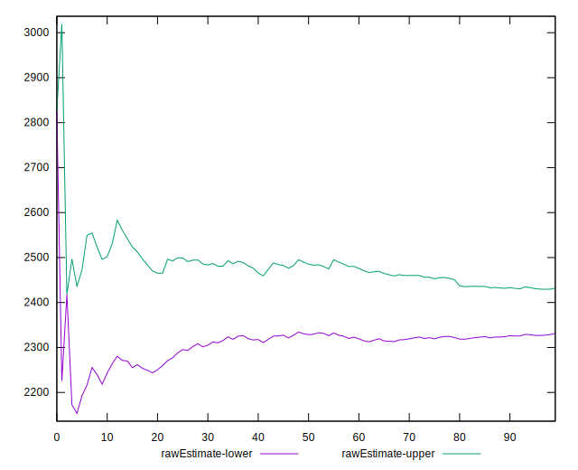
## Score Estimate

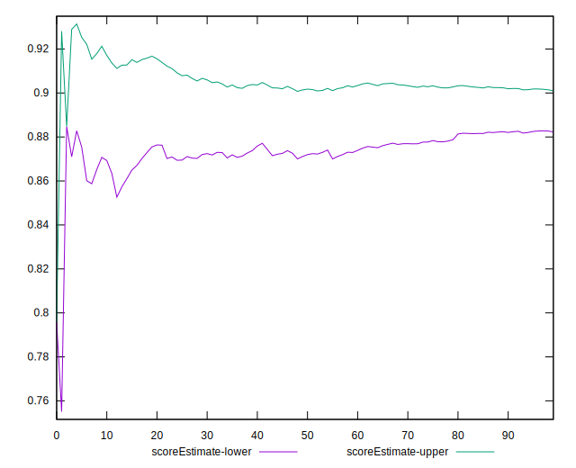
## P Score


```yaml
p90min: 0.788874602096204
p90max: 0.9356442046574713
p90range: 0.14676960256126736
p90mean: 0.8893373652154901
p90median: 0.8931465618565428
p90stdev: 0.034161818335485504
p90skewness: -0.8385874810016566
p90eccentricity: 0.9999999999999992
p90discretization: 1
outlandishness: 0.9876942602805938
confidence: 0.02118942504549131
p90confidence: 0.013811954492316083

```

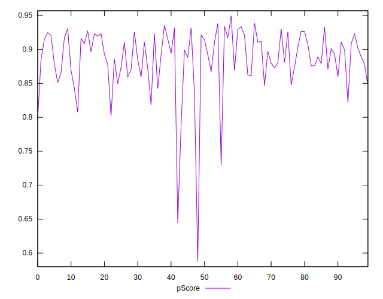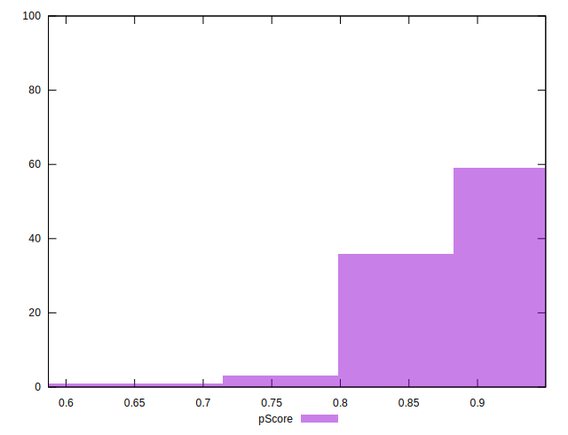
## Score Difference


```yaml
p90min: 0
p90max: 1.1102230246251565e-16
p90range: 1.1102230246251565e-16
p90mean: 3.543264972207946e-18
p90median: 0
p90stdev: 1.9514781802162963e-17
p90skewness: 5.326002287485495
p90eccentricity: 1.0000000000000044
p90discretization: 47
outlandishness: 3.5344000000000007
confidence: 1.0335413782903692e-17
p90confidence: 7.89001555865578e-18

```

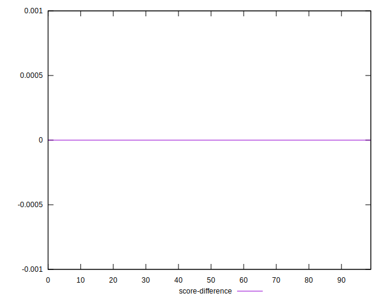
## P Score Difference


```yaml
p90min: -0.004355795342528612
p90max: 0.004587621021847732
p90range: 0.008943416364376344
p90mean: -0.00005697737090966175
p90median: -0.0003225482885788611
p90stdev: 0.0025105485819712243
p90skewness: 0.006699954519752443
p90eccentricity: 0.9999999999999997
p90discretization: 1
outlandishness: 0.8185770467180747
confidence: 0.0010561244413158403
p90confidence: 0.0010150391417811638

```

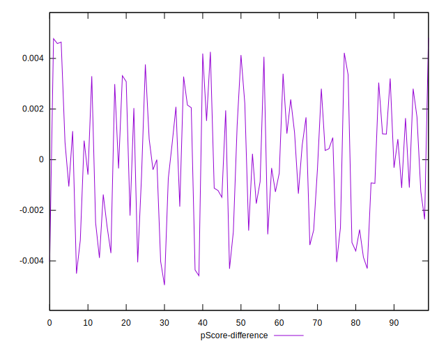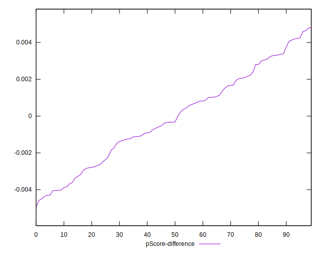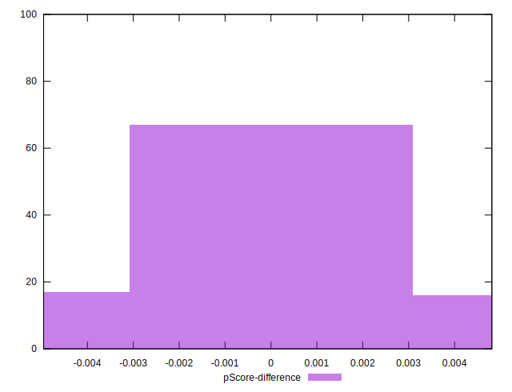