# //first-contentful-paint/samples/pages+cached+noadtech

[→ Parent](../..)


## Raw


```yaml
p90min: 2120.32085
p90max: 3313.3399999999997
p90range: 1193.0191499999996
p90mean: 2435.9093196808512
p90median: 2376.8377499999997
p90stdev: 253.95152436116624
p90skewness: 1.36785189138494
p90eccentricity: 1
p90discretization: 1
outlandishness: 1.0257181127394124
confidence: 138.81320438225092
p90confidence: 102.67506440332689

```

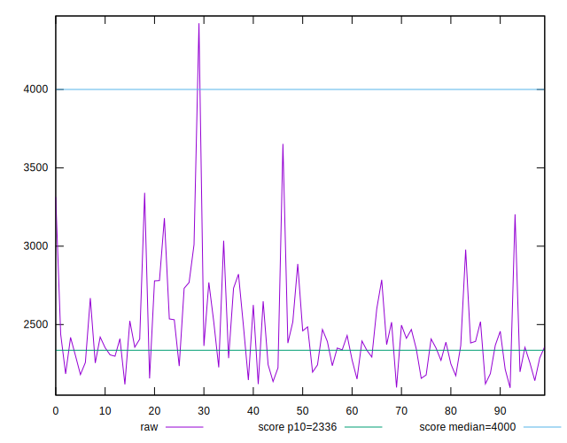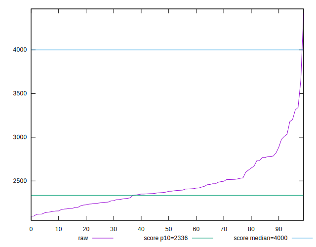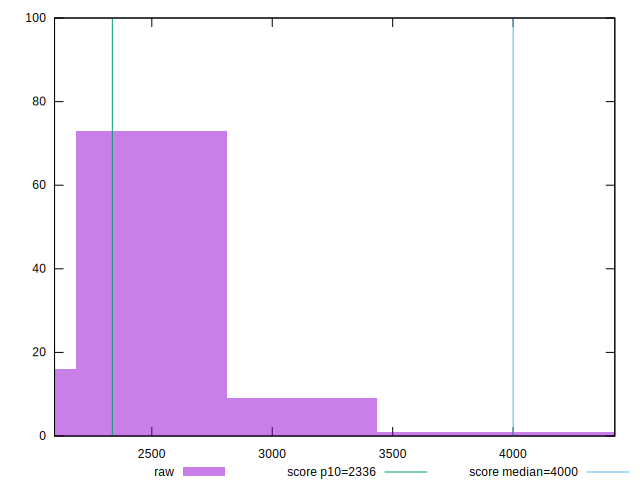
## Score


```yaml
p90min: 0.67
p90max: 0.93
p90range: 0.26
p90mean: 0.8774468085106386
p90median: 0.89
p90stdev: 0.0540475789253019
p90skewness: -1.7518770931446608
p90eccentricity: 0.9999999999999991
p90discretization: 4.476190476190476
outlandishness: 0.9824203338657299
confidence: 0.03097713001808977
p90confidence: 0.021851960372984713

```

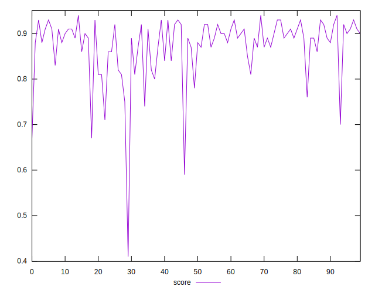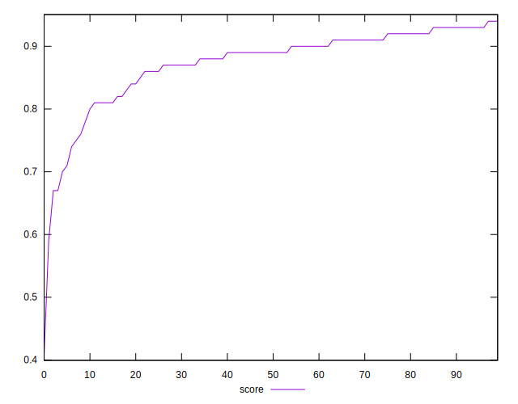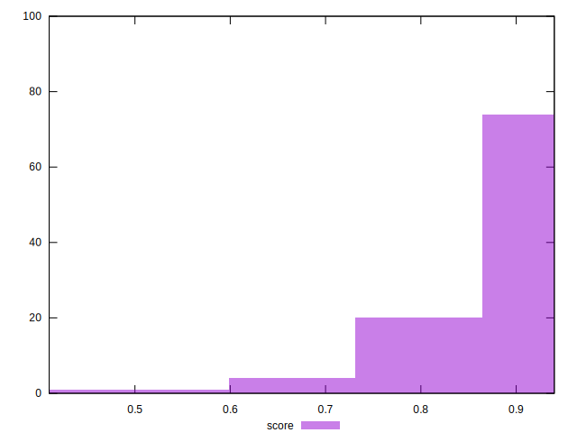
## Raw Estimate

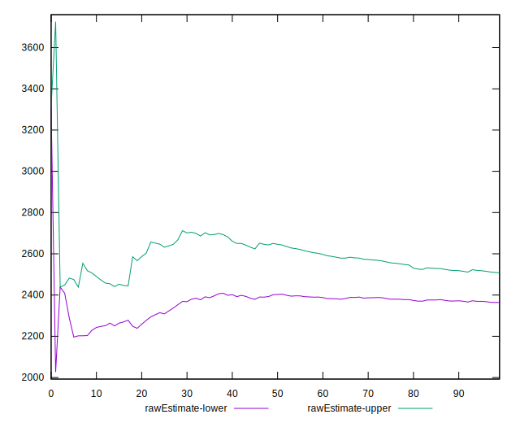
## Score Estimate

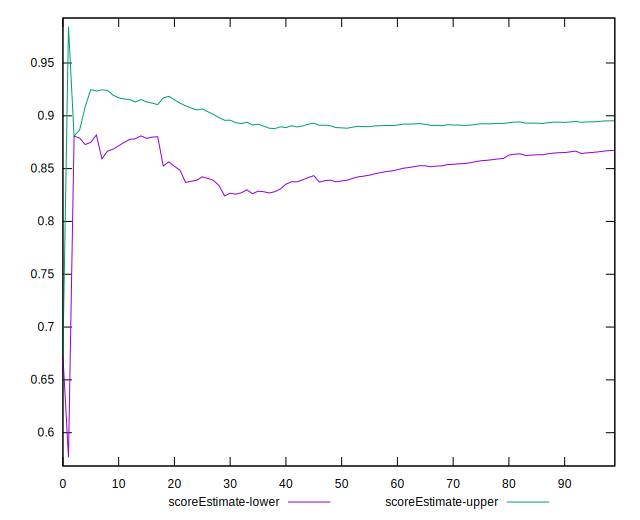
## P Score


```yaml
p90min: 0.6731954790615404
p90max: 0.9347802347826766
p90range: 0.26158475572113615
p90mean: 0.8772929114840451
p90median: 0.8925578752756306
p90stdev: 0.05391384349806314
p90skewness: -1.7266133573809344
p90eccentricity: 0.9999999999999992
p90discretization: 1
outlandishness: 0.9819523072965602
confidence: 0.031109342464111588
p90confidence: 0.021797889842637284

```

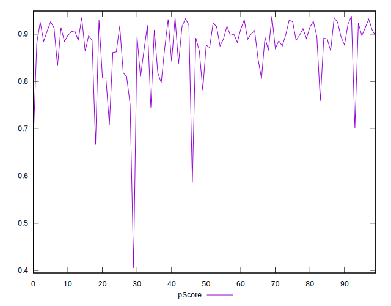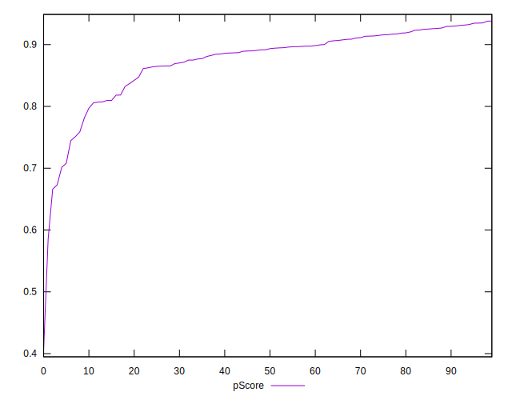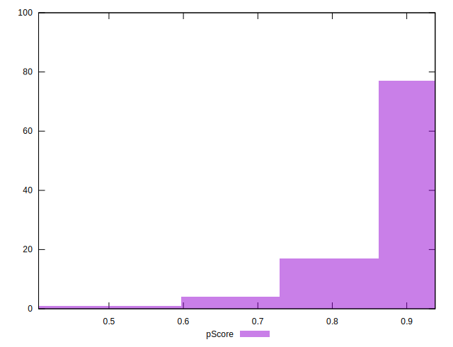
## Score Difference


```yaml
p90min: 0
p90max: 1.1102230246251565e-16
p90range: 1.1102230246251565e-16
p90mean: 5.3148974583119196e-18
p90median: 0
p90stdev: 2.300091806633269e-17
p90skewness: 4.22948885544422
p90eccentricity: 0.9999999999999988
p90discretization: 31.333333333333332
outlandishness: 2.4544444444444444
confidence: 1.1254344734729736e-17
p90confidence: 9.299494262683342e-18

```

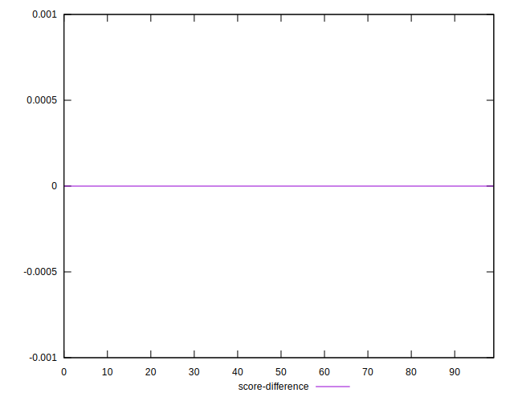
## P Score Difference


```yaml
p90min: -0.004808608796518121
p90max: 0.004928478890280363
p90range: 0.009737087686798485
p90mean: -0.00038524757363581313
p90median: -0.0005979967740950554
p90stdev: 0.002950211229961446
p90skewness: 0.31825274997382463
p90eccentricity: 0.9999999999999999
p90discretization: 1
outlandishness: 0.8717190742900808
confidence: 0.0012170503557135638
p90confidence: 0.001192799014700581

```

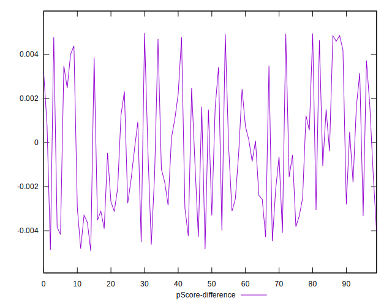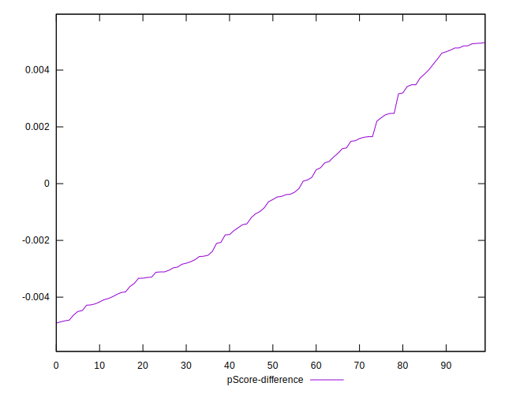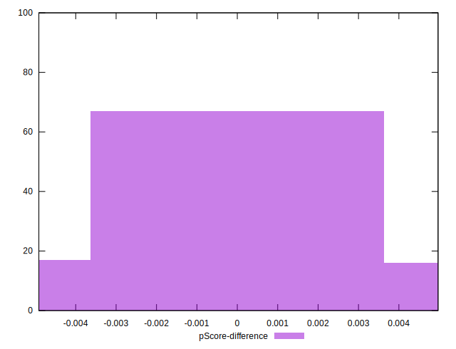