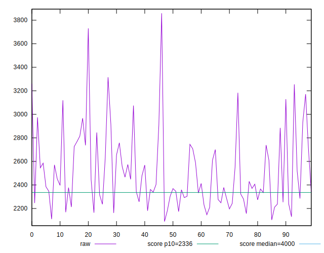
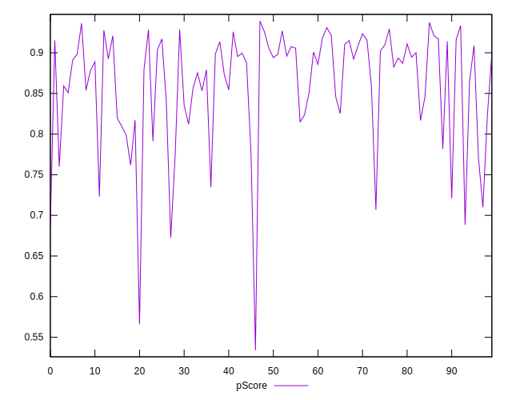

# //first-contentful-paint/samples/pages+cached

[→ Parent](../..)


## Raw


```yaml
p90min: 2129.698
p90max: 3260.0780000000004
p90range: 1130.3800000000006
p90mean: 2496.8455372340422
p90median: 2390.5024999999996
p90stdev: 289.1371130236579
p90skewness: 0.9635615343929202
p90eccentricity: 0.9999999999999999
p90discretization: 1
outlandishness: 1.0179042968187004
confidence: 137.63495617379712
p90confidence: 116.90093916851394

```


## Score


```yaml
p90min: 0.69
p90max: 0.93
p90range: 0.2400000000000001
p90mean: 0.8646808510638293
p90median: 0.89
p90stdev: 0.06263202443145259
p90skewness: -1.188384755121131
p90eccentricity: 1.0000000000000002
p90discretization: 4.2727272727272725
outlandishness: 0.9862141811297296
confidence: 0.0308389231287413
p90confidence: 0.02532273495261411

```


## Raw Estimate


## Score Estimate


## P Score


```yaml
p90min: 0.6870010377412159
p90max: 0.9334329198043909
p90range: 0.246431882063175
p90mean: 0.8642332718789218
p90median: 0.8900103562598529
p90stdev: 0.06231554897608688
p90skewness: -1.2044486155675784
p90eccentricity: 1.0000000000000007
p90discretization: 1
outlandishness: 0.9861637033448836
confidence: 0.030671674542144655
p90confidence: 0.02519478085647908

```


## Score Difference


```yaml
p90min: 0
p90max: 1.1102230246251565e-16
p90range: 1.1102230246251565e-16
p90mean: 1.1810883240693155e-17
p90median: 0
p90stdev: 3.423119174922787e-17
p90skewness: 2.553242569566712
p90eccentricity: 1.0000000000000009
p90discretization: 47
outlandishness: 1.4932839999999998
confidence: 1.4635906249893463e-17
p90confidence: 1.3840002836352587e-17

```


## P Score Difference


```yaml
p90min: -0.004644974820743553
p90max: 0.00460971489140638
p90range: 0.009254689712149933
p90mean: -0.0004913993745737892
p90median: -0.000593677893891642
p90stdev: 0.0027389526009738013
p90skewness: 0.15586130786815375
p90eccentricity: 1
p90discretization: 1
outlandishness: 0.9010253132459134
confidence: 0.0011383997569696133
p90confidence: 0.001107385101979914

```

