# //first-contentful-paint/samples/pages

[→ Parent](../..)


## Raw


```yaml
p90min: 2615.8235000000004
p90max: 4035.1994999999997
p90range: 1419.3759999999993
p90mean: 3085.28914893617
p90median: 2979.28025
p90stdev: 357.0097228676724
p90skewness: 1.0686235606758034
p90eccentricity: 1.0000000000000002
p90discretization: 1
outlandishness: 1.010568292430263
confidence: 157.3094716712332
p90confidence: 144.3424936324482

```

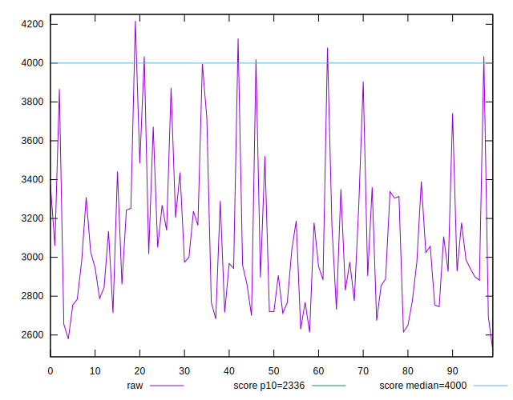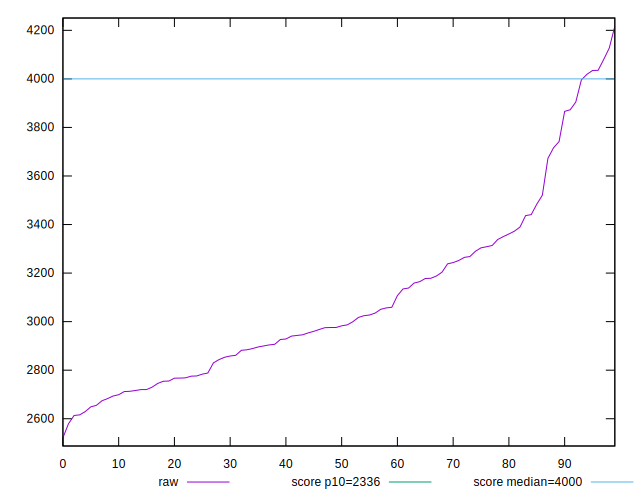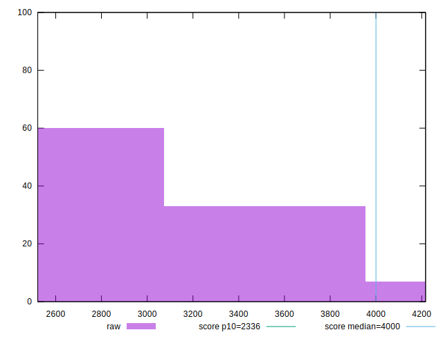
## Score


```yaml
p90min: 0.49
p90max: 0.84
p90range: 0.35
p90mean: 0.7307446808510641
p90median: 0.76
p90stdev: 0.09030962534056637
p90skewness: -1.101913933009821
p90eccentricity: 0.9999999999999992
p90discretization: 3.1333333333333333
outlandishness: 0.9881442446299848
confidence: 0.039536977244738467
p90confidence: 0.0365130574483014

```

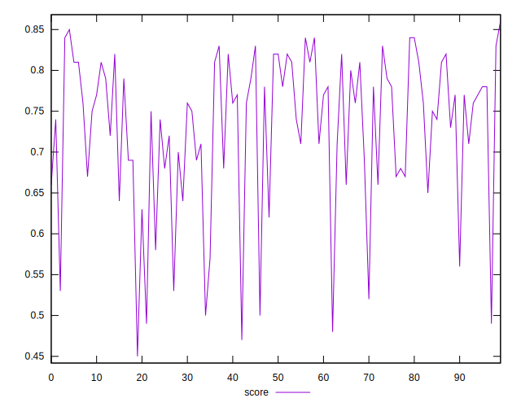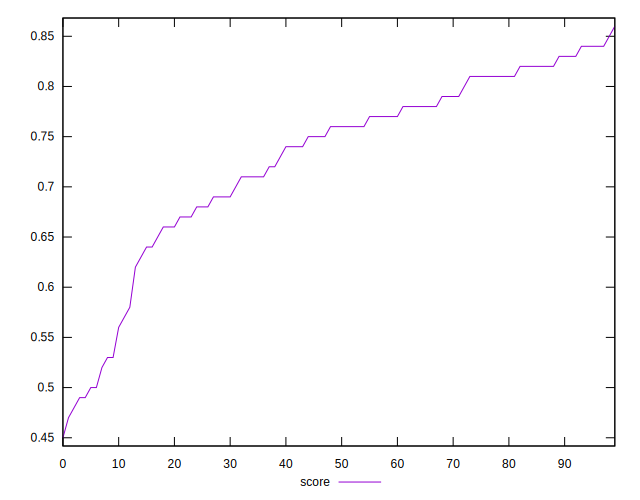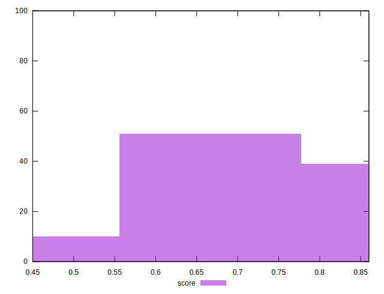
## Raw Estimate

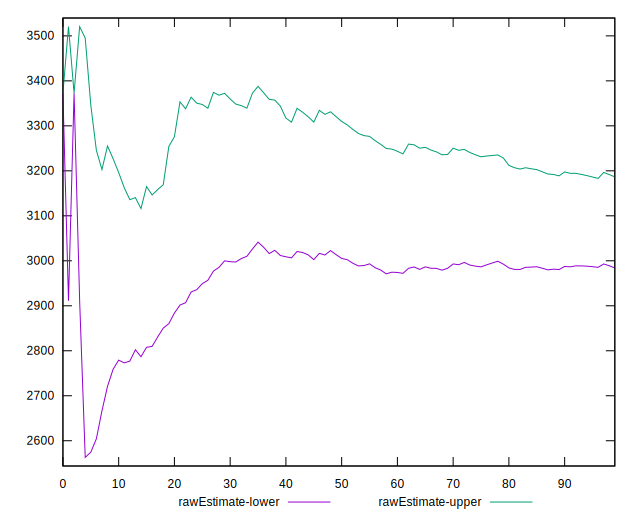
## Score Estimate

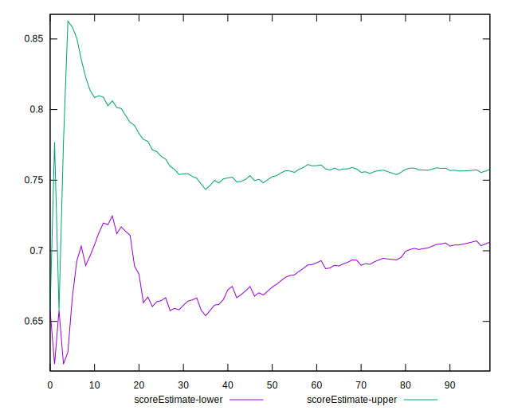
## P Score


```yaml
p90min: 0.4916723062314465
p90max: 0.8442247968778308
p90range: 0.35255249064638433
p90mean: 0.7304870171577208
p90median: 0.7586529400327477
p90stdev: 0.08979868940287573
p90skewness: -1.101646233788799
p90eccentricity: 1.0000000000000007
p90discretization: 1
outlandishness: 0.9885248306341263
confidence: 0.03940321454875599
p90confidence: 0.03630648109306853

```

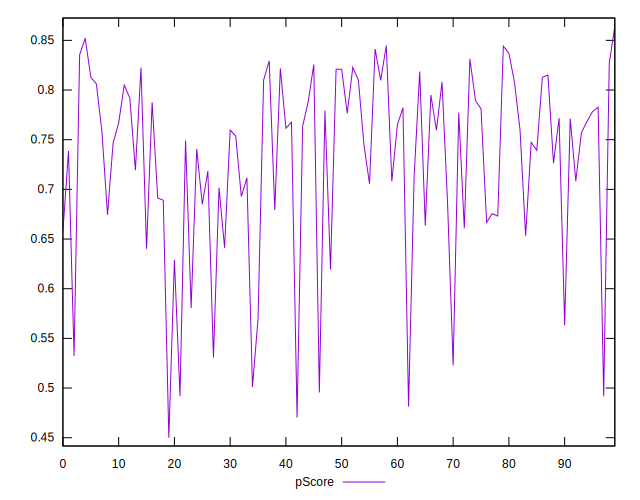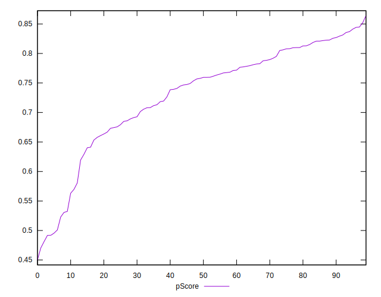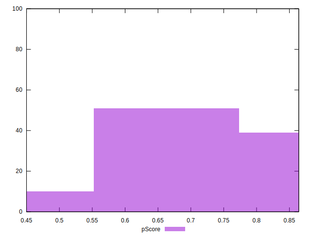
## Score Difference


```yaml
p90min: 0
p90max: 1.1102230246251565e-16
p90range: 1.1102230246251565e-16
p90mean: 1.7125780699005074e-17
p90median: 0
p90stdev: 3.968966431999388e-17
p90skewness: 1.9141489945266255
p90eccentricity: 1.0000000000000027
p90discretization: 31.333333333333332
outlandishness: 1.28705112960761
confidence: 1.6392351338594486e-17
p90confidence: 1.6046916239046442e-17

```

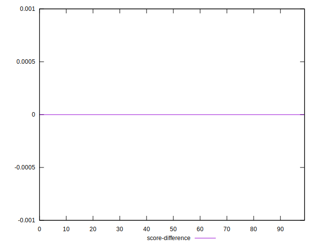
## P Score Difference


```yaml
p90min: -0.004897351245926274
p90max: 0.004439026495456466
p90range: 0.00933637774138274
p90mean: -0.00011811285516309874
p90median: -0.00015876670430348128
p90stdev: 0.002412824781913697
p90skewness: -0.12162136336711432
p90eccentricity: 1
p90discretization: 1
outlandishness: 0.9696589753100073
confidence: 0.001028898320867964
p90confidence: 0.000975528461583889

```

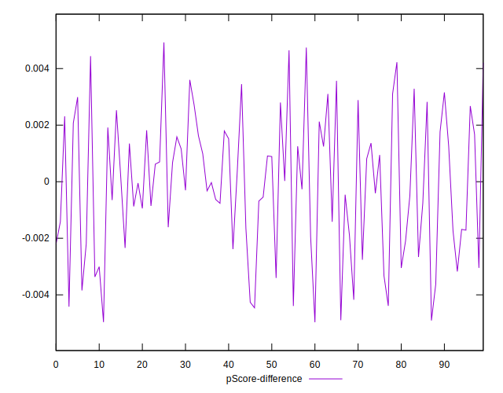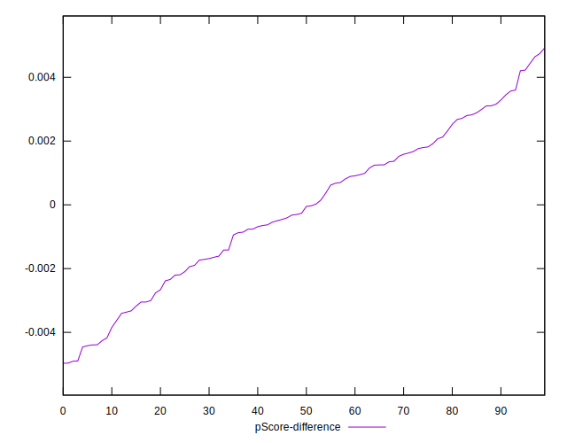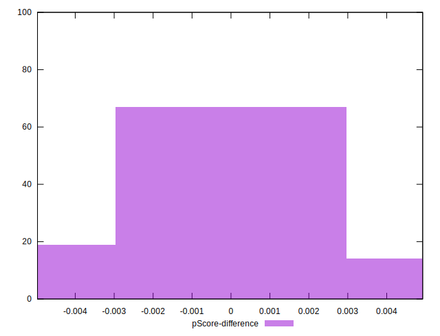