# //first-cpu-idle/samples/pages+cached+noadtech+nomedia+nocss

[→ Parent](../..)


## Raw


```yaml
p90min: 4201.67
p90max: 5901.1810000000005
p90range: 1699.5110000000004
p90mean: 4759.427977659576
p90median: 4699.8904999999995
p90stdev: 406.55919766950694
p90skewness: 0.7243962477742191
p90eccentricity: 0.9999999999999994
p90discretization: 1
outlandishness: 1.0164920422777974
confidence: 209.28260998136045
p90confidence: 164.3758268807024

```

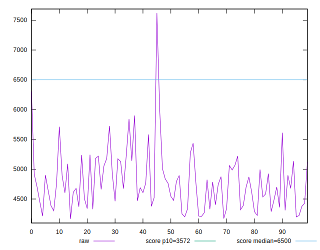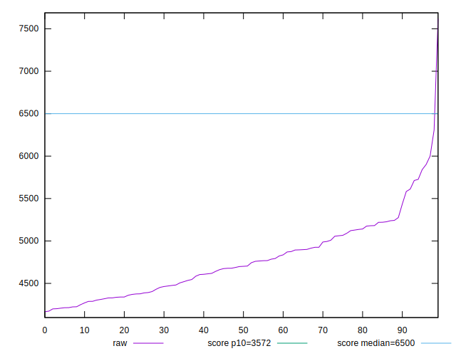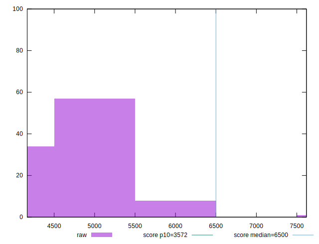
## Score


```yaml
p90min: 0.58
p90max: 0.82
p90range: 0.24
p90mean: 0.7468085106382982
p90median: 0.76
p90stdev: 0.05813068120865093
p90skewness: -0.7859117413900983
p90eccentricity: 0.9999999999999996
p90discretization: 4.2727272727272725
outlandishness: 0.9860999237343854
confidence: 0.0292276306437041
p90confidence: 0.023502798228606344

```

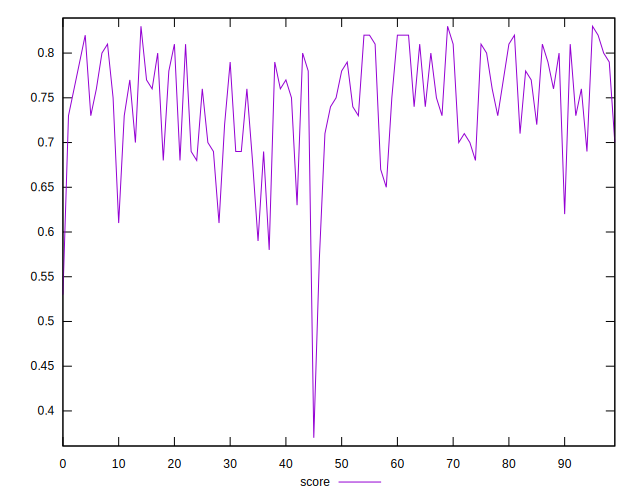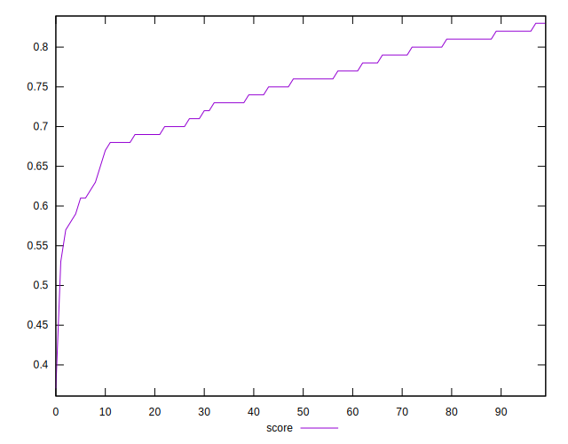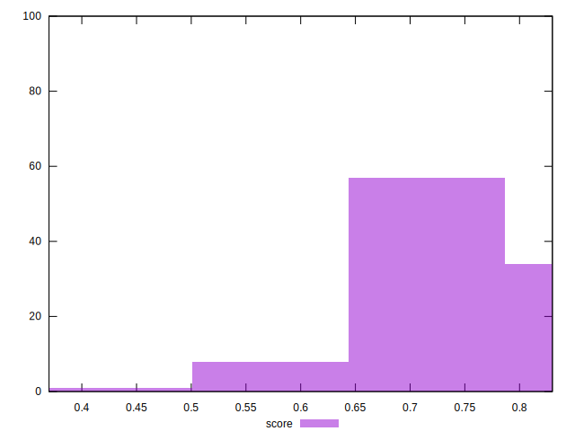
## Raw Estimate

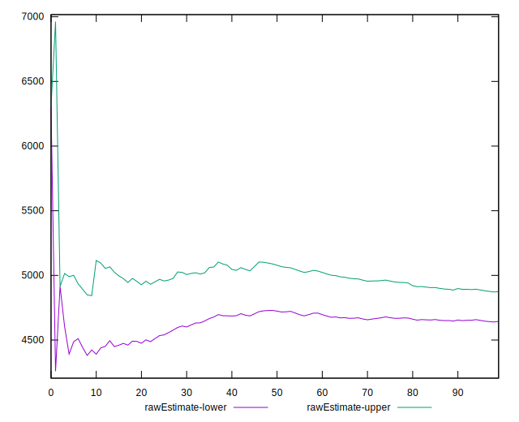
## Score Estimate

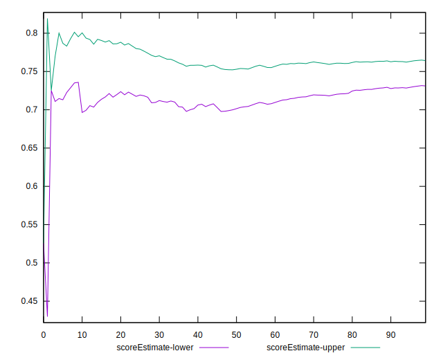
## P Score


```yaml
p90min: 0.5819529742041124
p90max: 0.8248493009545721
p90range: 0.2428963267504597
p90mean: 0.7468115504111762
p90median: 0.7561999147227367
p90stdev: 0.05821878967096436
p90skewness: -0.7680532828017858
p90eccentricity: 1
p90discretization: 1
outlandishness: 0.9856696111948466
confidence: 0.02934798626005918
p90confidence: 0.023538421334493447

```

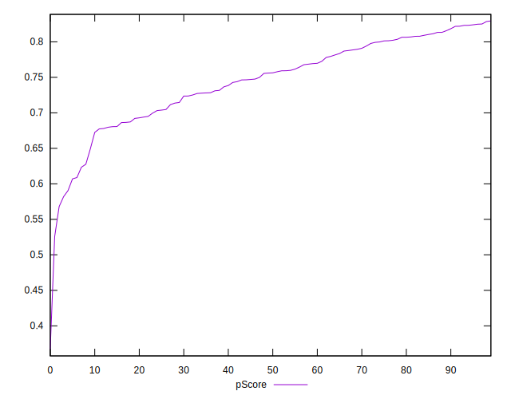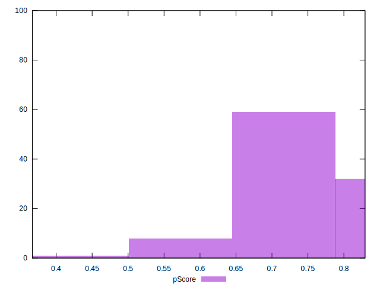
## Score Difference


```yaml
p90min: 0
p90max: 1.1102230246251565e-16
p90range: 1.1102230246251565e-16
p90mean: 2.362176648138631e-17
p90median: 0
p90stdev: 4.5437375048458033e-17
p90skewness: 1.4036631612571033
p90eccentricity: 1.0000000000000022
p90discretization: 47
outlandishness: 1.168561
confidence: 1.8314606713280826e-17
p90confidence: 1.8370771434250753e-17

```

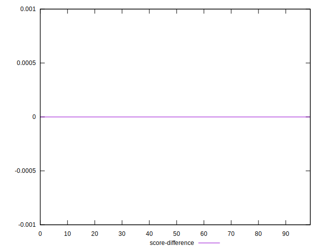
## P Score Difference


```yaml
p90min: -0.0044473420725855695
p90max: 0.004505739933952535
p90range: 0.008953082006538104
p90mean: -0.0001633477064958032
p90median: -0.0005279545113278106
p90stdev: 0.0025664138344250113
p90skewness: 0.19315699079691287
p90eccentricity: 0.9999999999999997
p90discretization: 1
outlandishness: 0.9451984341209382
confidence: 0.001078908423877758
p90confidence: 0.001037626005191533

```

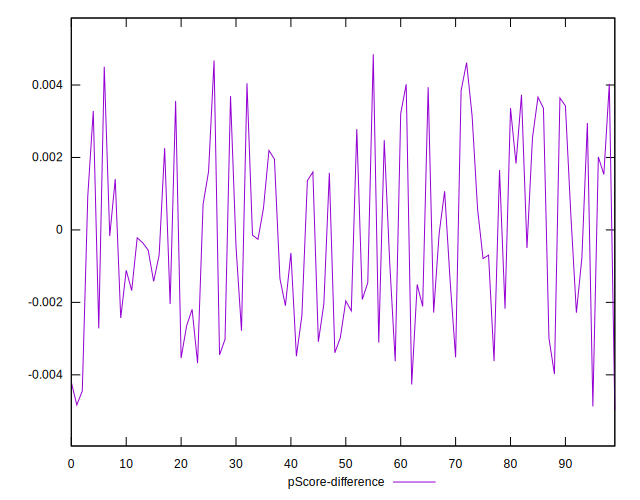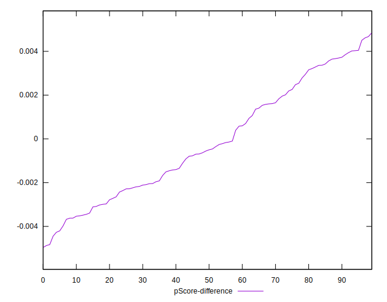