# //first-cpu-idle/samples/pages+cached+noadtech+nomedia

[→ Parent](../..)


## Raw


```yaml
p90min: 6284.134
p90max: 7721.289999999999
p90range: 1437.155999999999
p90mean: 6852.335076595741
p90median: 6834.413999999999
p90stdev: 370.7556796692364
p90skewness: 0.2732620684907701
p90eccentricity: 1.0000000000000004
p90discretization: 1
outlandishness: 1.0065607865413733
confidence: 173.26082289817774
p90confidence: 149.90011729088587

```

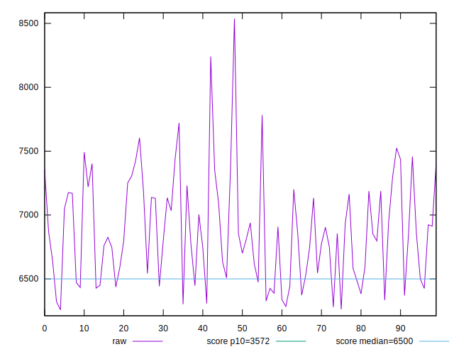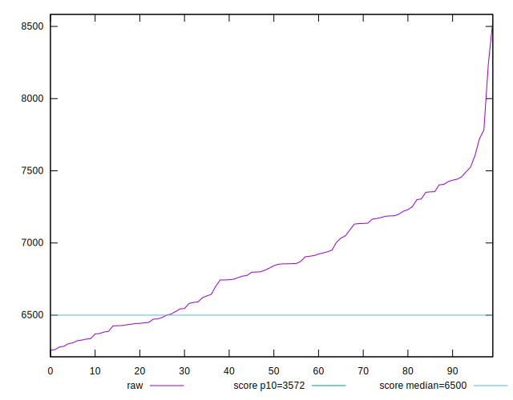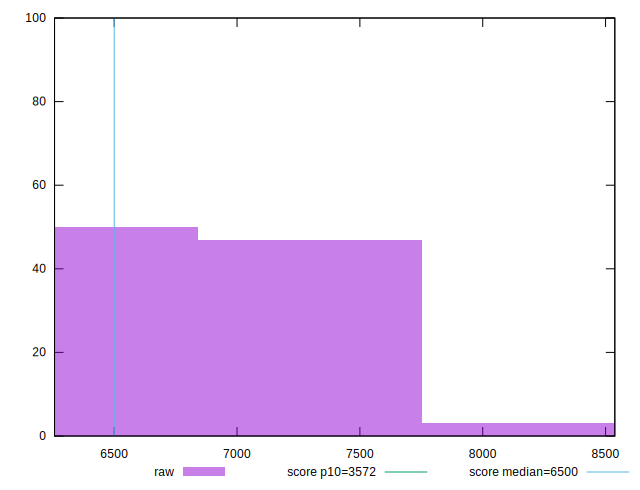
## Score


```yaml
p90min: 0.36
p90max: 0.53
p90range: 0.17000000000000004
p90mean: 0.45670212765957474
p90median: 0.46
p90stdev: 0.04525079752141535
p90skewness: -0.13655108348670864
p90eccentricity: 0.9999999999999991
p90discretization: 5.222222222222222
outlandishness: 0.990815502481871
confidence: 0.020454513179578533
p90confidence: 0.01829533633043119

```

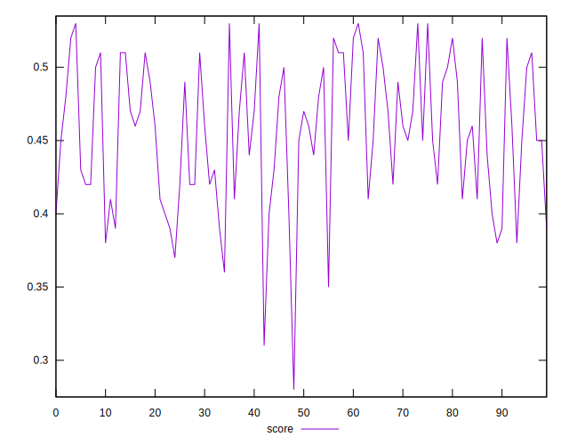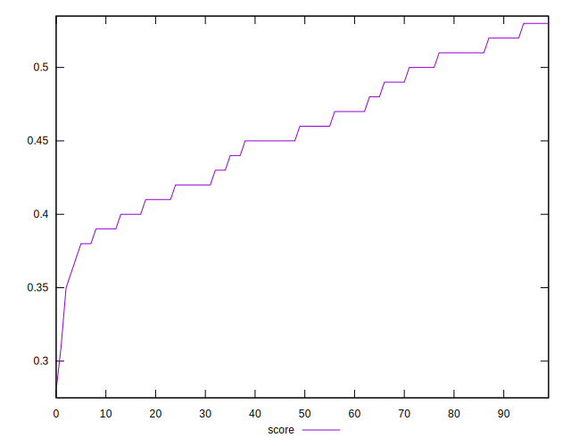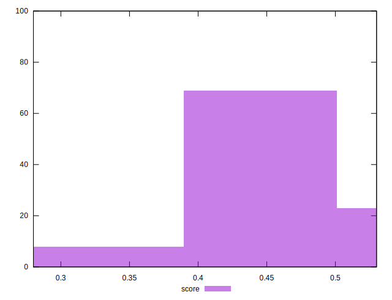
## Raw Estimate

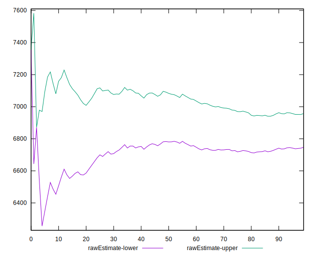
## Score Estimate

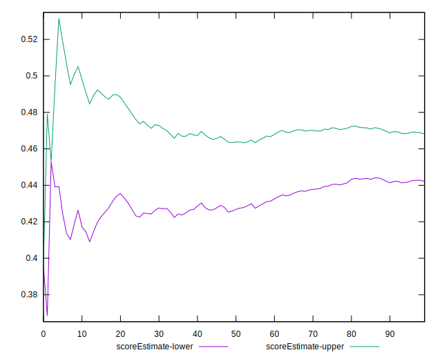
## P Score


```yaml
p90min: 0.3562226886033887
p90max: 0.5288178090877864
p90range: 0.17259512048439773
p90mean: 0.45655651719085394
p90median: 0.4572393978214089
p90stdev: 0.045442980163839755
p90skewness: -0.17880351780206044
p90eccentricity: 0.9999999999999999
p90discretization: 1
outlandishness: 0.9908213437667985
confidence: 0.020587216964847343
p90confidence: 0.018373037636764223

```

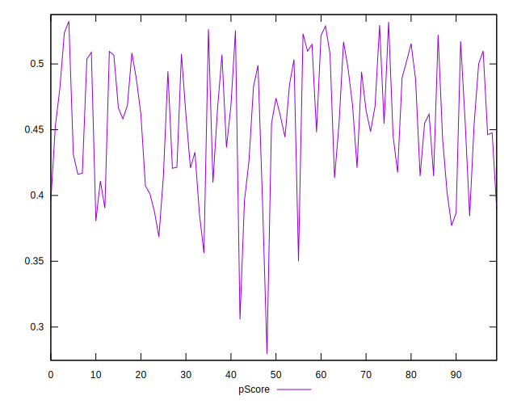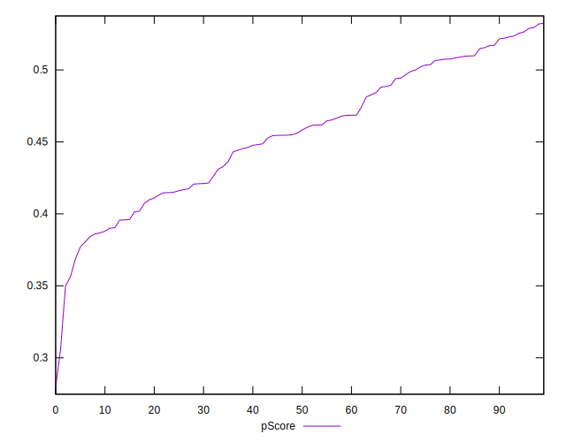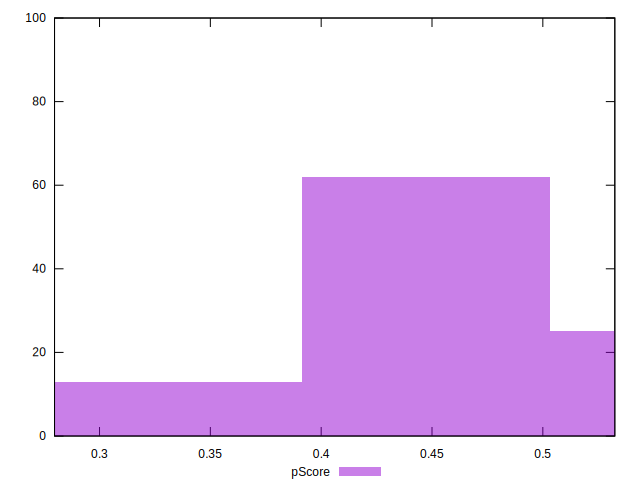
## Score Difference


```yaml
p90min: 0
p90max: 5.551115123125783e-17
p90range: 5.551115123125783e-17
p90mean: 6.495985782381235e-18
p90median: 0
p90stdev: 1.784381735719593e-17
p90skewness: 2.3828522123573808
p90eccentricity: 0.9999999999999987
p90discretization: 47
outlandishness: 1.4312859504132236
confidence: 7.550427891356826e-18
p90confidence: 7.214428426685427e-18

```

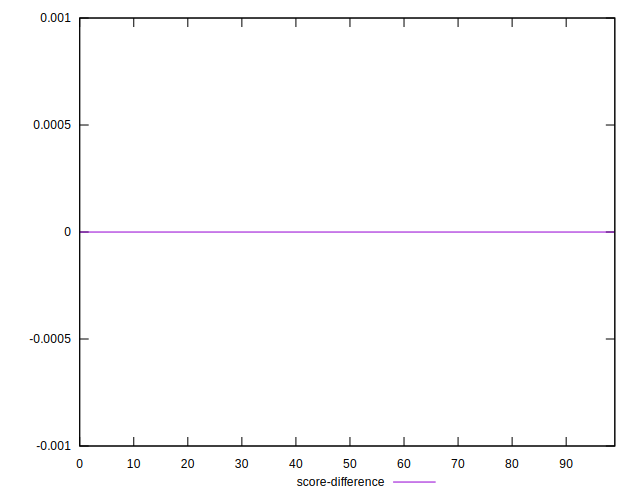
## P Score Difference


```yaml
p90min: -0.004511876118434399
p90max: 0.00471260693760106
p90range: 0.00922448305603546
p90mean: -0.0001560393506785609
p90median: -0.00029401250410923674
p90stdev: 0.0028216747658510594
p90skewness: 0.19568257829078167
p90eccentricity: 1
p90discretization: 1
outlandishness: 0.8469241339698439
confidence: 0.0011678378114535334
p90confidence: 0.0011408304755712764

```

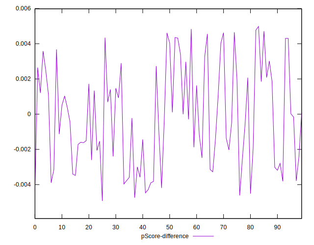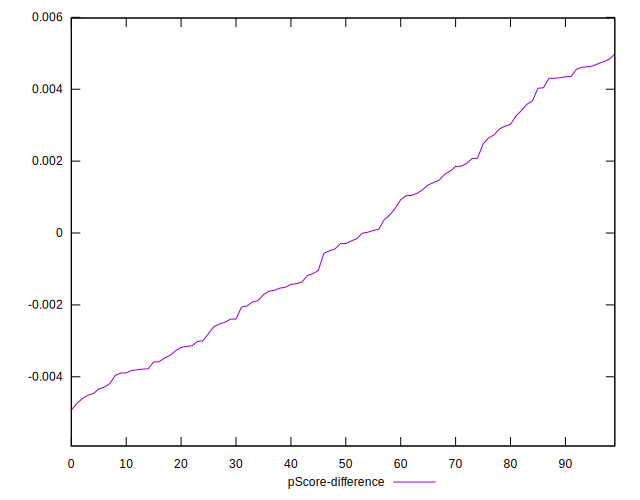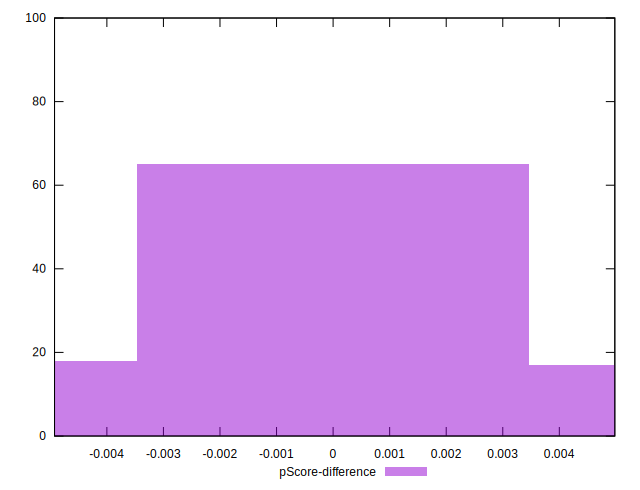