# //first-cpu-idle/samples/pages+cached+noadtech

[→ Parent](../..)


## Raw


```yaml
p90min: 6259.773499999998
p90max: 8356.341
p90range: 2096.567500000002
p90mean: 6940.903555319149
p90median: 6844.005999999999
p90stdev: 497.90445443396965
p90skewness: 1.0398841317674052
p90eccentricity: 1
p90discretization: 1
outlandishness: 1.0111503349461628
confidence: 237.92848332329547
p90confidence: 201.30760015838956

```

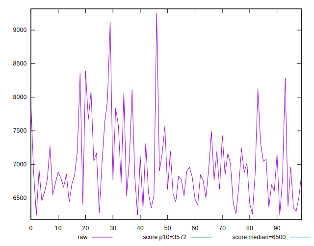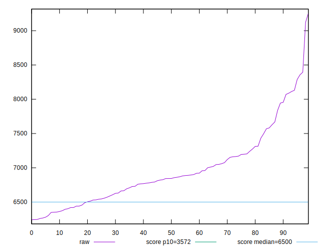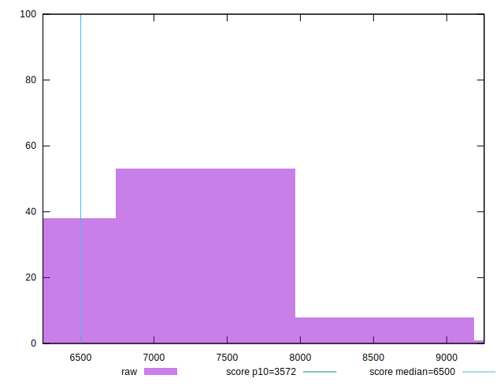
## Score


```yaml
p90min: 0.3
p90max: 0.53
p90range: 0.23000000000000004
p90mean: 0.44702127659574487
p90median: 0.46
p90stdev: 0.057848477558334346
p90skewness: -0.8060872841985934
p90eccentricity: 1.0000000000000002
p90discretization: 4.2727272727272725
outlandishness: 0.9843076476354379
confidence: 0.026507380724869127
p90confidence: 0.023388700555658726

```

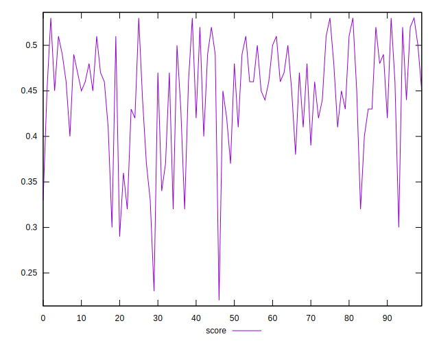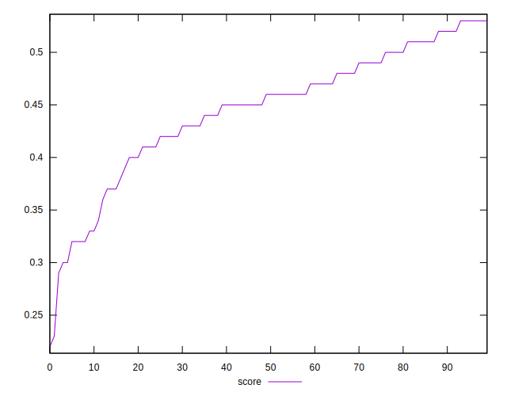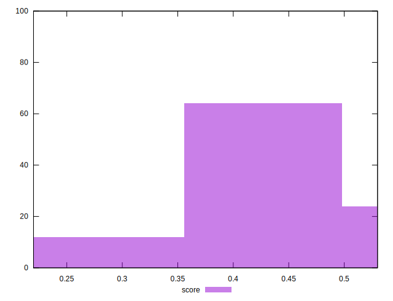
## Raw Estimate

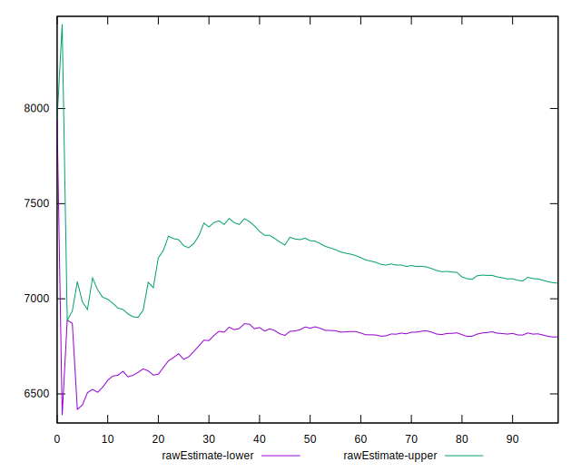
## Score Estimate

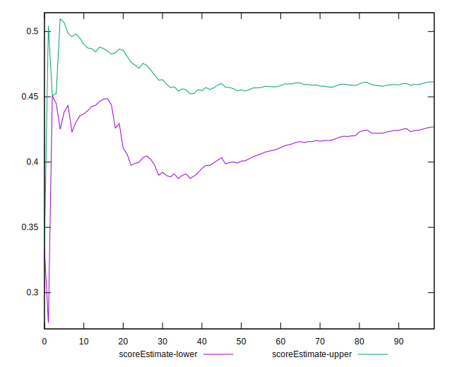
## P Score


```yaml
p90min: 0.29536838562872075
p90max: 0.5321250586725046
p90range: 0.23675667304378384
p90mean: 0.4469892476300241
p90median: 0.45604796204064335
p90stdev: 0.057649508335678536
p90skewness: -0.8217392134813164
p90eccentricity: 1.0000000000000002
p90discretization: 1
outlandishness: 0.9853614806670452
confidence: 0.02638247169285109
p90confidence: 0.023308255369114343

```

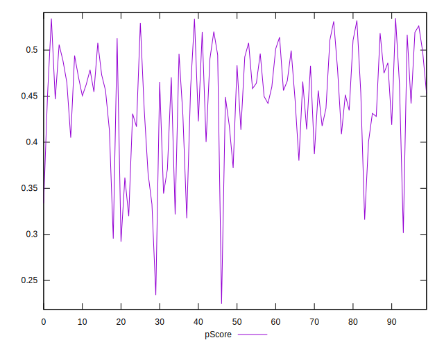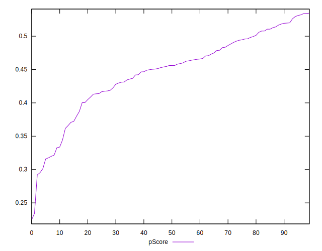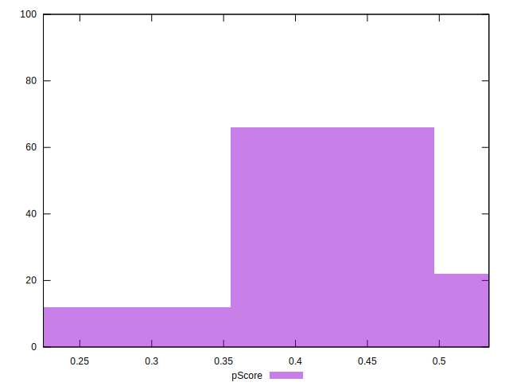
## Score Difference


```yaml
p90min: 0
p90max: 5.551115123125783e-17
p90range: 5.551115123125783e-17
p90mean: 4.133809134242604e-18
p90median: 0
p90stdev: 1.4573404751592852e-17
p90skewness: 3.241763593892422
p90eccentricity: 0.999999999999997
p90discretization: 47
outlandishness: 1.8032653061224493
confidence: 6.527991429217295e-18
p90confidence: 5.892168890144144e-18

```

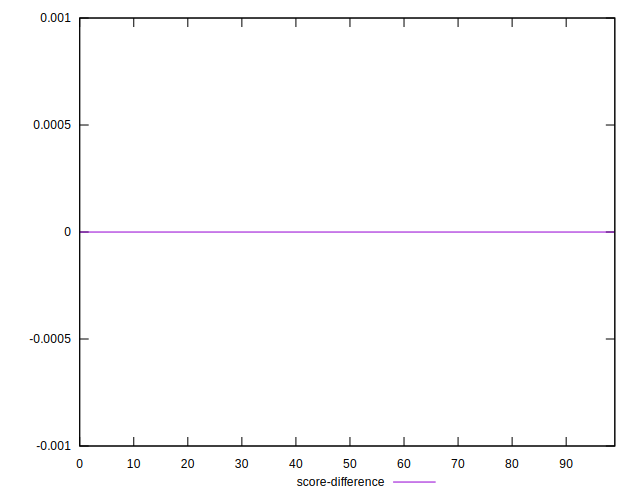
## P Score Difference


```yaml
p90min: -0.004257189565034458
p90max: 0.004629024434044837
p90range: 0.008886213999079295
p90mean: 0.00021841980369819502
p90median: 0.00041052237114216905
p90stdev: 0.0027443149648876558
p90skewness: -0.08101973595420481
p90eccentricity: 1.0000000000000004
p90discretization: 1
outlandishness: 0.8856776712347899
confidence: 0.0011379585080083577
p90confidence: 0.0011095531577204503

```

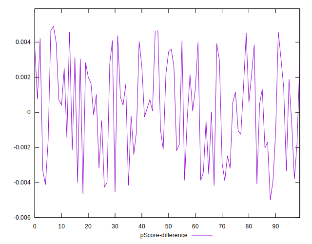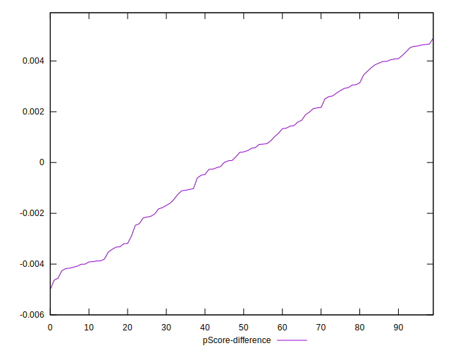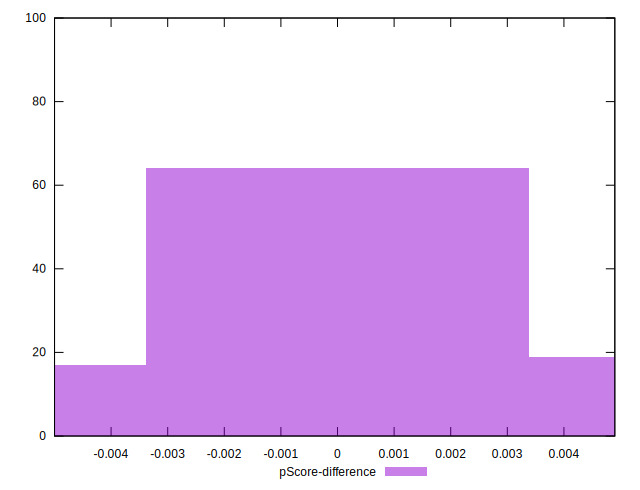