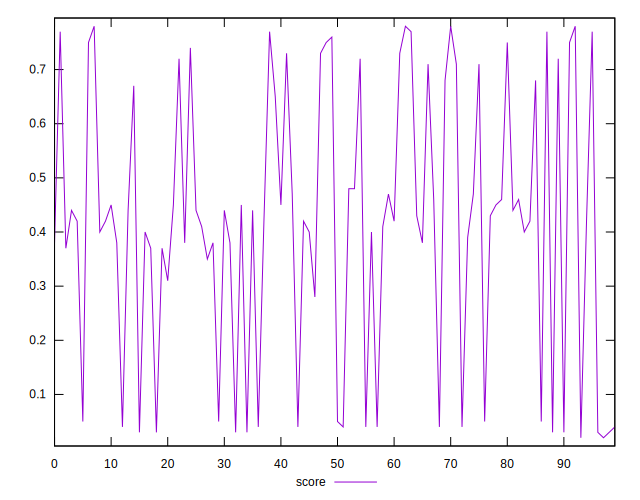

# //first-cpu-idle/samples/pages+cached

[→ Parent](../..)


## Raw


```yaml
p90min: 4549.354
p90max: 16133.494000000002
p90range: 11584.140000000003
p90mean: 8309.889255319147
p90median: 7115.155000000001
p90stdev: 3719.535754121059
p90skewness: 1.081427874871146
p90eccentricity: 1.0000000000000004
p90discretization: 1
outlandishness: 1.0333227758591077
confidence: 1544.5102510547704
p90confidence: 1503.844381582522

```


## Score


```yaml
p90min: 0.03
p90max: 0.78
p90range: 0.75
p90mean: 0.41585106382978726
p90median: 0.42
p90stdev: 0.2438058591727307
p90skewness: -0.23014679903574445
p90eccentricity: 0.9999999999999991
p90discretization: 3.2413793103448274
outlandishness: 0.995911069960036
confidence: 0.09953452817274093
p90confidence: 0.09857307356370622

```


## Raw Estimate


## Score Estimate


## P Score


```yaml
p90min: 0.02582449048275204
p90max: 0.7775119135817614
p90range: 0.7516874230990094
p90mean: 0.4153179780316562
p90median: 0.4232574756832158
p90stdev: 0.24408167146867174
p90skewness: -0.23049939305400774
p90eccentricity: 0.9999999999999997
p90discretization: 1
outlandishness: 0.9960095175494796
confidence: 0.09966098426980544
p90confidence: 0.09868458715008935

```


## Score Difference


```yaml
p90min: 0
p90max: 5.551115123125783e-17
p90range: 5.551115123125783e-17
p90mean: 1.771632486103973e-18
p90median: 0
p90stdev: 9.75739090108148e-18
p90skewness: 5.3260022874855
p90eccentricity: 1.0000000000000049
p90discretization: 47
outlandishness: 3.5344000000000007
confidence: 5.167706891451848e-18
p90confidence: 3.945007779327889e-18

```


## P Score Difference


```yaml
p90min: -0.004715844083921283
p90max: 0.00442306349830035
p90range: 0.009138907582221634
p90mean: -0.0005390017136521889
p90median: -0.0006914478476481023
p90stdev: 0.002604102146742807
p90skewness: 0.18658462324018657
p90eccentricity: 1.0000000000000004
p90discretization: 1
outlandishness: 0.9005912630870828
confidence: 0.0010913840282737244
p90confidence: 0.0010528637554047548

```

