# //first-cpu-idle/samples/pages

[→ Parent](../..)


## Raw


```yaml
p90min: 7076.314000000001
p90max: 16689.451999999997
p90range: 9613.137999999995
p90mean: 9337.572617021278
p90median: 7699.638500000001
p90stdev: 3110.0298557368064
p90skewness: 1.193765942407312
p90eccentricity: 0.9999999999999991
p90discretization: 1
outlandishness: 1.0349699491178534
confidence: 1315.7560199197437
p90confidence: 1257.4152352002034

```

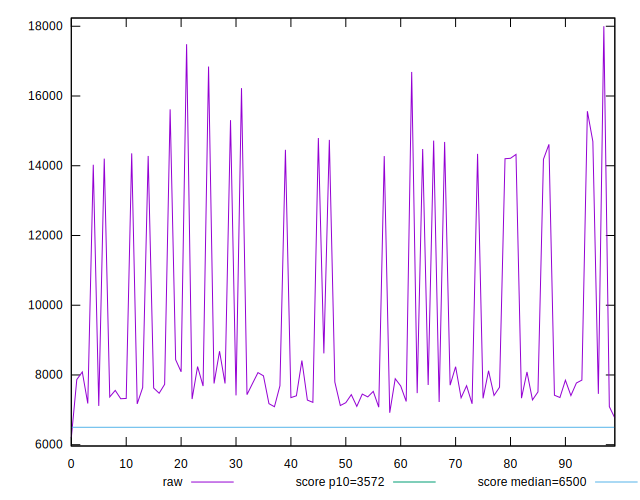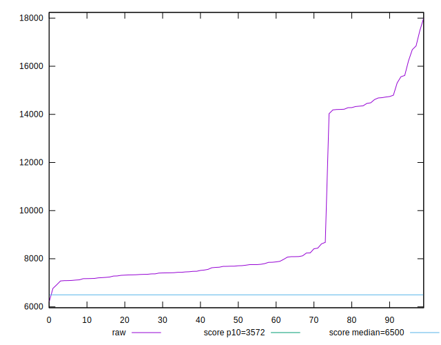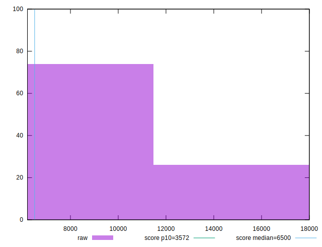
## Score


```yaml
p90min: 0.02
p90max: 0.43
p90range: 0.41
p90mean: 0.29127659574468073
p90median: 0.36
p90stdev: 0.14636179337048247
p90skewness: -1.014844808880997
p90eccentricity: 1.0000000000000007
p90discretization: 4.947368421052632
outlandishness: 0.9837480925598174
confidence: 0.060198391380799555
p90confidence: 0.059175492639014525

```

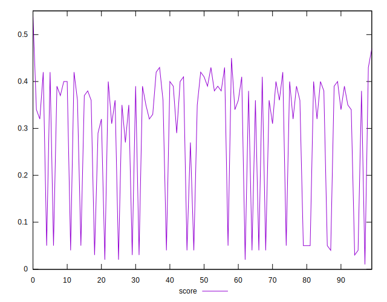
## Raw Estimate

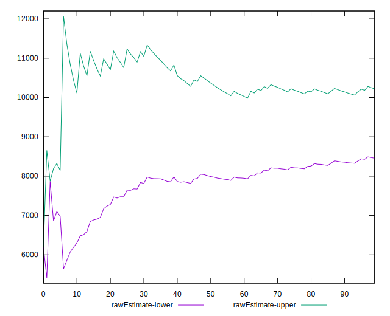
## Score Estimate

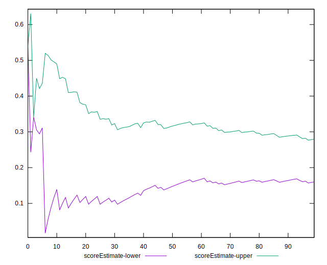
## P Score


```yaml
p90min: 0.021765872500050798
p90max: 0.4278504099650076
p90range: 0.4060845374649568
p90mean: 0.2908909825144296
p90median: 0.35846650405552927
p90stdev: 0.14642366779958813
p90skewness: -1.0176293822481346
p90eccentricity: 0.9999999999999991
p90discretization: 1
outlandishness: 0.9835875013860291
confidence: 0.060171358877320176
p90confidence: 0.05920050907082892

```

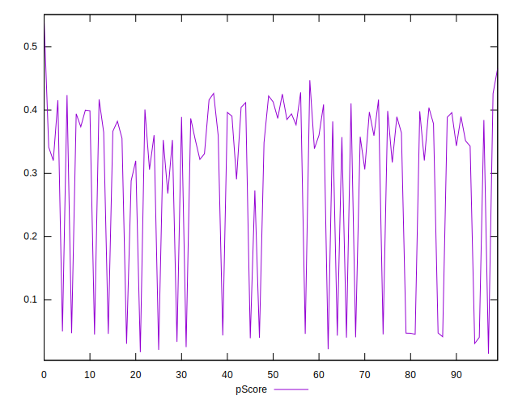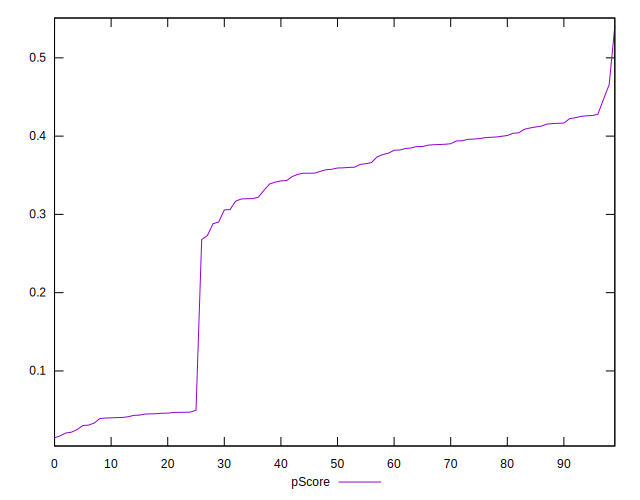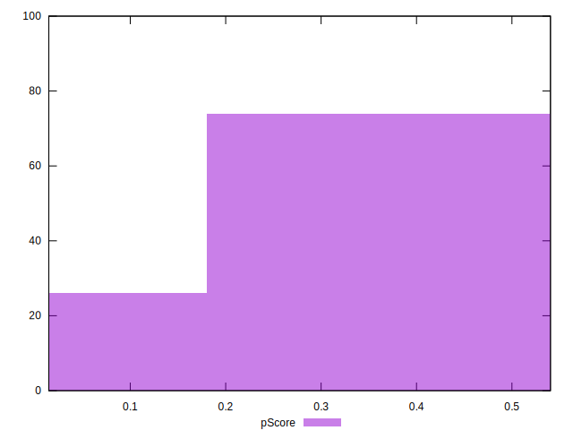
## Score Difference


```yaml
p90min: 0
p90max: 5.551115123125783e-17
p90range: 5.551115123125783e-17
p90mean: 4.133809134242604e-18
p90median: 0
p90stdev: 1.457340475159285e-17
p90skewness: 3.2417635938924185
p90eccentricity: 0.9999999999999976
p90discretization: 47
outlandishness: 1.8032653061224493
confidence: 6.527991429217295e-18
p90confidence: 5.892168890144142e-18

```

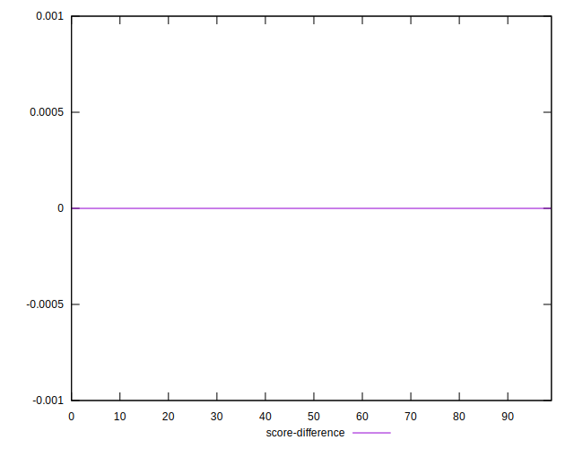
## P Score Difference


```yaml
p90min: -0.0048082598963292145
p90max: 0.004612384773550091
p90range: 0.009420644669879305
p90mean: -0.00043143629720882
p90median: -0.00025811785109162294
p90stdev: 0.0026496839823913925
p90skewness: 0.12724062451610196
p90eccentricity: 1.0000000000000002
p90discretization: 1
outlandishness: 0.8856368767144227
confidence: 0.0011107786218663516
p90confidence: 0.0010712929336607765

```

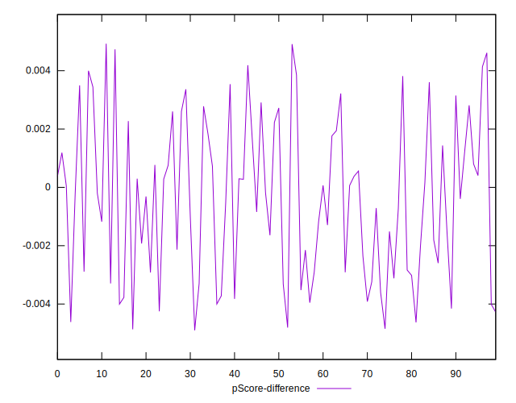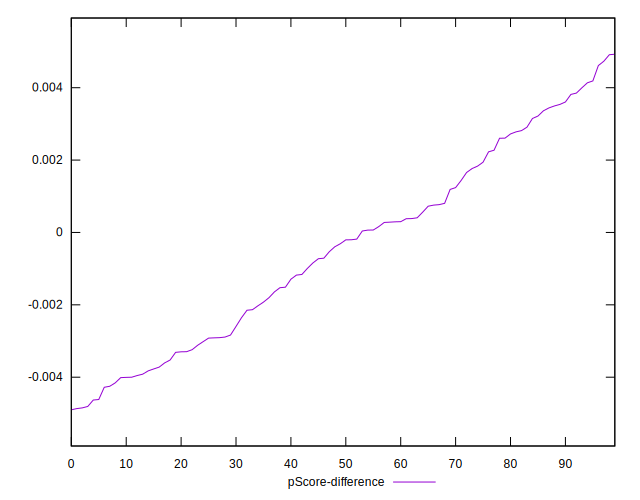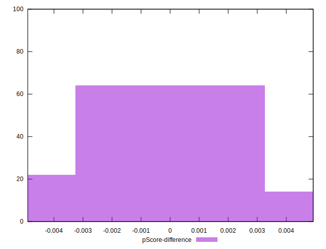