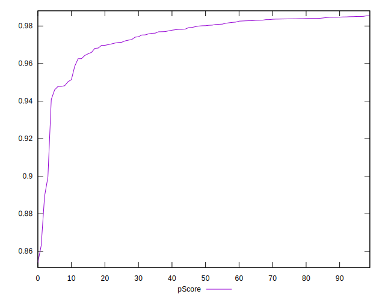

# //first-meaningful-paint/samples/pages+cached+noadtech+nomedia+nocss

[→ Parent](../..)


## Raw


```yaml
p90min: 1607.2624999999998
p90max: 2338.4865
p90range: 731.2240000000002
p90mean: 1731.297943617022
p90median: 1687.1317499999998
p90stdev: 132.71282304863462
p90skewness: 1.7789254602165425
p90eccentricity: 1
p90discretization: 1
outlandishness: 1.0222067217156205
confidence: 72.75563901726463
p90confidence: 53.657081555008745

```


## Score


```yaml
p90min: 0.9
p90max: 0.99
p90range: 0.08999999999999997
p90mean: 0.9744680851063829
p90median: 0.98
p90stdev: 0.012170510337085187
p90skewness: -3.1690883108640766
p90eccentricity: 1
p90discretization: 13.428571428571429
outlandishness: 0.9943268463654394
confidence: 0.008731062101564874
p90confidence: 0.004920655372418253

```


## Raw Estimate


## Score Estimate


## P Score


```yaml
p90min: 0.8995543426429096
p90max: 0.9850897708128485
p90range: 0.08553542816993898
p90mean: 0.9755219190580193
p90median: 0.9801526196617564
p90stdev: 0.012912710435791926
p90skewness: -2.905995862206461
p90eccentricity: 0.9999999999999997
p90discretization: 1
outlandishness: 0.9940498402268079
confidence: 0.00876063316535712
p90confidence: 0.005220734071006774

```


## Score Difference


```yaml
p90min: 0
p90max: 1.1102230246251565e-16
p90range: 1.1102230246251565e-16
p90mean: 4.724353296277262e-18
p90median: 0
p90stdev: 2.2409575331340657e-17
p90skewness: 4.532597979574665
p90eccentricity: 1.0000000000000016
p90discretization: 47
outlandishness: 2.706025000000001
confidence: 1.1103983576888547e-17
p90confidence: 9.06040865942704e-18

```


## P Score Difference


```yaml
p90min: -0.004778268531495655
p90max: 0.00483441925328254
p90range: 0.009612687784778196
p90mean: 0.0009730830057185248
p90median: 0.0014036118387992236
p90stdev: 0.002867600293339519
p90skewness: -0.4807078429342855
p90eccentricity: 1.0000000000000002
p90discretization: 1
outlandishness: 0.8848277877829533
confidence: 0.0011912016812326716
p90confidence: 0.0011593986117716646

```

