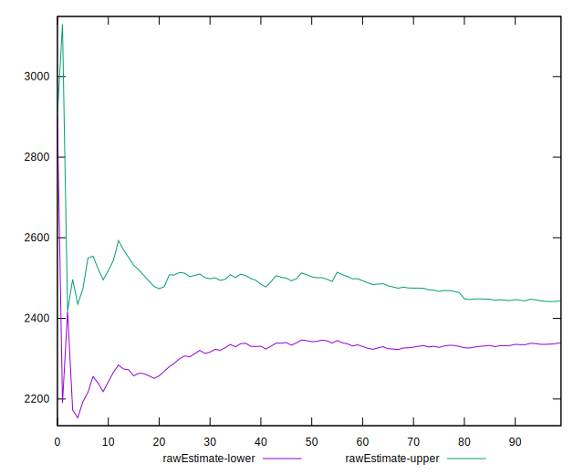
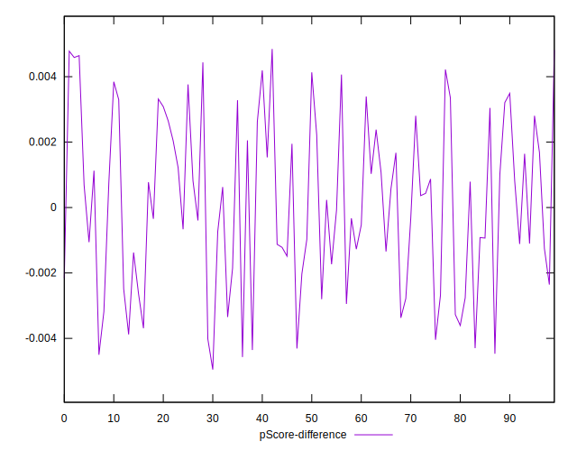

# //first-meaningful-paint/samples/pages+cached+noadtech+nomedia

[→ Parent](../..)


## Raw


```yaml
p90min: 2114.2505
p90max: 2901.6150000000002
p90range: 787.3645000000001
p90mean: 2392.1437372340424
p90median: 2373.6675
p90stdev: 183.88031147414418
p90skewness: 0.5374395431354991
p90eccentricity: 0.9999999999999999
p90discretization: 1
outlandishness: 1.0187952046951017
confidence: 104.13791400896717
p90confidence: 74.344593404609

```


## Score


```yaml
p90min: 0.78
p90max: 0.94
p90range: 0.15999999999999992
p90mean: 0.8871276595744683
p90median: 0.89
p90stdev: 0.03541914197050325
p90skewness: -0.7854404653606398
p90eccentricity: 1.0000000000000007
p90discretization: 5.529411764705882
outlandishness: 0.9866809345287368
confidence: 0.022424454934959533
p90confidence: 0.014320302632875674

```


## Raw Estimate


## Score Estimate


## P Score


```yaml
p90min: 0.7778388112182868
p90max: 0.9356442046574713
p90range: 0.15780539343918454
p90mean: 0.8872556213539716
p90median: 0.8931465618565428
p90stdev: 0.03559462517185796
p90skewness: -0.8124514883606138
p90eccentricity: 1
p90discretization: 1
outlandishness: 0.986650741908392
confidence: 0.02241406536551834
p90confidence: 0.014391252193214491

```


## Score Difference


```yaml
p90min: 0
p90max: 1.1102230246251565e-16
p90range: 1.1102230246251565e-16
p90mean: 5.9054416203465774e-18
p90median: 0
p90stdev: 2.4915085490873318e-17
p90skewness: 3.981981890375801
p90eccentricity: 0.9999999999999967
p90discretization: 47
outlandishness: 2.262016
confidence: 1.1806664533324076e-17
p90confidence: 1.0073410718148074e-17

```


## P Score Difference


```yaml
p90min: -0.004469399984484812
p90max: 0.0046449762650585535
p90range: 0.009114376249543366
p90mean: 0.00011646598205141713
p90median: 0.00029813289331548365
p90stdev: 0.002561133441388133
p90skewness: -0.018615626279422648
p90eccentricity: 0.9999999999999997
p90discretization: 1
outlandishness: 0.9517627788184612
confidence: 0.0010747934625211912
p90confidence: 0.0010354910910716029

```

