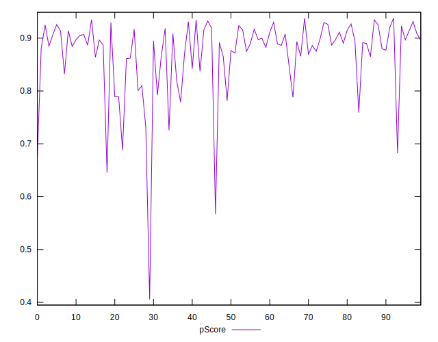

# //first-meaningful-paint/samples/pages+cached+noadtech

[→ Parent](../..)


## Raw


```yaml
p90min: 2120.32085
p90max: 3313.34
p90range: 1193.01915
p90mean: 2445.5063037234045
p90median: 2385.03975
p90stdev: 269.12079700697296
p90skewness: 1.4012300493474827
p90eccentricity: 1.0000000000000002
p90discretization: 1
outlandishness: 1.0264245437867716
confidence: 144.3324640985993
p90confidence: 108.80814846249075

```


## Score


```yaml
p90min: 0.67
p90max: 0.93
p90range: 0.26
p90mean: 0.8752127659574472
p90median: 0.89
p90stdev: 0.05790176426600002
p90skewness: -1.7441658940070222
p90eccentricity: 1
p90discretization: 4.476190476190476
outlandishness: 0.9817733768344141
confidence: 0.0323629405062411
p90confidence: 0.02341024488840167

```


## Raw Estimate


## Score Estimate


## P Score


```yaml
p90min: 0.6731954790615404
p90max: 0.9347802347826766
p90range: 0.26158475572113615
p90mean: 0.8750338280034371
p90median: 0.8910340528506193
p90stdev: 0.05776744100175986
p90skewness: -1.7344398509198113
p90eccentricity: 0.9999999999999997
p90discretization: 1
outlandishness: 0.9813126975621925
confidence: 0.03248467505151753
p90confidence: 0.023355936689853075

```


## Score Difference


```yaml
p90min: 0
p90max: 1.1102230246251565e-16
p90range: 1.1102230246251565e-16
p90mean: 5.3148974583119196e-18
p90median: 0
p90stdev: 2.300091806633268e-17
p90skewness: 4.229488855444225
p90eccentricity: 1.0000000000000004
p90discretization: 31.333333333333332
outlandishness: 2.4544444444444444
confidence: 1.1254344734729734e-17
p90confidence: 9.299494262683337e-18

```


## P Score Difference


```yaml
p90min: -0.004808608796518121
p90max: 0.004928478890280363
p90range: 0.009737087686798485
p90mean: -0.00040764231431289076
p90median: -0.0005979967740950554
p90stdev: 0.0028761280694425792
p90skewness: 0.2815165796662797
p90eccentricity: 1
p90discretization: 1
outlandishness: 0.8723696918722865
confidence: 0.0011912332225656752
p90confidence: 0.001162846474361982

```

