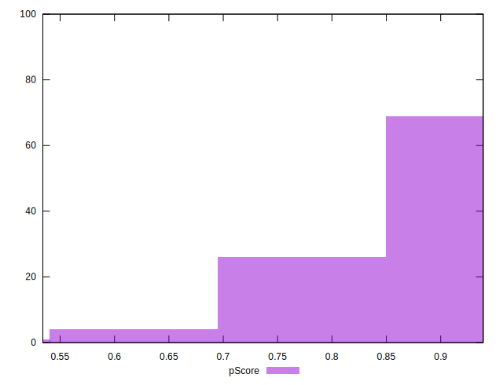
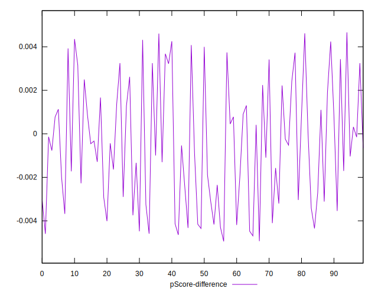

# //first-meaningful-paint/samples/pages+cached

[→ Parent](../..)


## Raw


```yaml
p90min: 2129.698
p90max: 3260.0780000000004
p90range: 1130.3800000000006
p90mean: 2499.243867021276
p90median: 2394.0252499999997
p90stdev: 291.03158344557966
p90skewness: 0.9494568917467661
p90eccentricity: 0.9999999999999997
p90discretization: 1
outlandishness: 1.0177708626409454
confidence: 138.15487019067342
p90confidence: 117.66689193477644

```


## Score


```yaml
p90min: 0.69
p90max: 0.93
p90range: 0.2400000000000001
p90mean: 0.8641489361702124
p90median: 0.89
p90stdev: 0.06296587347343419
p90skewness: -1.168419443236468
p90eccentricity: 1.0000000000000004
p90discretization: 4.2727272727272725
outlandishness: 0.9862790794052825
confidence: 0.030922145003904618
p90confidence: 0.025457713358326296

```


## Raw Estimate


## Score Estimate


## P Score


```yaml
p90min: 0.6870010377412159
p90max: 0.9334329198043909
p90range: 0.246431882063175
p90mean: 0.8636914484720553
p90median: 0.8893451519089255
p90stdev: 0.06276697280274199
p90skewness: -1.18539142178207
p90eccentricity: 1
p90discretization: 1
outlandishness: 0.9862298122231373
confidence: 0.0307891353588776
p90confidence: 0.02537729588800569

```


## Score Difference


```yaml
p90min: 0
p90max: 1.1102230246251565e-16
p90range: 1.1102230246251565e-16
p90mean: 1.1810883240693155e-17
p90median: 0
p90stdev: 3.423119174922787e-17
p90skewness: 2.553242569566712
p90eccentricity: 1.0000000000000009
p90discretization: 47
outlandishness: 1.4932839999999998
confidence: 1.4635906249893463e-17
p90confidence: 1.3840002836352587e-17

```


## P Score Difference


```yaml
p90min: -0.004644974820743553
p90max: 0.004356832796210353
p90range: 0.009001807616953905
p90mean: -0.0004989240140683445
p90median: -0.000593677893891642
p90stdev: 0.0027849998559667235
p90skewness: 0.17615068287711652
p90eccentricity: 1.0000000000000002
p90discretization: 1
outlandishness: 0.9093067545026307
confidence: 0.0011528964059479556
p90confidence: 0.0011260024537910055

```

